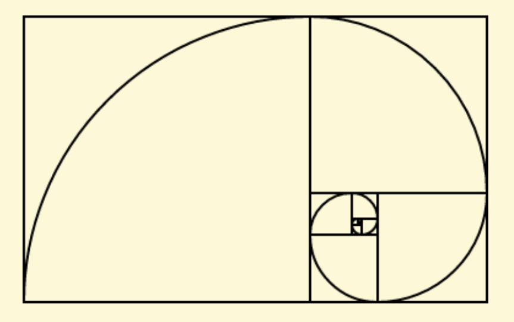
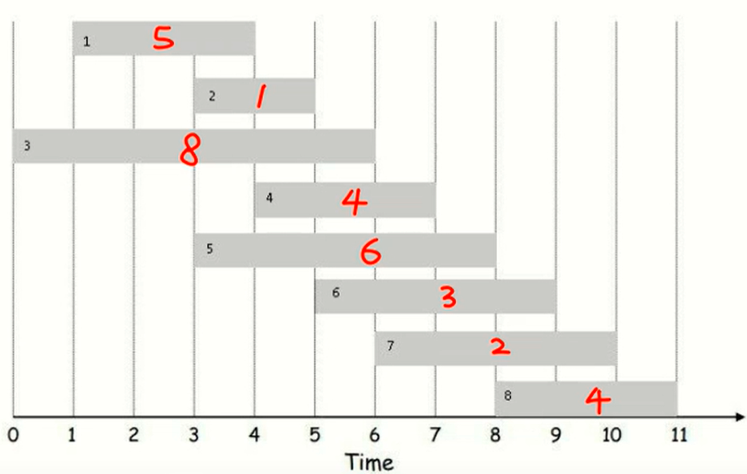
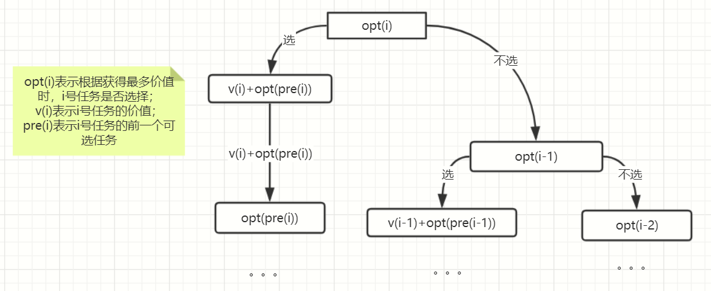
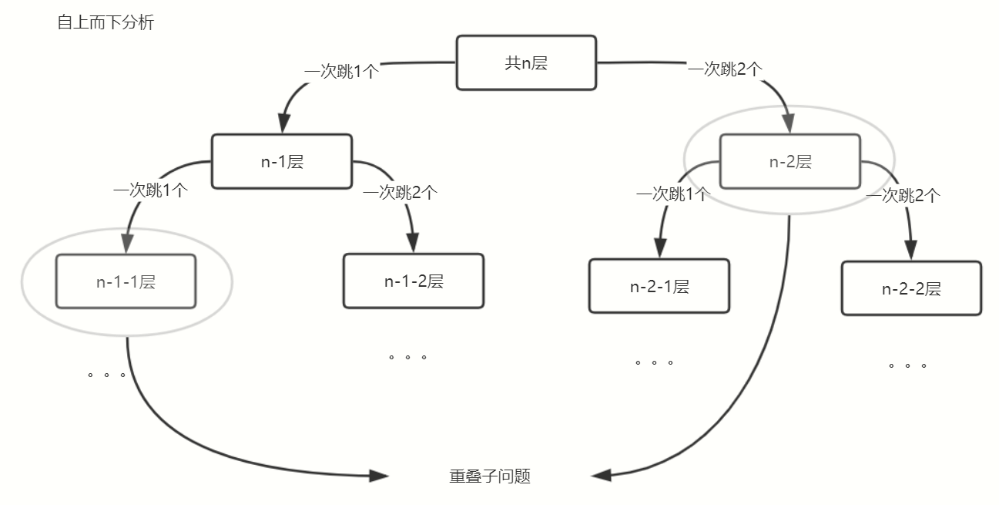
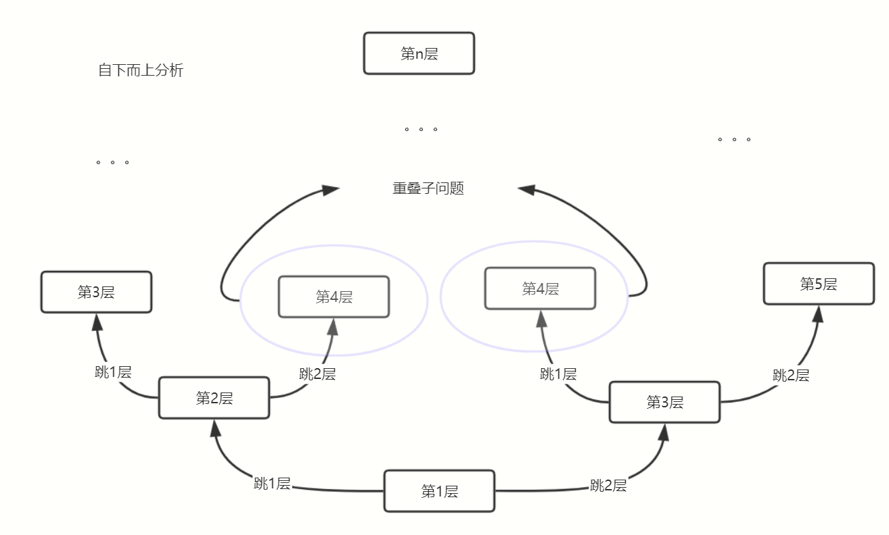

# 动态规划

- 是求解决策过程(decision process)最优化的数学方法
- 把多阶段过程转化为一系列单阶段问题，利用各阶段之间的关系，逐个求解
- 求最优解

适用条件

- 最优子结构：一个最优化策略的子策略总是最优的
- 无后效应：每个状态都是过去历史的一个完整总结
- 子问题重叠：动态规划将原来具有指数级时间复杂度的搜索算法改进成了具有多项式时间复杂度的算法，动态规划实质上是一种以空间换时间的技术，其中的关键在于解决冗余，这是动态规划算法的根本目的

## 斐波那契数列

```js 代码实现
// 斐波那契数列
function series(arr, num) {
  // 初始值
  let n1 = 1,
    n2 = 1,
    cur = 1
  arr.push(n1)
  // 判断上限
  while (num >= cur) {
    // 先压一个
    arr.push(cur)
    // 当前=上一个+上上个
    cur = n2 + n1
    // 更新上上个
    n1 = n2
    // 更新上个
    n2 = cur
  }
  console.log(arr)
  // 由于while不满足时cur为后一个，应该选n2，由于n1被n2取代，n2被cur取代，所以取n1的值
  return n1
}
console.log(series(array, 500))
----------------------------------------------
// 递归求斐波那契数列
function series(num, arr = [1, 1], n1 = 1, n2 = 1, cur = 2) { // 参数初始化
  if (cur > num) return arr // 满足条件跳出
  arr.push(cur) // 压入
  return series(num, arr, n2, cur, cur + n2) // 下一轮
}
console.log(series(500))
```

canvas画一个斐波那契数组图

```js 斐波那契数组
// 斐波那契数组
const array = series(300)
// 获取canvas
const canvas = document.querySelector('#can')
// 设置画布大小
canvas.width = 900
canvas.height = 400
// 2d模式上下文
const ctx = canvas.getContext('2d')
// 初始化数据
const pi = Math.PI
let beginAngle = 0
let endAngle = pi * 3 / 2
let aPointX = 500
let aPointY = 200
let rPointX = 500 - array[0]
let rPointY = 200 - array[0] * 2
let radius = 1
let l = array.length
let i = -1
let rem = 0

// 开始画图
ctx.beginPath()
while (++i < l) {
  array[i] = array[i]
  if (i > 1) {
    rem = i % 4
    switch (rem) {
      // y轴+
      case 0:
        aPointY += array[i - 2]
        break;
        // x轴+
      case 1:
        aPointX += array[i - 2]
        break;
        // y轴-
      case 2:
        aPointY -= array[i - 2]
        break;
        // x轴-
      case 3:
        aPointX -= array[i - 2]
        break;
    }
  }
  radius = array[i]
  beginAngle -= pi / 2
  endAngle -= pi / 2
  // 画弧
  ctx.moveTo(aPointX, aPointY)
  ctx.arc(aPointX, aPointY, radius, beginAngle, endAngle, true)
  if (i < 2) {
    rPointY += array[0]
  } else {
    // 画矩形
    switch (rem) {
      // x-r
      case 0:
        rPointX -= array[i]
        break;
        // y+(r-1)
      case 1:
        rPointY += array[i - 1]
        break;
        // x+(r-1) y-(r-2)
      case 2:
        rPointX += array[i - 1]
        rPointY -= array[i - 2]
        break;
        // x-(r-2) y-(r)
      case 3:
        rPointX -= array[i - 2]
        rPointY -= array[i]
        break;
    }
  }
  ctx.moveTo(rPointX, rPointY)
  // 画矩形
  ctx.rect(rPointX, rPointY, radius, radius)
}
ctx.lineWidth = 2
ctx.stroke()
```



## 经典动态规划题



描述

- 在给定time的情况下计算出最多能赚多少钱
- 红字写的是任务能赚的钱，小黑字是任务序号，长条是执行任务所在的时间段

分析



- 从最优子问题开始求解，比如输入的是11time，那么最开始的子问题应该是判断任务8是否选择，再往前面推到

以下是对应任务的前一个(最近)可选任务

| i(当前任务) | pre(i)(前一个可选任务) |
| ----------- | ---------------------- |
| 1           | 0                      |
| 2           | 0                      |
| 3           | 0                      |
| 4           | 1                      |
| 5           | 0                      |
| 6           | 2                      |
| 7           | 3                      |
| 8           | 5                      |

任务对应的价格表

| i(当前任务) | v(i) |
| ----------- | ---- |
| 1           | 5    |
| 2           | 1    |
| 3           | 8    |
| 4           | 4    |
| 5           | 6    |
| 6           | 3    |
| 7           | 2    |
| 8           | 4    |

判断i号任务时获取的最多价值

| i(当前任务) | opt(i)      |
| ----------- | ----------- |
| 1           | 5=v1        |
| 2           | 5=v1        |
| 3           | 8=v3        |
| 4           | 9=v4+v1     |
| 5           | 9=v4+v1     |
| 6           | 9=v4+v1     |
| 7           | 10=v7+v3    |
| 8           | 13=v8+v4+v1 |

代码实现

```js 动态规划
// 为了方便分析，填充了数组的第一个元素，使数组下标与任务对应
const value = [null, 5, 1, 8, 4, 6, 3, 2, 4]
const pre = [null, 0, 0, 0, 1, 0, 2, 3, 5]
/* 计算给定能够执行的最大index任务时，最多能获得多少价值
  * @value:任务价格表
  * @pre对应任务的前一个可选任务
  * @start初始计算任务
  * @max累计最大值
  * @sum保存之前每个任务的最大值
  */
// 自下而上
function dp(value, pre, index, start = 1, max = 0, sum = [null]) { // sum填充第一个
  // 获取当前任务自身价格
  let v = value[start]
  // 如果当前任务有可选的前一个任务，则把价值相加
  if (pre[start]) v += sum[pre[start]]
  // 如果当前价格比上一个任务获得多，则更新最高价格
  if (v > max) max = v
  sum.push(max)
  // 求到给定位置，返回最终价格
  if (index === start) return max
  // 求下一任务价格
  return dp(value, pre, index, ++start, max, sum)
}
// 求当最高能做第i个任务时，所能获得的最高价格
let i = 8
console.log(dp(value, pre, 8)) // 13
```

## 爬楼梯

题目描述：

- 假设你正在爬楼梯。需要 n 阶你才能到达楼顶。
- 每次你可以爬 1 或 2 个台阶。你有多少种不同的方法可以爬到楼顶呢？
- 注意：给定 n 是一个正整数

分析

自上而下分析，从最终目标出发，分解成子问题



自下而上分析，从成子问题开始归纳，得出最终结果



- 对于重复的子问题可以不需要再次计算，只需第一次计算过即可，之后直接使用保存的结果
- 要想得出最终结果，都需要从之前的结果推算出来

代码实现

```js 爬楼梯
// 爬楼梯递归版，自上而下
function way(layer, arr = []) {
  // 递归出口，0层，共有0种方法
  if (layer == 0) return 0
  // 递归出口，只有一层，共有1种方法
  if (layer == 1) return 1
  // 递归出口，只有二层，共有2种方法
  if (layer == 2) return 2
  // 如果已经保存则直接读取
  if (arr[layer]) return arr[layer]
  // 计算当前层
  return arr[layer] = way(layer - 1, arr) + way(layer - 2, arr)
}
console.log(way(8)) // 34
-----------------------------------------------
// 循环法，自下而上
function way(layer) {
  // 第一层
  if (layer == 1) return 1
  // 第二层
  if (layer == 2) return 2
  let start = 2, pre1 = 2, pre2 = 1, sum = 0
  // 累加直到目标层
  while(layer>start++){
    sum=pre1+pre2
    pre2=pre1
    pre1=sum
  }
  return sum
}
console.log(way(8)) // 34
```