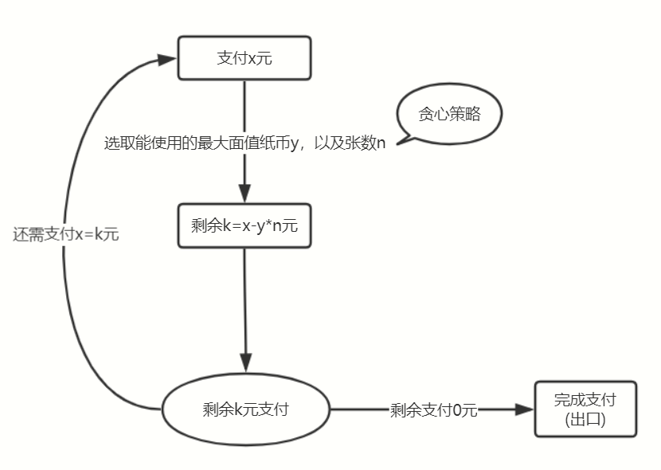

# 贪心算法

- 贪心算法（又称贪婪算法）是指，在对问题求解时，总是做出在当前看来是最好的选择
- 不从整体最优上加以考虑，他所做出的是在某种意义上的局部最优解
- 贪心关注的是当前问题的最优解，而不是全局最优解。动态规划关注的是全局最优解

基本要素

- 贪心选择是采用从顶向下、以迭代的方法做出相继选择，每做一次贪心选择就将所求问题简化为一个规模更小的子问题
- 要确定它是否具有贪心选择的性质，我们必须证明每一步所作的贪心选择最终能得到问题的最优解
- 当一个问题的最优解包含其子问题的最优解时，称此问题具有最优子结构性质

步骤

- 遍历备选元素
- 贪心策略确定选择元素

1. 当我们看到这类问题的时候，首先要联想到贪心算法：针对一组数据，我们定义了限制值和期望值，希望从中选出几个数据，在满足限制值的情况下，期望值最大
2. 我们尝试看下这个问题是否可以用贪心算法解决：每次选择当前情况下，在对限制值同等贡献量的情况下，对期望值贡献最大的数据
3. 我们举几个例子看下贪心算法产生的结果是否是最优的。大部分情况下，举几个例子验证一下就可以了

实际上，用贪心算法解决问题的思路，并不总能给出最优解

## 支付找零问题

- 给定纸币面值数组`[1,2,5,10,20,50,100]`，每张纸币不限次数使用
- 当要支付x元时，求最少使用的纸币数，并列出使用的纸币面值及其张数
- 不能多付，少付

分析



代码实现

```js 支付找零
// 纸币面值
const coins = [1, 2, 5, 10, 20, 50, 100]
// 支付找零
function pay(coins, money, i = coins.length - 1, arr = []) {
  // 不符合
  if (i < 0) {
    arr.pop()
    return 0
  }
  if (money - coins[i] < 0) return 0
  arr.push(coins[i])
  // 符合
  if (money - coins[i] === 0) return arr
  money -= coins[i]
  // 再选择本面值，不符合，选择下一个面值
  while (!pay(coins, money, i--, arr));
  return arr
}
console.log(pay(coins, 123))
```

## 限制有限张纸币，求支付情况

```js 条件找零
const coins = [
  [1, 5],
  [2, 2],
  [5, 2],
  [10, 2],
  [20, 2],
  [50, 2],
  [100, 1],
]

function pay(
  coins,
  money,
  i = coins.length - 1,
  count = coins[i][1],
  arr = []
) {
  // 纸张数总额度不够
  if (count <= 0 && i <= 0) return -1
  // 不符合
  if (count <= 0 || money - coins[i][0] < 0) {
    if (i < 0) arr.pop()
    return 0
  }
  // 符合，添加
  arr.push(coins[i][0])
  count--
  // 刚好
  if (money - coins[i][0] === 0) return arr
  money -= coins[i][0]
  // 再选择本面值，不符合
  let res = 1
  while (!(res = pay(coins, money, i, count, arr))) {
    count = coins[--i][1]
  }
  return res === -1 ? -1 : arr
}

console.log(pay(coins, 236)) // [100, 50, 50, 20, 10, 5, 1]
```

## 求移除k个数，使剩下值最小

- 在一个非负整数 a 中，我们希望从中移除 k 个数字，让剩下的数字值最小，如何选择移除哪 k 个数字呢？

```js
// 迭代
let num = 59513048
function foo(num, s) {
  let arr = String(num).split('')
  for (let i = 0; i < arr.length; i++) {
    if (s && arr[i] * 1 > arr[i + 1] * 1) {
      arr.splice(i, 1)
      s--
      i = -1  // 继续从最高位开始
      continue
    } 
  }
  return arr.join('') * 1
}
console.log(foo(num, 2));
-----------------------------------------------
// 递归
const num = 59513048
// 移除k个元素使数值最小
function remove(num, k, i = 0) {
  if (typeof num === 'number') num = num.toString()
  if (k <= 0) return num * 1
  // 到最后一个,则没有比第一个小的数，就删除第一个
  let pos
  // 超过界限或最后一个
  if (i >= num.length - 1) {
    return remove(num.replace(new RegExp(num[0]), ''), --k, 0)
  }
  // 前一个大于后一个，则删除,再从最前面开始删除
  if (num[i] > num[i + 1]) {
    return remove(num.replace(new RegExp(num[i]), ''), --k, 0)
  }
  return remove(num, k, i + 1)
}

console.log(remove(num, 5))
```

<Vssue title="算法 issue" />