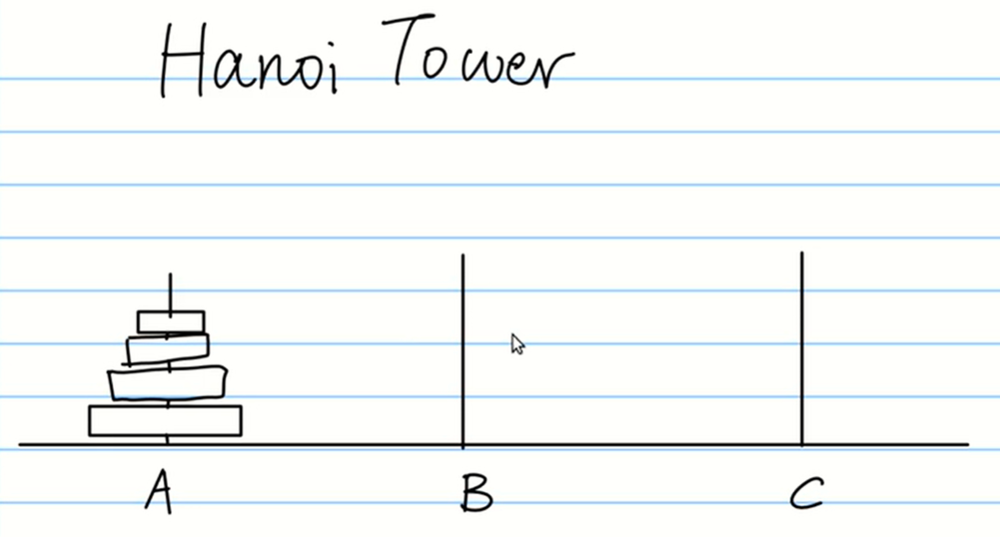

# 递归

- 递归是一种应用非常广泛的算法（或者编程技巧）
- 一个非常标准的递归求解问题的分解过程，去的过程叫“递”，回来的过程叫“归”。基本上，所有的递归问题都可以用递推公式来表示
- 递归一种计算过程，如果其中每一步都要用到前一步或前几步的结果，称为递归
- 函数调用自身

递归条件

- 在每一次调用自己时，必须是（在某种意义上）更接近于解，递归关系式
- 必须有一个终止处理或计算的准则（递归出口），就是可以直接看出结果，不需要进一步分析

## 递归需要满足的三个条件

1. 一个问题的解可以分解为几个子问题的解
2. 这个问题与分解之后的子问题，除了数据规模不同，求解思路完全一样
3. 存在递归终止条件

## 如何编写递归代码？

1. 写出递推公式
2. 找到终止条件

> 写递归代码的关键就是找到如何将大问题分解为小问题的规律，并且基于此写出递推公式，然后再推敲终止条件，最后将递推公式和终止条件翻译成代码

注意：

1. 试图想搞清楚计算机每一步都是怎么执行的，这样就很容易被绕进去
2. 对于递归代码，这种试图想清楚整个递和归过程的做法，实际上是进入了一个思维误区
3. 如果递归求解的数据规模很大，调用层次很深，一直压入栈，就会有堆栈溢出的风险
4. 递归代码要警惕重复计算

屏蔽掉递归细节

> 编写递归代码的关键是，只要遇到递归，我们就把它抽象成一个递推公式，不用想一层层的调用关系，不要试图用人脑去分解递归的每个步骤

递归有利有弊，利是递归代码的表达力很强，写起来非常简洁；而弊就是空间复杂度高、有堆栈溢出的风险、存在重复计算、过多的函数调用会耗时较多等问题

- 所有递归都能改写成迭代循环

## 递归调试

- log递归值
- 使用条件断点，对特定值进行调试

## 汉诺塔递归题



- 把a中的所有元素移动到c中
- 一次只能移动一个元素，从塔的上方移除，且只能移动最上层元素
- 大元素必须在小元素之下，b为辅助使用

代码实现

```js 汉诺塔
// 定义初始塔元素,数组下标越小表示越处于塔的上方，10为塔底
const A = [1, 2, 3, 4, 5, 6, 7, 8, 9, 10]
// 定义辅助塔，空数组
const B = []
// 定义最终放置的塔，空数组
const C = []
// 递归函数，i为当前需要移动的块
function move(a, b, c, i = a.length - 1) {
  // a,b塔都没有元素，说明移动完成
  if (!(a.length || b.length)) return c
  // 只有一个
  if (!i) { // 拐点
    // 从a移动最底部块到c
    c.unshift(a.shift())
  } else { // 不止一块则继续递归，寻找出口
    // 第i-1块，从a通过c移动到b
    move(a, c, b, i - 1)
    // 从a移动非最底部块
    c.unshift(a.shift())
    // 第i-1块，从b通过a移动到c
    move(b, a, c, i - 1)
  }
}
move(A, B, C) // 执行移动
console.log(A, B, C) // [],[],[1,2,3,4,5,6,7,8,9,10]
```