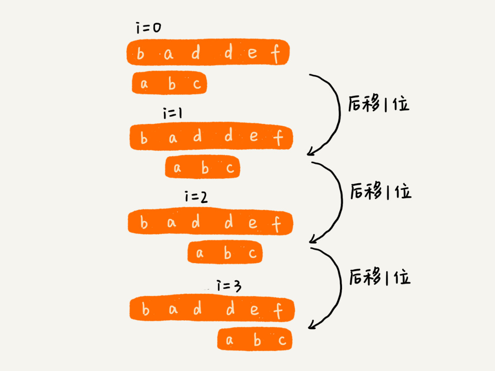

# 字符串匹配算法

主串：原字符串，长度n
模式串：匹配的子串，长度m

## BF暴力匹配算法

- BF 算法中的 BF 是 Brute Force 的缩写，中文叫作暴力匹配算法，也叫朴素匹配算法,时间复杂度是 O(n*m)
- 我们在主串中，检查起始位置分别是 0、1、2…n-m 且长度为 m 的 n-m+1 个子串，看有没有跟模式串匹配的



## RK暴力匹配算法升级版

- RK 算法的全称叫 Rabin-Karp 算法，是BF算法升级版，时间复杂度是 O(n)
- RK 算法的思路是这样的：我们通过哈希算法对主串中的 n-m+1 个子串分别求哈希值，然后逐个与模式串的哈希值比较大小，如果某个子串的哈希值与模式串相等，那就说明对应的子串和模式串匹配了


## BM算法(KMP升级版)

- BM（Boyer-Moore）算法，它的性能是著名的KMP 算法的 3 到 4 倍
- BM 算法包含两部分，分别是坏字符规则（bad character rule）和好后缀规则（good suffix shift）

## KMP著名的字符串匹配算法

- KMP 算法是根据三位作者（D.E.Knuth，J.H.Morris 和 V.R.Pratt）的名字来命名的，算法的全称是 Knuth Morris Pratt 算法，简称为 KMP 算法
- KMP 算法跟 BM 算法的本质是一样的

```js
const str = 'abaabcac'
const target = 'abca'

// 匹配字符串
String.prototype.myIndexOf = function myIndexOf(target) {
  // 生成nextVal数组
  const nextVal = ((target) => {
    const next = [0, 1]
    const nextVal = [0, target[0] === target[1] ? 0 : 1]
    let pre = 1,
      cur = 2
    // 生成next数组
    for (let cur = 2; cur < target.length; ) {
      if (target[cur - 1] === target[next[pre] - 1]) {
        next[cur] = next[pre] + 1
        pre = cur++
      } else {
        // 继续寻找前一个
        pre = next[pre] - 1
        // 直到第一个
        if (pre === 0) {
          next[cur] = 1
          pre = cur++
        }
      }
    }
    // 生成nextVal数组
    for (let cur = 2; cur < target.length; ) {
      // 当前值与next指向的值相同
      if (target[cur] === target[next[pre] - 1]) {
        pre = next[pre] - 1
        // 直到第一个
        if (pre === 0) {
          nextVal[cur] = 0
          pre = ++cur
        }
      } else {
        // 值不同
        nextVal[cur] = next[pre]
        pre = ++cur
      }
    }
    return nextVal
  })(target)

  // matchEnd子串在主串中能够匹配的最后一个索引
  let matchEnd = 0
  for (let i = 0; i < this.length; i++) {
    // 匹配,且未匹配完成
    if (this[i] === target[matchEnd] && matchEnd < target.length) {
      // 匹配成功
      if (matchEnd + 1 >= target.length) return i - matchEnd
      matchEnd++
    } else if (matchEnd > 0) {
      // 匹配过,调整移动
      matchEnd = matchEnd - nextVal[matchEnd - 1]
    }
  }
  return -1
}

console.log(str.myIndexOf(target))
```

## Sunday算法(更高效的字符串匹配算法)

- 当不匹配时，判断主串下一个字符是否在模式串中出现过，如果出现过多次则选择模式串最靠右的的字符位置，根据模式串中匹配的字符与主串中下一个匹配位置对齐，再进行重新匹配
- 主要就是当主串和模式串不匹配时，把主串中的下一个未对齐的子串在模式串中，从右往前匹配，如果匹配到则把第一个匹配的字符与主串中对齐，再重新开始匹配

```js
const str = 'bcababcaa'
const target = 'abca'
String.prototype.myIndexOf = function myIndexOf(str, fromIndex = 0) {
  if (str === '') return 0
  if (typeof str !== 'string') throw new TypeError('Argument must be a string')
  let sIndex = 0,
    pos = fromIndex
  for (let i = fromIndex; i < this.length; i++) {
    if (str[sIndex] !== this[i]) {
      sIndex = str.length - 1
      // 匹配失败时查找当前下一个未匹配字符是否存在于模式串，如果存在则于模式串对齐
      while (this[pos + str.length] !== str[sIndex] && sIndex > 0) {
        sIndex--
      }
      // 调整移动
      if (sIndex <= 0) {
        pos += str.length + 1
      } else {
        pos += str.length - sIndex
      }
      sIndex = 0
      i = pos - 1
    } else {
      // 继续匹配
      sIndex++
    }
    if (sIndex >= str.length) return pos >= this.length ? -1 : pos
  }
  return -1
}

console.log(str.myIndexOf(target))
```