# 深入浏览器工作原理(上)

这次从头到脚系统的梳理浏览器工作原理，缘由是近期我看了某专栏，几乎又重新刷新了我对浏览器的认知，使我反思，是不是我还不不是真正了解浏览器工作原理，而只是停留在他人博客以及零碎的知识点，这些零碎的知识点无法使我连贯的串联起来，这也是导致我无法进一步深入学习的原因

学习一块知识，最好的方法是系统全面的学习，这样能够保证你能把这一块的知识串联起来，建立自己的知识体系，深度学习、追本溯源是很有必要的，深度决定你的高度，你对底层原理掌握的更多，才会更有把握，才会站在更高的维度去审视事物，正所谓“知其然，知其所以然”，真正能够了解事物的本质是我追寻知识的初衷

当你站在一个更高的维度去审视事物，你将得到与常人不同的视野。站在巨人的肩膀上，你能看到更广阔的远野。这就是我能够快速学习的原因，当然在这途中，你可能会有许许多多的质疑，没关系，用实践来检验他

- 基于Chrome浏览器占据超一半以上的市场份额，这里主要就以Chrome浏览器为例，深入浏览器工作原理

> [Chromium](https://baike.baidu.com/item/chromium/529755?fr=aladdin) 是 Google 的Chrome浏览器背后的引擎

## 深入浏览器工作原理给你带来的好处

1. 准确评估Web开发项目的可行性
2. 从更高的维度去审视页面
3. 在快节奏的技术迭代中把握本质

亘古不变的是那些最底层、最基础的知识。系统的学习这些知识，这有助于你快速适应迭代更新的技术，从而提升核心竞争力。

## 浏览器进程

学习浏览器进程架构能够有利于你全面了解浏览器的样子，让你全面的认识浏览器的组成

### 进程与线程

- 一个进程就是一个程序的运行实例。详细解释就是，启动一个程序的时候，操作系统会为该程序创建一块内存，用来存放代码、运行中的数据和一个执行任务的主线程，我们把这样的一个运行环境叫进程
- 线程是不能单独存在的，它是由进程来启动和管理的

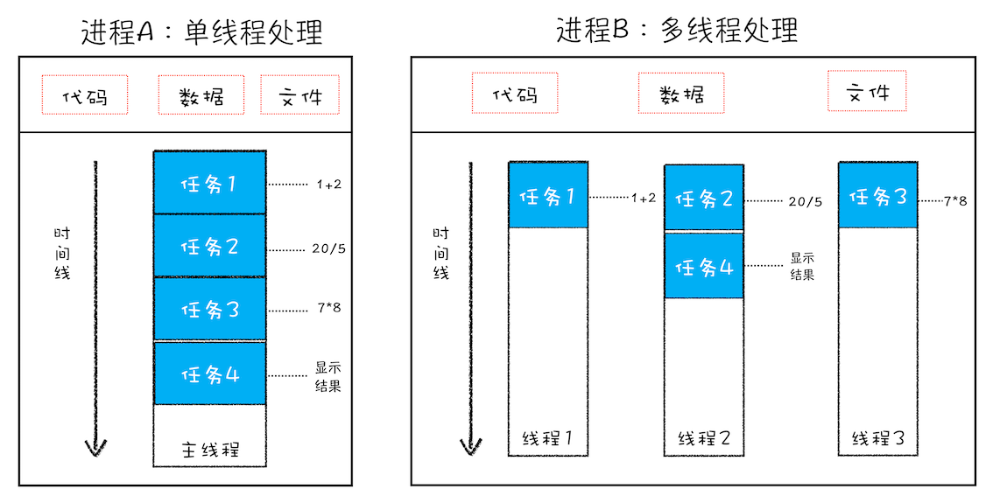

- 一个进程中又可以包含多个线程，如果只包含一个线程称为单线程，包含多个线程称为多线程
- 线程是依附于进程的，而进程中使用多线程并行处理能提升运算效率

进程与线程的关系：

1. 进程中的任意一线程执行出错，都会导致整个进程的崩溃
2. 线程之间共享进程中的数据


3. 当一个进程关闭之后，操作系统会回收进程所占用的内存
4. 进程之间的内容相互隔离，需要使用[IPC](https://baike.baidu.com/item/%E8%BF%9B%E7%A8%8B%E9%97%B4%E9%80%9A%E4%BF%A1)通信
5. 进程间通信比线程间通信开销大
6. 进程是操作系统进行资源分配和调度的基本单位
7. 线程是操作系统能够进行运算调度的最小单位

### 浏览器单进程

- 单进程浏览器是指浏览器的所有功能模块都是运行在同一个进程里
- 早在2007年前，市面上的浏览器都是单进程架构


浏览器单进程架构存在的问题：

1. **不稳定**：单进程意味着所有线程都在一个进程中，当一个线程崩溃，意味着整个浏览器进程也将崩溃。特别是插件与渲染引擎都是不稳定的，一旦崩溃，那么也只能强制关闭浏览器，意味着所有页面将关闭，这对我们来说体验极差
2. **不流畅**：多个浏览器模块抢占主线程执行权，一旦一个模块执行过程很久或者卡住，这将阻塞后面的模块执行，导致浏览器各个模块不能正常工作，从而使页面卡顿，甚至失去响应，进而崩溃。脚本或者插件的内存泄露也会导致浏览器变得卡顿，浏览器工作时间越长，如果存在内存不能被完全回收，这样导致的问题是使用时间越长，内存占用越高，浏览器会变得越慢，最终崩溃
3. **不安全**：单进程意味着所有模块都具控制操作系统任意资源的权限，如果一个使用c/c++编写的插件，他可能使用各种接口来操作你的电脑资源，这就引发了安全性的问题。包括页面脚本也存在类似的安全问题。如果不给浏览器控制操作系统资源的权限，那是不现实的

### 浏览器多进程

- 随着技术的发展，单进程显然不能满足我们的需求
- 2008年Chrome发布了浏览器多进程架构


从图中可以看出，Chrome 的页面是运行在单独的渲染进程中的，同时页面里的插件也是运行在单独的插件进程之中，而进程之间是通过 IPC 机制进行通信

多进程解决的问题：

1. **解决不稳定**：多进程架构把插件、渲染引擎、浏览器主进程分离出来，并且为每个页面都创建单独的渲染进程。由于进程之间相互隔离，所以也就解决了一个页面崩溃导致浏览器崩溃的问题
2. **解决不流畅**：给每个页面都创建单独的进程，这样一来当前页面的渲染不会影响到其他页面，及时当前页面存在内存泄漏，那么也只会影响这个页面流畅，关闭之后，进程资源将会被系统回收
3. **解决不安全**：多进程架构的好处是可以使用安全沙箱，所谓安全沙箱，你可以把沙箱看成是操作系统给进程上了一把锁，沙箱里面的程序可以运行，但是不能在你的硬盘上写入任何数据，也不能在敏感位置读取任何数据。在多进程架构中把可能存在安全问题的插件进程和渲染进程使用安全沙箱隔离起来，这样就避免恶意程序获取系统权限

多进程架构也导致新的问题出现：

1. **更高的资源占用**：每个进程都会包含公共基础结构的副本（如 JavaScript 运行环境），这就意味着浏览器会消耗更多的内存资源
2. **更复杂的体系架构**：浏览器各模块之间耦合性高、扩展性差等问题，会导致现在的架构已经很难适应新的需求了

### 目前多进程架构


最新浏览器架构包含：

1. **浏览器进程**：主要负责界面显示、用户交互、子进程管理，同时提供存储等功能
2. **渲染进程**：核心任务是将 HTML、CSS 和 JavaScript 转换为用户可以与之交互的网页，排版引擎 Blink 和 JavaScript 引擎 V8 都是运行在该进程中，默认情况下，Chrome 会为每个 Tab 标签创建一个渲染进程
3. **GPU进程**：Chrome 刚开始发布的时候是没有 GPU 进程的。而 GPU 的使用初衷是为了实现 3D CSS 的效果，只是随后网页、Chrome 的 UI 界面都选择采用 GPU 来绘制，这使得 GPU 成为浏览器普遍的需求
4. **网络进程**：主要负责页面的网络资源加载
5. **插件进程**：主要是负责插件的运行，因插件易崩溃，所以需要通过插件进程来隔离，以保证插件进程崩溃不会对浏览器和页面造成影响

插件进程、渲染进程都使用安全沙箱模式

### 未来面向服务架构

为了解决这些问题，在 2016 年，Chrome 官方团队使用“面向服务的架构”（Services Oriented Architecture，简称 SOA）的思想设计了新的 Chrome 架构。也就是说 Chrome 整体架构会朝向现代操作系统所采用的“面向服务的架构” 方向发展，原来的各种模块会被重构成独立的服务（Service），每个服务（Service）都可以在独立的进程中运行，访问服务（Service）必须使用定义好的接口，通过 IPC 来通信，从而构建一个更内聚、松耦合、易于维护和扩展的系统，更好实现 Chrome 简单、稳定、高速、安全的目标

Chrome 最终要把 UI、数据库、文件、设备、网络等模块重构为基础服务，类似操作系统底层服务


### 弹性架构

为了在资源受限的设备上能够正常的运行浏览器，Chrome提供了弹性架构


在强大性能设备上会以多进程的方式运行基础服务，反之 Chrome 会将很多服务整合到一个进程中，从而节省内存占用，以便低端设备也能流程运行

### 打开浏览器时有多个进程

从以下方式打开浏览器任务管理器

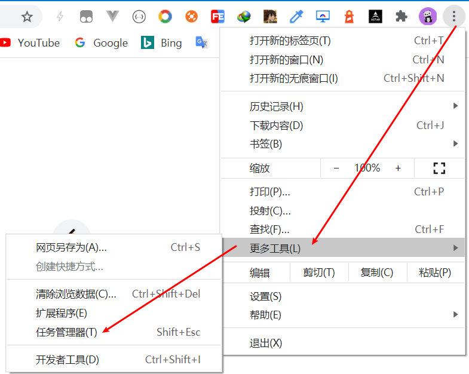

根据不同浏览器以及不同版本将会显示不同的初始进程，这里以Chrome Canary为例

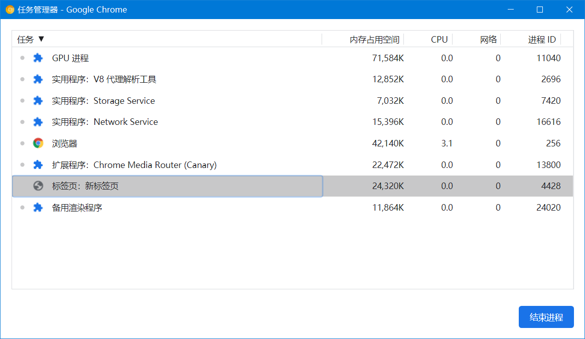

这里包括浏览器主进程、网络、存储、插件、渲染等基础进程

根据不同浏览器版本，浏览器架构之间也会有细微的区别

浏览器多窗口也只有一个浏览器主进程维护

## 浏览器渲染流程

这里先把浏览器的各个部分单独来讲，之后再用一个经典面试题(从输入URL到页面展示发生了什么？)来把这些知识串联起来

这是一个比较老旧的渲染流程图了，不过这里涵盖了大部分过程


### 页面渲染

一个页面主要由HTML、CSS、JS文件组成，浏览器对这些文件解析并且执行渲染最后显示出来


按照渲染流程划分为以下几个阶段：

1. 构建DOM树：解析HTML文件构建成DOM节点对象树
2. 样式计算：解析CSS样式文件，标准化并计算节点样式，生成styleSheets样式表(CSSOM树)
3. 布局阶段：合并DOM与CSSOM树，并计算元素几何坐标位置，生成布局树
4. 分层：对布局树中进行分层处理，对应不同元素创建图层，最后生成图层树
5. 绘制：根据图层树，把图层拆分为各种绘制指令，按照绘制顺序组成绘制指令列表
6. 分块：合成线程将图层划分为图块，视口附近的图块优先生成位图
7. 栅格化(光栅化)：图块经过栅格化(借助GPU)生成位图
8. 合成：所有图块栅格化之后合成线程生成绘制图块命令，然后发送给浏览器主进程，由主进程viz组件按照DrawQuad命令绘制到内存中最后显示器显示

### 构建DOM树

> DOM树全称为Document Object Model文档对象模型

浏览器不能直接读取HTML文本内容，需要借助HTML解析器对HTML文本内容进行解析，生成DOM树，DOM是保存在内存中树状结构


在开发者工具中选中"Elements"可以看到以下HTML文档结构

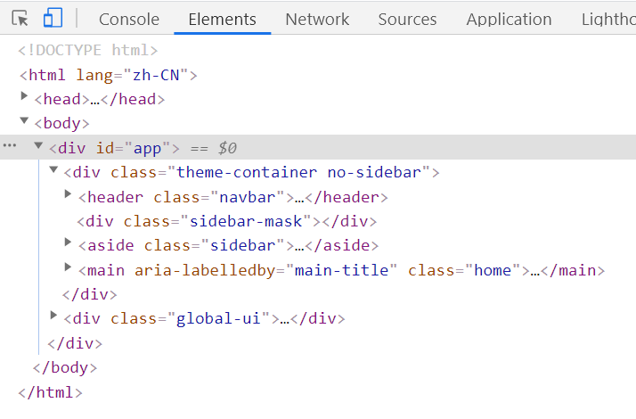

当然，也可在"Console"中输入document查看DOM树对象结构

- 由HTML解析器解析生成的DOM对象，就能通过js来修改内容，其中document对象挂载在浏览器全局对象window下，通过`window.document或者document`直接获取DOM对象进行操作

通过js修改dom

```html
<div></div>
<script>
  const div = document.querySelector('div')
  div.innerText = 'div'
</script>
```

#### HTML解析生成DOM过程

解析HTML由解析器来完成，解析器一般将工作分配给两个组件——词法分析器（有时也叫分词器）负责将输入分解为合法的符号，解析器则根据语言的语法规则分析文档结构，从而构建解析树，词法分析器知道怎么跳过空白和换行之类的无关字符

我强烈推荐这篇文章，虽然有点旧了，但是这里有很详细的描述解析器是如何解析处理，包括其参考文章都非常具有研究意义
[关于HTML、CSS解析器解析渲染过程](https://www.cnblogs.com/lhb25/p/how-browsers-work.html)

主要经历以下几个过程：

1. 编码：HTML解析器对HTML原始字节数据进行转换，在解析到`<meta charset="UTF-8" />`之前将会默认使用ASCII码对其进行转换，当解析到HTML文件使用了指定编码之后，将会使用指定的编码形式对HTML文件进行译码，通常我们都将使用"UTF-8"编码形式，这样浏览器才不会出现乱码情况
2. 令牌化：译码之后，浏览器根据HTML规范对字符串数据依照规范进行转换，最后把各种标签、属性等转换为令牌(token)，这里的令牌化类似解析js时的分词阶段
3. 生成对象：接下来每个令牌都会被转换成定义其属性和规则的对象（这个对象就是节点对象）
4. 构建完毕：DOM树构建完成，形成DOM树结构，其中每个节点都对应一个标签，父子节点的关系就是嵌套标签的关系

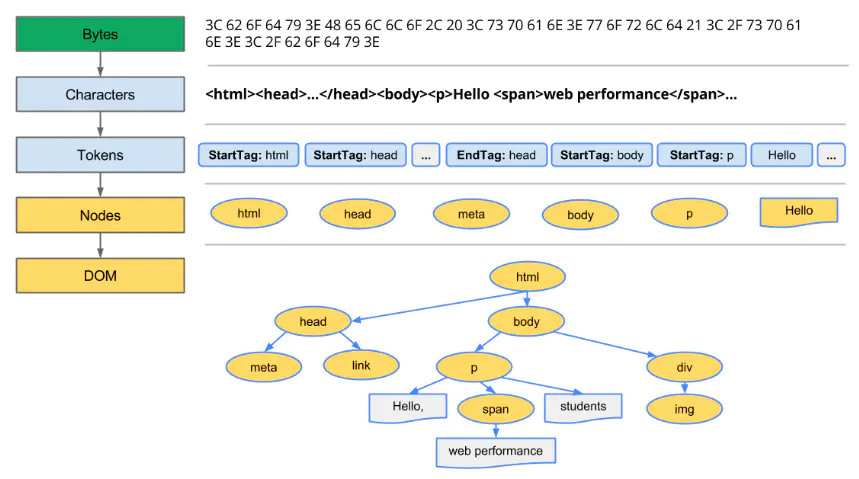

以上为DOM树构建的各个过程中，数据的体现形式

到目前为止，浏览器只解析了HTML中的标签。当HTML解析器解析到由link标签引入的外部CSS文件、内部、内联CSS，那么将会进行接下来的样式计算

### 样式计算

> CSSOM树全称为Cascading Style Sheets Object Model层叠样式表对象模型

同样，浏览器不能直接识别CSS文件中的样式字符串，当遇到CSS样式时，浏览器会把它交给CSS解析器，来解析CSS样式生成便于我们操作的styleSheets(CSSOM对象)

CSS样式的主要来源：

1. link标签引入的外部样式
2. 使用style标记的内部样式
3. 标签元素内联CSS样式

在开发者工具中选中"Elements"，并且选中要查看的标签样式，将会列出标签详细的CSS样式来源

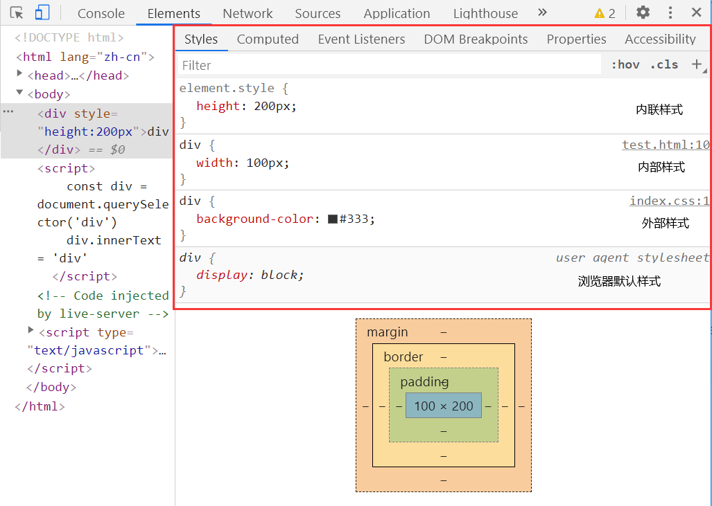

使用`window.document.styleSheets`查看样式树

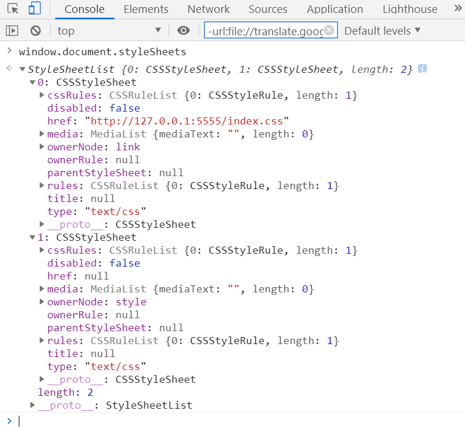

可以看到内部和外部样式将会单独区分(href)

生成styleSheets步骤：

1. 解析CSS字符串，生成styleSheets结构的CSSOM树，为样式操作提供可能
2. 转换样式表中的属性值，使其标准化。css中存在各种值的表达方式，浏览器需要对其做统一处理，以便之后的计算，比如把所有单位转换为以px为基准的值、把颜色单词转为rgb形式等等。


3. 计算DOM树种每个节点的具体样式。根据**继承**和**层叠规则**计算每个节点具体的样式

[层叠上下文](https://developer.mozilla.org/zh-CN/docs/Web/Guide/CSS/Understanding_z_index/The_stacking_context)


最终就生成具体styleSheets样式表


在开发者工具中可以看到具体样式的来源，包括继承的样式等。层叠是 CSS 的一个基本特征，它是一个定义了如何合并来自多个源的属性值的算法

这个阶段最终输出的内容是每个 DOM 节点的样式，并被保存在 ComputedStyle 的结构内

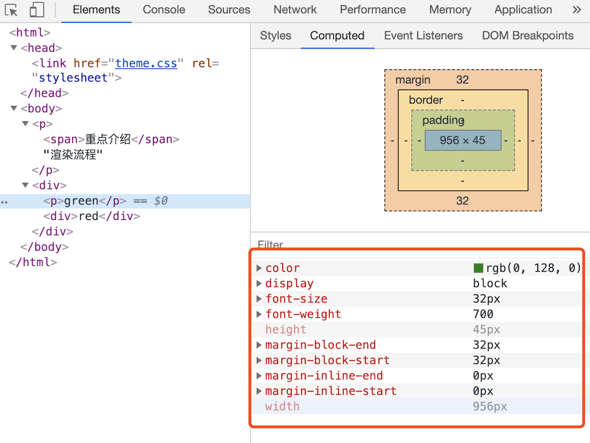

在Computed中也能看到元素的最终样式

### 生成布局树

有了DOM树和CSSOM树之后，还需要计算元素在页面上的具体位置坐标，这时就需要对DOM和CSSOM合并，并且计算几何位置，生成的布局树


生成布局树：

1. 遍历DOM树的所有可见节点，把这些节点按照结构顺序添加到布局树种
2. 忽略不可见的节点，包括head中的所有内容、display为none、注释节点等
3. 根据css选择器顺序从右往左，从下到上匹配节点样式，并且应用样式
4. 布局计算，对节点进行布局计算，把具体计算信息位置存入布局树中

布局阶段会从渲染树的根节点开始遍历，然后确定每个节点对象在页面上的确切大小与位置，布局阶段的输出是一个盒子模型，它会精确地捕获每个元素在屏幕内的确切位置与大小，所有相对的测量值也都会被转换为屏幕内的绝对像素值

[元素位置计算](https://www.rrfed.com/2017/02/26/chrome-layout/)

### 分层

当生成布局树之后，渲染引擎还需要为特定的节点生成专用的图层，并生成一棵对应的图层树（LayerTree）

通过开发者工具打开图层情况

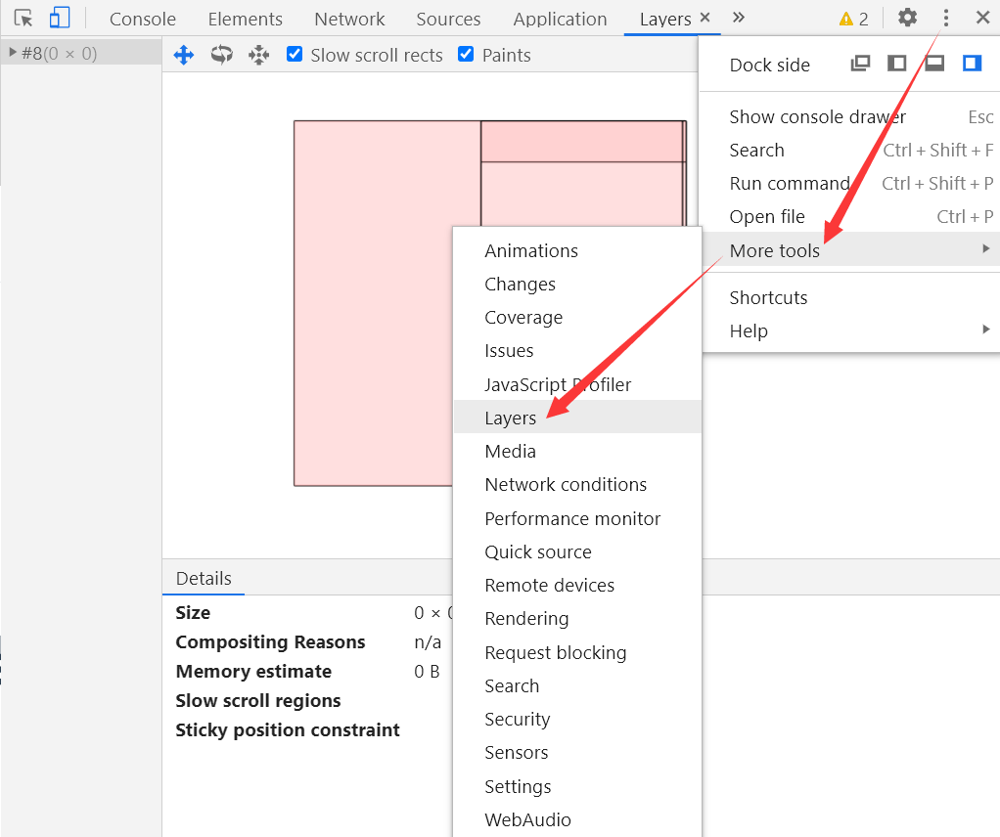

在这里我们可以通过调节来查看页面图层情况

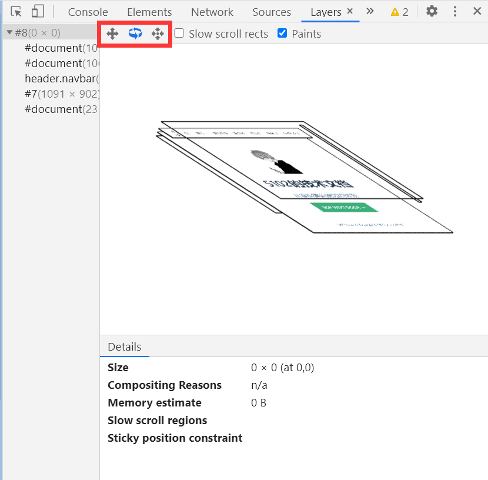

可以看到只有几个图层，这说明了不是所有节点都是单个图层，浏览器会根据节点的渲染情况生成不同的图层

并不是布局树的每个节点都包含一个图层，如果一个节点没有对应的层，那么这个节点就从属于父节点的图层

会被提升为单独图层的情况：

显式合成：

1. 拥有层叠上下文属性的原生会被提升为单独图层
2. 需要剪裁（clip）的地方会被创建为图层
3. 3D变换，translate3d、translateZ不为none
4. 带有will-change属性
5. video、iframe、canvas、webgl标签
6. opacity属性值不为1时
7. position:fixed
8. filter不为none
9. isolation(是否创建新的层叠上下文)值是isolate(创建)，默认情况下为auto

隐式合成：

1. 当一个具有定位属性并且具有z-index值，那么这个元素将会单独创建图层，并且层叠等级比它高的元素都将会被提升为单独图层
2. 当设置了一个比较低的z-index属性，在其上方覆盖了许多嵌套元素，这样一来可能会将提升数百上千个图层，过多的图层将会导致内存占用增加，甚至页面崩溃，这就是层爆炸。适当的提升独立图层有利于页面加速渲染，过度的提升图层将适得其反

我们将尽量避免隐式合成

### 图层绘制

当创建好图层之后，渲染引擎将准备绘制图层。绘制过程会按照一步步绘制，渲染引擎会把一个图层拆分成很多小的**绘制指令**，根据绘制顺序，组成等待绘制的指令列表


其中绘制指令包含绘制的具体信息，包括页面坐标、样式、背景等

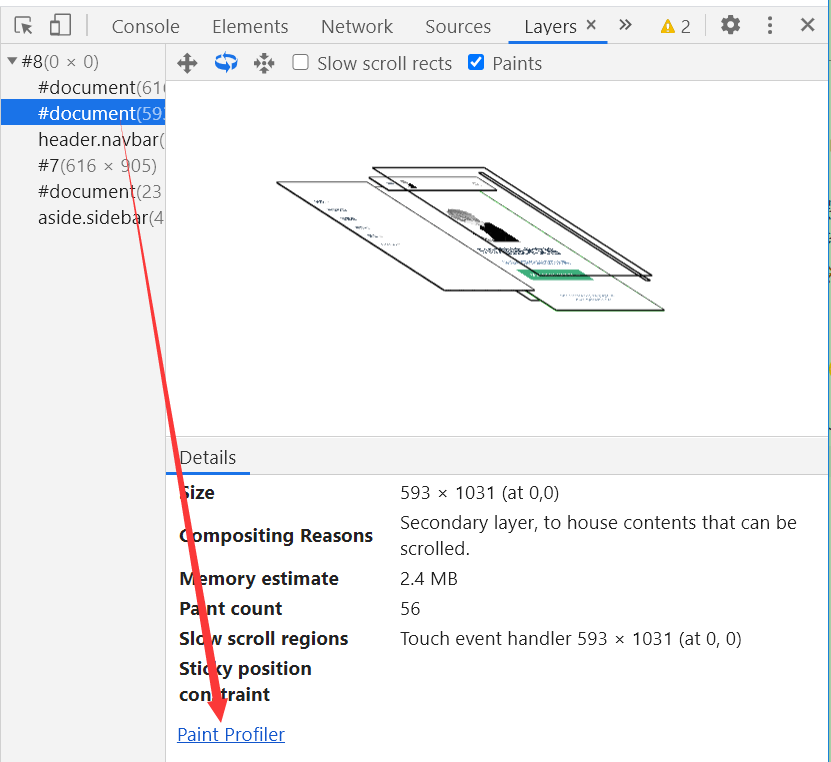

查看具体图层的信息，点击"Paint Profile"来查看这个图层的具体绘制指令列表

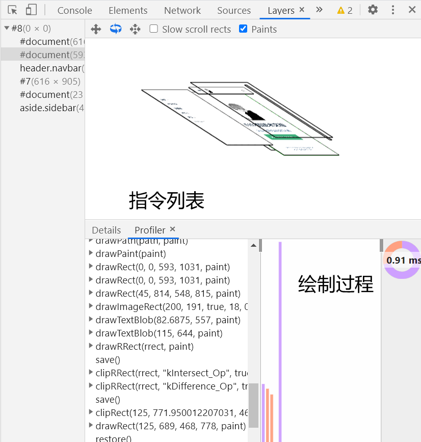

### 分块

当图层指令列表生成后，把绘制指令列表提交给合成线程，并且合成线程会按照视口附近的图层位置，根据显示优先级进行图层分块，根据优先级把绘制图块的指令提交给栅格化线程池进行绘制

- 合成线程会根据当前需要被渲染以及将要被渲染的页面内容优先级，生成对应的图块，然后交给栅格化线程池生成位图

### 栅格化

栅格化线程池接受到合成线程传入的分块绘制指令后，将其打包生成一个个执行任务进行转换

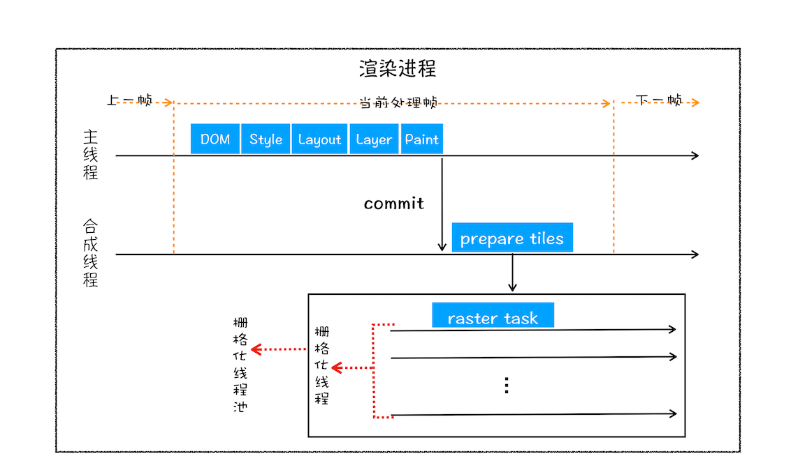

生成位图的任务由栅格化来完成，而图块是栅格化任务执行的最小单位，渲染进程维护了一个栅格化的线程池，所有的图块栅格化都是在线程池内执行的


通常，栅格化过程都会使用 GPU 来加速生成，使用 GPU 生成位图的过程叫快速栅格化，或者 GPU 栅格化，生成的位图被保存在 GPU 内存中

渲染进程与GPU进程通过IPC来进行进程间通信

### 合成显示

当所有图块都被栅格化处理之后，合成线程将会生成绘制命令"DrawQuad"，并把命令提交给浏览器主进程


浏览器主进程中的viz组件用来接收合成线程的"DrawQuad"命令，并且根据命令生成页面内容到内存中，最后显示器再读取内存，最终展示到屏幕上

### reflow重排(回流)

当使用js或者css更新了元素的**几何属性**之后，浏览器将会触发重排。重排需要更新完整的渲染流水线，所以开销也是最大的


触发重排条件：

1. 增加或者删除可见的dom元素
2. 元素的位置发生了改变
3. 元素的尺寸发生了改变，例如边距，宽高等几何属性改变
4. 内容改变，例如图片大小，字体大小改变等
5. 页面渲染初始化
6. 浏览器窗口尺寸改变，例如resize事件发生时等
7. 计算/获取 offsetWidth 和 offsetHeight 等属性
8. table布局，一个小改动引发全部重排

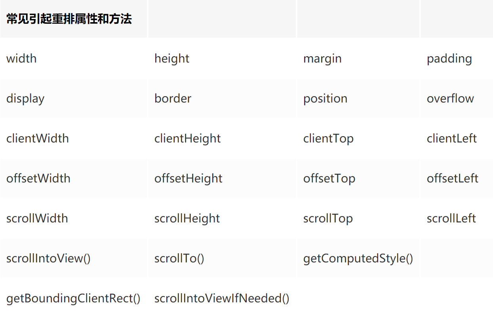

以上是常见的会导致引起重排的属性和方法，我们应当尽量避免操作这些

重排影响范围：

1. 全局范围重排：从根节点html开始对整个渲染树进行重新布局，比如修改全局字体
2. 局部范围重排：对渲染树的某部分或某一个渲染对象进行重新布局，比如只在固定尺寸的几何内修改元素

由于浏览器渲染界面是基于流式布局模型的，所以触发重排时会对周围DOM重新排列

### repaint重绘

当使用js或者css更新了元素的**颜色**等，不会改变几何属性的样式之后，浏览器将会触发重绘。重绘省去了布局和分层阶段，所以执行效率会比重排操作要高一些


一个元素发生外观改变时，没有改变布局，只是修改了元素的颜色，不透明度等，将只会触发重绘

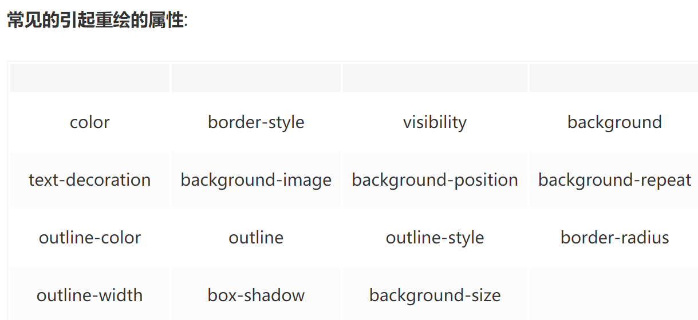

> 每个页面至少需要引发一次重排+重绘，而且重排（回流）一定会引发重绘

### 直接合成

当你更改了一个既不需要重排也不需要重绘的属性之后，浏览器只会进行合成操作，比如使用css的过渡属性来实现动画，相对于重绘和重排，合成能大大提升绘制效率


只会触发合成的操作：

1. transform变换操作
2. opacity不透明度改变

### 渲染队列机制

#### 合并操作

浏览器的渲染队列机制可以保证多次修改合并为一次重排，比如：

```js
div.style.left = '10px';
div.style.top = '10px';
div.style.width = '20px';
div.style.height = '20px';
```

当我们修改了元素的几何属性，导致浏览器触发重排或重绘时。它会把该操作放进渲染队列，等到队列中的操作到了一定的数量或者到了一定的时间间隔时，浏览器就会批量执行这些操作，这就类似于`MutationObserver()`

#### 强制刷新队列

当你修改了样式属性之后，又立即读取样式属性，那么浏览器会任务你需要马上获取最新样式信息，这将导致浏览器马上发生重排/重绘，而不会累计操作一次执行，比如：

```js
div.style.left = '10px';
console.log(div.offsetLeft);
div.style.top = '10px';
console.log(div.offsetTop);
div.style.width = '20px';
console.log(div.offsetWidth);
div.style.height = '20px';
console.log(div.offsetHeight);
```

以上这些操作交换导致4次重排和重绘

读取以下属性、方法将会触发强制刷新队列(立即触发重排重绘)

1. `offsetTop, offsetLeft, offsetWidth, offsetHeight`
2. `scrollTop, scrollLeft, scrollWidth, scrollHeight`
3. `clientTop, clientLeft, clientWidth, clientHeight`
4. `getComputedStyle(),IE的currentStyle`

### 最佳实践

#### 分离读写

```js
div.style.left = '10px';
div.style.top = '10px';
div.style.width = '20px';
div.style.height = '20px';
console.log(div.offsetLeft);
console.log(div.offsetTop);
console.log(div.offsetWidth);
console.log(div.offsetHeight);
```

统一批量修改再查看样式信息，这里只会触发一次重排

#### 一次性改变

```js
// 差 多次修改属性 添加多个队列任务
var left = 10;
var top = 10;
el.style.left = left + "px";
el.style.top  = top  + "px";
// 好 使用类名 一次性增加属性 添加一个队列任务
el.className += " theclassname";
// 好 使用一次性增加属性 添加一个队列任务
el.style.cssText += "; left: " + left + "px; top: " + top + "px;";
```

这里注意，同时修改和分多次修改的区别，一次修改只会添加一次重排/重绘任务，多次修改将会添加多个任务

#### 离线改变DOM

```js
// 多次修改样式前，先脱离文档环境
dom.display = 'none'
//  ...频繁修改操作
// 修改完成之后再显示
dom.display = 'block'
```

不可见元素不会导致重排/重绘，注意`visibility: hidden;`不一样，还存在文档中(占位置)修改会触发重排

```js
// 创建片段
const fragment = document.createDocumentFragment()
// 给片段添加元素
fragment.appendChild(element)

// 将修改完成的片段添加到真实dom中
node.appendChild(fragment)
```

通过`document.createDocumentFragment()`创建原始dom的文档片段副本进行批量操作dom之后，再替换原有dom，这也同样只触发一次重排

#### 优化动画

1. 把动画应用在position属性为absolute或者fixed的元素上，这样开销会小
2. 使用GPU加速来优化动画，使用transform变化、opacity来实现动画，尽量不使用js来实现动画效果

GPU硬件加速包括：Canvas2D，布局合成, CSS3转换（transitions），CSS3 3D变换（transforms），WebGL和视频(video)

[浏览器渲染过程与性能优化](https://juejin.im/post/6844903501953237006#heading-0)

[一篇文章说清浏览器解析和CSS（GPU）动画优化](https://segmentfault.com/a/1190000008015671)

[浏览器内部工作原理](https://www.cnblogs.com/wyaocn/p/5761163.html)

[极客时间——浏览器工作原理与实践](https://time.geekbang.org/column/article/118205)

推荐国外资料：

[Web浏览器内部资源汇总](https://developers.google.com/web/updates/2012/04/Round-up-of-Web-Browser-Internals-Resources)