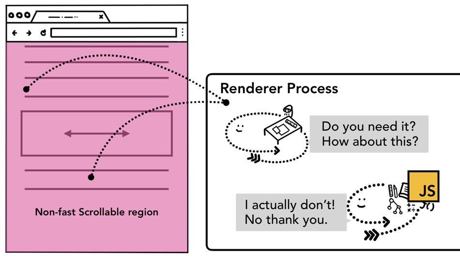

# 深入浏览器工作原理(中)

这篇主要介绍浏览器处理输入事件、渲染进程事件循环

## 浏览器如何处理输入事件

这里，你能了解到浏览器是怎么监听事件，并且更新页面

### 从浏览器的角度看事件

在浏览器角度，任何用户的交互行为都算是输入事件，比如移动鼠标、鼠标滚轮滚动、鼠标悬停、点击、触摸屏等

当用户触发行为时，**浏览器进程是最先接收行为**的进程，但是由于页面内容是由渲染进程处理，因此浏览器进程只会知道触发行为的位置，而不会知道到底需要做些什么


因此**浏览器主进程**将触发的**事件类型以及坐标位置**发送**给渲染进程**，**渲染进程根据坐标信息，定位出事件目标并且运行事件处理程序**

### 渲染进程如何处理接收的事件

如果页面**没有存在任何的输入事件监听器**，那么**合成线程**将会创建一个**新的合成框架**，以便重新渲染页面

#### 非快速滚动区域

由于运行JavaScript是主线程的工作，因此在合成页面时，合成器线程会将页面上**具有事件处理程序**的区域**标记为“非快速可滚动区域”**

根据事件发生的坐标来判断触发的事件是否处于“非快速可滚动区域”，也就是触发在添加了事件处理程序的区域中，如果是，那么**合成线程将会把输入事件信息发送渲染主线程**，以便处理事件回调。如果不是，合成线程将不会等待主线程，而**直接合成新帧(跳过重排/重绘，直接进入合成)**


### 使用事件处理程序需要注意的

在开发中我们经常使用事件委托处理程序

```js
document.body.addEventListener('touchstart', event => {
    if (event.target === area) {
        event.preventDefault();
    }
});
```

**事件委托**可以帮助我们节省很多代码，但是基于“非快速可滚动区域”，使得**页面中大部分的区域变为“非快速可滚动区域”**，这样一来，大部分触发的事件都**需要由合成线程发送给主线程处理**，并在每次输入事件发生时等待它。因此，合成线程的平滑度下降



为了减轻大面积的“非快速可滚动区域”导致合成效率降低的问题，我们可以在注册事件监听处理程序时设置`{ passive: true }`选项，这将向浏览器说明事件**仍需要监听**，但是合成器也可以**继续合成新帧**而不必等待主线程处理

当设置了`{ passive: true }`，页面将会更加平滑，但是如果使用preventDefault限制事件触发，那么preventDefault将会被**延迟处理**。由于`passive: true`会导致合成线程**不等待**主线程处理事件之后再生成新帧，这将导致preventDefault不会立即生效

```js
document.body.addEventListener('pointermove', event => {
    if (event.cancelable) {
        event.preventDefault(); // block the native scroll
        /*
        *  do what you want the application to do here
        */
    }
}, {passive: true});
```

使用`event.cancelable`来检查事件是否能够取消

### 如何命中事件目标

当合成线程把输入事件发送给主线程之后，主线程就需要根据触发事件信息(事件类型、触发坐标)，并且在渲染过程中生成的**绘制记录(绘制命令)**数据中找出**事件发生坐标点下的内容(找出事件触发目标的样式信息)**


### 最小化事件触发(节流)

众所周知大多数的显示器每秒刷新频率在60次，也就是60HZ、16.66ms刷新一次屏幕。对于输入设备来说，大多数触摸屏以每秒60-120次触发触摸事件，而鼠标则在100次，可以看出输入事件触发频率高于屏幕刷新频率，这将导致在一帧中有过多的重复事件被处理，但却又没能立即体现到屏幕上


如果在一帧中多次触发事件那么将浪费一部分的处理结果，最终也只会渲染最新的处理结果。为了降低对主程序的过渡调用，Chrome将**合并连续触发的事件**(比如wheel，mousewheel，mousemove，pointermove， touchmove)，以及延迟到requestAnimationFrame中处理


这样一来，连续触发的事件将**在一帧中合并处理**

对于**离散的事件**，比如keydown，keyup，mouseup，mousedown，touchstart，和touchend将会**立即触发**

> 简单讲，Chrome对连续触发的事件进行节流，并在requestAnimationFrame中统一处理

#### 获取每次触发的事件对象

对于大多数情况下，事件节流有利于我们高效的处理事件，但是在某些情况下可能会导致一些问题(由于事件节流，每次触发不一定都能立即执行事件处理程序)

当我们基于鼠标移动事件来绘制一条弧线时，由于事件节流，导致绘制的路径只有60次/秒的精度，这样一来当我们快速的移动鼠标绘制的曲线也就成了这样


我把它称为抗锯齿曲线

为了保证在页面不能及时渲染的情况下也能正确记录精确的绘制路径，我们就需要在事件处理程序中使用如下操作

```js
window.addEventListener('pointermove', event => {
    const events = event.getCoalescedEvents();
    for (let event of events) {
        const x = event.pageX;
        const y = event.pageY;
        // draw a line using x and y coordinates.
    }
});
```

即便Chrome合并处理连续触发的事件，但是事件对中**依然保存了每次触发时的事件信息**，通过`event.getCoalescedEvents()`获取每次触发的事件对象，当合并执行时，将按照记录绘制一帧完整的路径

[国外资料](https://developers.google.com/web/updates/2018/09/inside-browser-part4)