# CSS常见布局

## 单列布局

许多网站都是使用这种布局，从上至下只有一列

单列布局主要有header、content、footer组成，由于header于footer有不同的布局方式又分为，等宽与通栏布局

### 单列等宽布局

header、content、footer都是相同宽度，且居中

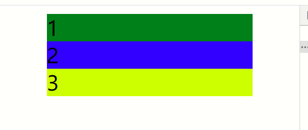

```js 单列布局等宽
<style>
  .header {
    max-width: 200px;
    margin: 0 auto;
    background-color: green;
  }
  .content {
    max-width: 200px;
    margin: 0 auto;
    background-color: blue;
  }
  .footer {
    max-width: 200px;
    margin: 0 auto;
    background-color: yellow;
  }
</style>
<div class="header">1</div>
<div class="content">2</div>
<div class="footer">3</div>
```

以上通过定宽+`margin:0 auto`居中就实现了单例定宽居中

### 单列通栏布局

此布局与上一种布局不同点就是header与footer不设置宽度，通过块级元素的自适应撑满宽度来达到通栏效果

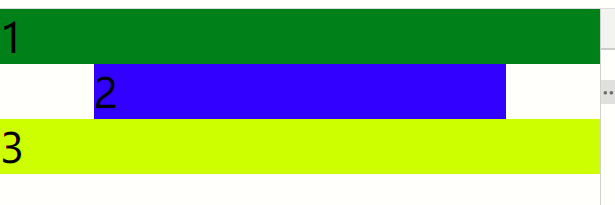

```js 单列布局通栏
<style>
  *{
    margin: 0;
  }
  .header {
    background-color: green;
  }
  .content {
    max-width: 200px;
    margin: 0 auto;
    background-color: blue;
  }
  .footer {
    background-color: yellow;
  }
</style>
<div class="header">1</div>
<div class="content">2</div>
<div class="footer">3</div>
```

此布局不需要给header、footer宽度，也不需要居中，即可实现

## 双列布局

双列布局分为左右两列，一般情况其中一列设置为侧边栏，另一列设置为主体

### 绝对定位实现双列布局

通过对左右列进行绝对定位，主体列通过margin控制位置


```js 双列定位布局
<style>
  .contain {
    position: relative;
    max-width: 200px;
    margin: 0 auto;
    background-color: green;
  }

  .aside {
    position: absolute;
    width: 50px;
    background-color: blue;
  }

  .main {
    position: absolute;
    margin-left: 50px;
    width: 150px;
    background-color: yellow;
  }
</style>
<div class="contain">
  <div class="aside">1</div>
  <div class="main">2</div>
</div>
```

父容器有定位属性，且居中，子容器通过绝对定位实现双列布局

### float+BFC实现双列自适应布局

此布局在BFC中有详解，这里简单说明


```js 双列浮动BFC自适应布局
<style>
  .contain {
    max-width: 200px;
    margin: 0 auto;
    border: 2px solid black;
  }
  .float {
    float: left;
    background-color: blue;
  }
  .main {
    overflow: hidden;
    height: 50px;
    background-color: yellow;
  }
</style>
<div class="contain">
  <div class="float">1</div>
  <div class="main">2</div>
</div>
```

可以看到浮动元素不在main盒子内部，而是被挤开，浮动盒子可以定宽或者不定宽由内容撑开，这些都取决于你的需求

### flex实现双列自适应布局

flex就可以很容易实现双列自适应布局，通过给父容器设置flex盒子，子容器通过按比例分配剩余空间来实现自适应布局。flex自适应也可适应于多列


```js 双列flex自适应布局
<style>
  .contain {
    max-width: 200px;
    margin: 0 auto;
    border: 2px solid black;

    display: flex;
  }
  .left {
    flex: 1;
    background-color: blue;
  }
  .right {
    flex: 2;
    background-color: yellow;
  }
</style>
<div class="contain">
  <div class="left">1</div>
  <div class="right">2</div>
</div>
```

很简单的实现，使用弹性盒模型自身属性就可以轻易达到效果，而且还是自适应

### grid实现双列自适应布局

grid又是一种新型布局方式，对于table来说更加方便


```js 双列grid自适应布局
<style>
  .contain {
    max-width: 200px;
    margin: 0 auto;
    border: 2px solid black;

    display: grid;
    grid-template-columns: 1fr 2fr;
  }
  .left {
    background-color: blue;
  }
  .right {
    background-color: yellow;
  }
</style>
<div class="contain">
  <div class="left">1</div>
  <div class="right">2</div>
</div>
```

只给父容器设置了`display:grid`与`grid-template-columns: 1fr 2fr;`就实现了双列自适应布局，非常方便，这里的fr单位类似flex的剩余空间分配，通过设置fr的比例分配剩余空间

### 通过浮动以及定宽实现双列布局

浮动元素会按照行进行排列，通过设置%宽度占满父容器的宽度来实现双列布局


```js 双列浮动定宽布局
<style>
  .contain {
    max-width: 200px;
    margin: 0 auto;
    border: 2px solid black;
    overflow: hidden;
  }
  .left {
    float: left;
    width: 30%;
    background-color: blue;
  }
  .right {
    float: left;
    width: 70%;
    background-color: yellow;
  }
</style>
<div class="contain">
  <div class="left">1</div>
  <div class="right">2</div>
</div>
```

两列都使用浮动，再通过%定宽或者指定像素撑满父容器宽度即可

> 由于CSS渲染机制，建议把主体部分写在前面，可以通过改变顺序来实现相同布局效果，好处就是主体优先加载

## 三列布局

最常规的三列布局即左中右，左右为侧边栏中间为主体部分，通常左右固定，主体自适应宽度

### 通过浮动实现

通过浮动元素浮在标准流元素上方，再通过标准流元素设置margin为左右浮动元素的宽度，空出位置给浮动元素占用，实现三列布局


```js 三列浮动布局
<style>
  .contain {
    max-width: 200px;
    margin: 0 auto;
    border: 2px solid black;
    overflow: hidden;
  }
  .left {
    float: left;
    width: 20%;
    background-color: blue;
  }
  .right {
    float: right;
    width: 20%;
    background-color: yellow;
  }
  .middle {
    margin: 0 20%;
    height: 50px;
    background-color: rgb(255, 0, 0);
  }
</style>
<div class="contain">
  <div class="left">1</div>
  <div class="right">3</div>
  <div class="middle">2</div>
</div>
```

不过这样的布局无法实现主体内容优先渲染

### 圣杯布局实现三列布局

通过给元素都设置浮动，使其能够在同一行上显示，由于需要实现中间自适应，那么中间列需要自动宽度，而导致中间列撑满一行，左右列被挤到下一行中，不过这样的布局可以让主体部分优先渲染


```js 三列圣杯布局
<style>
  .contain {
    max-width: 200px;
    margin: 0 auto;
    border: 2px solid black;
    overflow: hidden;
    padding: 0 50px;
  }
  .left {
    float: left;
    width: 50px;
    margin-left: -100%;
    position: relative;
    left: -50px;
    background-color: blue;
  }
  .right {
    float: left;
    width: 50px;
    margin-left: -50px;
    position: relative;
    left: 50px;
    background-color: yellow;
  }
  .middle {
    float: left;
    width: 100%;
    background-color: rgb(255, 0, 0);
  }
</style>
<div class="contain">
  <div class="middle">2</div>
  <div class="left">1</div>
  <div class="right">3</div>
</div>
```

这种布局有些复杂，不过认真分析原理就简单多了

- 三列都使用浮动，由于浮动元素可以在同一行显示所以使用浮动
- 主体部分需要自适应，所以设置宽度100%
- 如果父容器没有高度的情况下需要清除浮动，且设置padding是为了之后给左右栏腾出位置
- 左右栏部分
  - 定宽，这样主体可以自适应，以及后续操作方便
  - 相对定位+左右偏移，真好定位到父容器腾出的位置，且不会遮挡主体部分
  - 重点部分，左栏设置`margin-left:-100%`
    - 个人理解：元素在页面上占据的总宽度=左右外边距宽度+左右边框宽度+左右内边距宽度+内容宽度，当左栏设置了`margin-left:-100%`，此处的100%为父容器内容宽度即200px，由于左栏内容宽度50px，所以计算之后左栏占据空间总宽度=-200px+50px=-150px，这样一来，左栏在页面上占据的宽度为负数，则往回移动，由于正宽度是追加排列，负宽度则是回走排列，即在有正宽度的情况下按照正常从左到右，不够换行的方式排列，而负宽度则就是往回走，从右往左，不够则回到上行，直到抵消负宽度值
  - 右栏同理

这里通过图解来说明

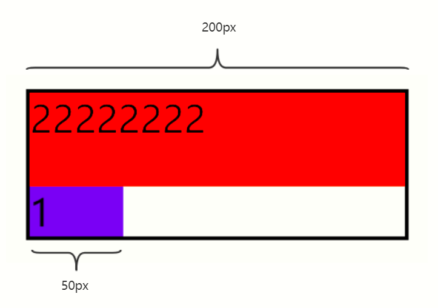

这是未使用负边距时的布局情况，接下来使用负边距看看效果

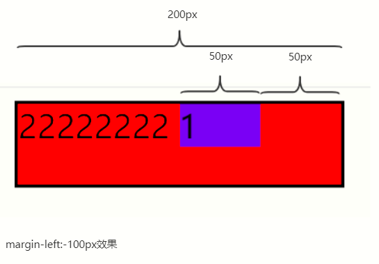

这是`margin-left:-100px`的效果，看看对比图

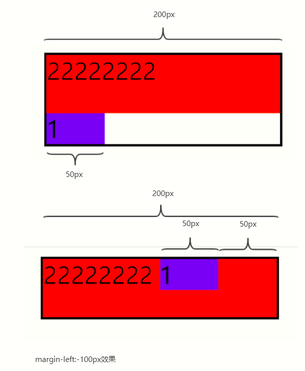

通过对比，可以看出元素1回走了100px，由于`margin-left:-100px`，导致元素1在页面上占据空间的总宽度从原来自身宽度的50px，变成-100px+50px=-50px。当元素没有自身宽度的时候其空间位置就是上一个元素的结尾位置，所以在上一个元素结尾位置再向前移动50px则是当前元素的最终位置。当然元素自身渲染出来的宽度是由width属性决定，但是空间上的位置是由总宽度来计算

> 这里注意，如果不是浮动元素，就算回走也不会跳到上一行，这是因为块级元素在垂直方向上是竖直排列，而浮动元素是以水平排列，至于换行，是因为放不下才另起一行排列，本质上还是横向排列

看看完整的圣杯布局吧!

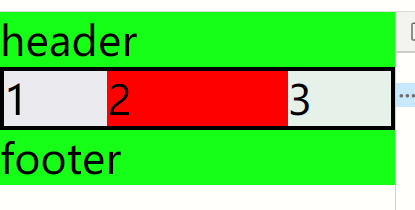

```js 圣杯布局
<style>
  *{
    margin: 0;
    padding: 0;
  }
  .contain {
    margin: 0 auto;
    border: 2px solid black;
    overflow: hidden;
    padding: 0 50px;
  }
  .left {
    float: left;
    width: 50px;
    margin-left: -100%;
    position: relative;
    left: -50px;
    background-color: rgb(234, 234, 241);
  }
  .right {
    float: left;
    width: 50px;
    margin-left: -50px;
    position: relative;
    left: 50px;
    background-color: rgb(234, 241, 234);
  }
  .middle {
    float: left;
    width: 100%;
    background-color: rgb(255, 0, 0);
  }
  .header,.footer{
    background-color: chartreuse;
  }
</style>
<div class="header">header</div>
<div class="contain">
  <div class="middle">2</div>
  <div class="left">1</div>
  <div class="right">3</div>
</div>
<div class="footer">footer</div>
```

这样是不是更像圣杯呢？

不过圣杯也缺点

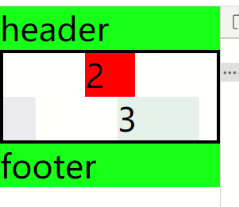

- 当主体内容宽度小于左栏宽度时，左右栏会回到原来位置，由于左栏margin值是相对于主体部分自适应的，所以当主体部分margin值小于左栏自身宽度时，其占据空间的总宽度为正值，则不会往回走，最多自身渲染大小缩小，直到负宽度时才会回走。右栏由于是相对于左栏尾部位置进行追加，所以也跟随左栏同时换行

对于这个问题设置主体最小宽度不小于左栏宽度即可

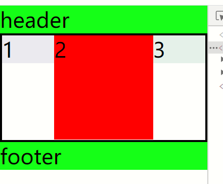

- 由于主体部分高度增加，导致左右栏无法适应等高情况，出现留空情况

对于这种情况通过等高布局就可以解决

### 双飞翼布局

双飞翼布局与圣杯布局类似，只是在左右栏位置处理上的思路不同，圣杯布局是通过定位与父容器留位置实现不遮挡主体，而双飞翼布局是通过创建额外标签放置主体，通过margin给左右栏留位置，这个好处就避免了圣杯由于宽度减小导致左右栏跳动问题


```js 三列双飞翼布局
<style>
  *{
    margin: 0;
    padding: 0;
  }
  .contain {
    max-width: 200px;
    margin: 0 auto;
    border: 2px solid black;
    overflow: hidden;
  }
  .left {
    float: left;
    width: 50px;
    margin-left: -100%;
    background-color: rgb(234, 234, 241);
  }
  .right {
    float: left;
    width: 50px;
    margin-left: -50px;
    background-color: rgb(234, 241, 234);
  }
  .middle {
    float: left;
    width: 100%;
    background-color: rgb(255, 0, 0);
  }
  .content{
    margin: 0 50px;
    background-color: cornflowerblue;
  }
</style>
<div class="contain">
  <div class="middle">
    <div class="content">2</div>
  </div>
  <div class="left">1</div>
  <div class="right">3</div>
</div>
```

双飞翼布局更加简单些，不过增加了个内部存放主体的标签

对比上述2种布局异同点

- 两种布局方式都是把主列放在文档流最前面，使主列优先加载。
- 两种布局方式在实现上也有相同之处，都是让三列浮动，然后通过负外边距形成三列布局。
- 两种布局方式的不同之处在于如何处理中间主列的位置：圣杯布局是利用父容器的左、右内边距+两个从列相对定位；双飞翼布局是把主列嵌套在一个新的父级块中利用主列的左、右外边距进行布局调整

### 通过flex或者grid实现三列自适应布局

flex与grid可以说是布局上的万金油，可以解决大部分的布局问题，唯一不足可能就是兼容性吧，当然也没有优先加载的特点


一样的效果

```js 三列flex布局
<style>
  .contain {
    max-width: 200px;
    margin: 0 auto;
    border: 2px solid black;
    display: flex;
  }
  .left {
    flex: 1;
    background-color: rgb(234, 234, 241);
  }
  .right {
    flex: 1;
    background-color: rgb(234, 241, 234);
  }
  .middle {
    flex: 2;
    background-color: rgb(255, 0, 0);
  }
</style>
<div class="contain">
  <div class="left">1</div>
  <div class="middle">2</div>
  <div class="right">3</div>
</div>
```

flex布局，一如既往的简单，况且还能自适应

```js grid
<style>
  .contain {
    max-width: 200px;
    margin: 0 auto;
    border: 2px solid black;
    display: grid;
    grid-template-columns: 1fr 2fr 1fr;
  }
  .left {
    background-color: rgb(234, 234, 241);
  }
  .right {
    background-color: rgb(234, 241, 234);
  }
  .middle {
    background-color: rgb(255, 0, 0);
  }
</style>
<div class="contain">
  <div class="left">1</div>
  <div class="middle">2</div>
  <div class="right">3</div>
</div>
```

grid两行实现，当然事物都有双面性，看你取舍咯。

## 等高布局

实现每列都是相同高度，在多列布局中应用

### 通过flex与grid实现等高布局

话不多说，直接上代码，效果就是拉满高度

```js 通过flex与grid实现等高布局
<!-- flex -->
<style>
  .contain {
    max-width: 200px;
    margin: 0 auto;
    border: 2px solid black;
    display: flex;
  }
  .left {
    flex: 1;
    background-color: rgb(18, 18, 224);
  }
  .right {
    flex: 1;
    background-color: rgb(12, 240, 12);
  }
  .middle {
    height: 100px;
    flex: 1;
    background-color: rgb(255, 0, 0);
  }
</style>
<div class="contain">
  <div class="left">1</div>
  <div class="middle">2</div>
  <div class="right">3</div>
</div>
<!-- grid -->
<style>
  .contain {
    max-width: 200px;
    margin: 0 auto;
    border: 2px solid black;
    display: grid;
    grid-template-columns: 1fr 1fr 1fr;
  }
  .left {
    background-color: rgb(18, 18, 224);
  }
  .right {
    background-color: rgb(12, 240, 12);
  }
  .middle {
    height: 100px;
    background-color: rgb(255, 0, 0);
  }
</style>
<div class="contain">
  <div class="left">1</div>
  <div class="middle">2</div>
  <div class="right">3</div>
</div>
```

这两种方法可谓是万金油，看看兼容性吧

flex兼容性

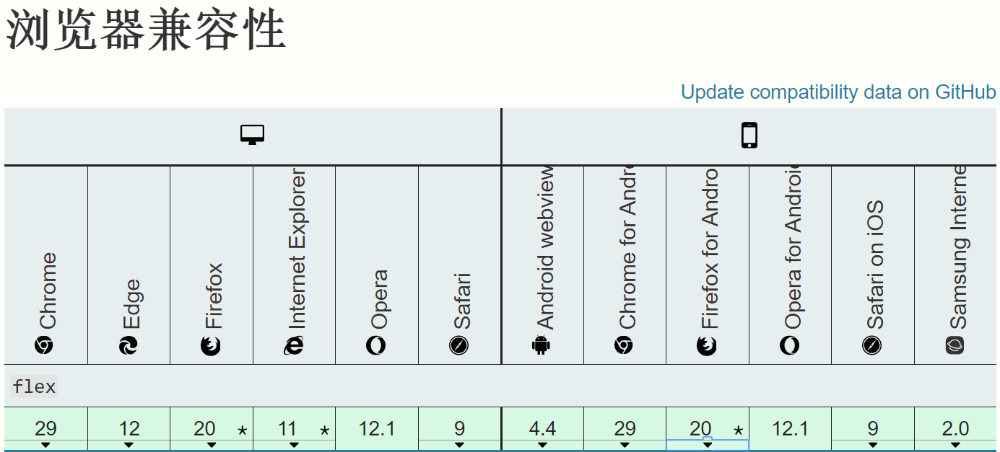

grid兼容性

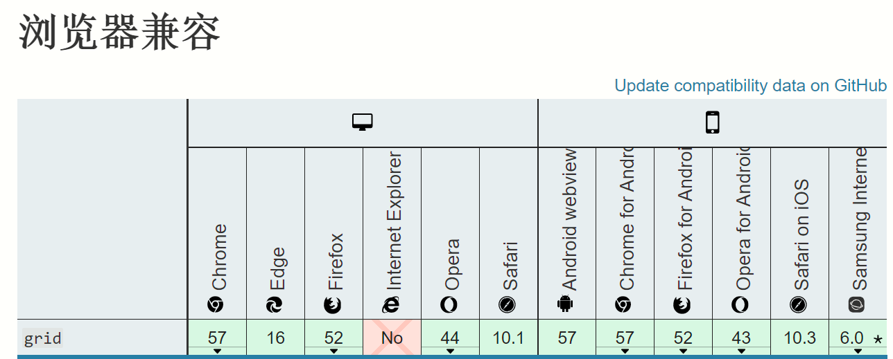

flex兼容性好些，不过ie是个坎

### 通过绝对定位实现等高

左右栏使用绝对定位，右栏定位到右边，都不设置高度，且左右各设置`top:0;bottom:0`实现充满父容器高度，且主体部分通过外边距留位置即可

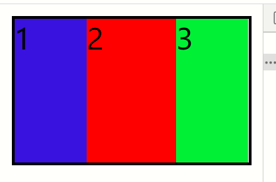

```js 等高效果
<style>
  .contain {
    max-width: 200px;
    margin: 0 auto;
    border: 2px solid black;
    position: relative;
  }
  .left {
    position: absolute;
    top: 0;
    bottom:0;
    width: 50px;
    background-color: rgb(18, 18, 224);
  }
  .right {
    position: absolute;
    right: 0;
    top: 0;
    bottom:0;
    width: 50px;
    background-color: rgb(12, 240, 12);
  }
  .middle {
    margin: 0 50px;
    height: 100px;
    background-color: rgb(255, 0, 0);
  }
</style>
<div class="contain">
  <div class="left">1</div>
  <div class="middle">2</div>
  <div class="right">3</div>
</div>
```

### 使用table布局实现等高

由于表格元素的单元格默认等高，所以也可以借助此属性实现元素等高效果

```js 使用table布局实现等高
<style>
  .contain {
    max-width: 200px;
    margin: 0 auto;
    border: 2px solid black;
    display: table;
  }
  .left {
    display: table-cell;
    width: 50px;
    background-color: rgb(18, 18, 224);
  }
  .right {
    display: table-cell;
    width: 50px;
    background-color: rgb(12, 240, 12);
  }
  .middle {
    display: table-cell;
    width: 100px;
    height: 100px;
    background-color: rgb(255, 0, 0);
  }
</style>
<div class="contain">
  <div class="left">1</div>
  <div class="middle">2</div>
  <div class="right">3</div>
</div>
```

父容器设置为table布局，其内部元素设置为`table-cell`，即表格单元格布局，其高度默认就是等高，以最高单元格高度为准

### 伪等高实现

伪等高主要用在不显示真实内容，通过背景或者图片等方式达到视觉上与主体等高，但是其实只是画面上是感觉等高，实际元素并不是等高

#### padding与负margin实现伪等高

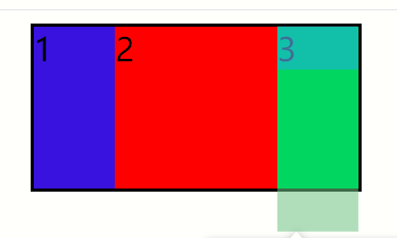

可以看到实际上左右栏的高度没有改变，只是通过padding把背景颜色填满高度

```js 伪等高
<style>
  .contain {
    max-width: 200px;
    margin: 0 auto;
    border: 2px solid black;
    overflow: hidden;
  }
  .left {
    float: left;
    width: 50px;
    margin-bottom: -100px;
    padding-bottom: 100px;
    background-color: rgb(18, 18, 224);
  }
  .right {
    float: left;
    width: 50px;
    margin-bottom: -100px;
    padding-bottom: 100px;
    background-color: rgb(12, 240, 12);
  }
  .middle {
    float: left;
    width: 100px;
    height: 100px;
    background-color: rgb(255, 0, 0);
  }
</style>
<div class="contain">
  <div class="left">1</div>
  <div class="middle">2</div>
  <div class="right">3</div>
</div>
```

此处需要用到浮动，以及父元素清除浮动和超出的padding部分背景，`margin`原理同圣杯布局，这里的负外底边距是为了抵消`padding`的底部填充部分，使其还是只占据本身高度空间

#### 边框伪装实现伪等高

通过主体的边框来实现冒充左右栏的背景。

具体步骤:

- 主体设置左右边框，颜色同左右栏背景色
- 左右栏通过绝对定位到边框位置上，且设置背景为透明色，这样才能显示边框伪造背景，或者使用左右浮动来定位

```js 边框伪装实现伪等高
<style>
  .contain {
    max-width: 200px;
    margin: 0 auto;
    border: 2px solid black;
    overflow: hidden;
  }
  .left {
    float: left;
    width: 50px;
  }
  .right {
    float: right;
    width: 50px;
  }
  .middle {
    width: 100px;
    height: 100px;
    border-left: 50px solid rgb(18, 18, 224);
    border-right: 50px solid rgb(12, 240, 12);
    background-color: rgb(255, 0, 0);
  }
</style>
<div class="contain">
  <div class="left">1</div>
  <div class="right">3</div>
  <div class="middle">2</div>
</div>
```

效果一致，也可用绝对定位哦！

#### 背景图实现伪等高

这操作没谁了，使用一张背景图伪装成左右栏背景的填充，实现视觉等高，这就不演示了吧！

CSS布局先补充到这里，持续更新。。。