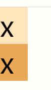
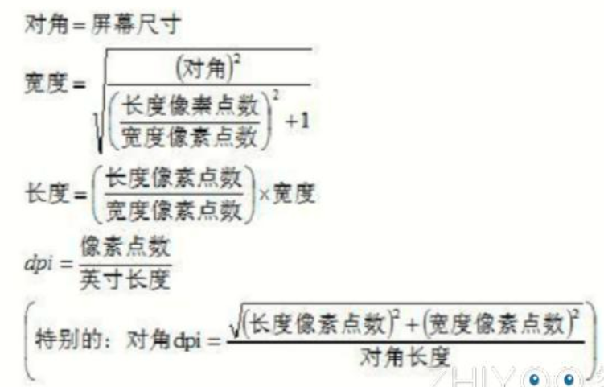
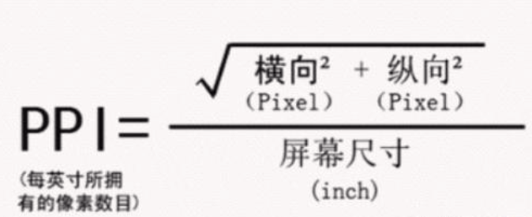
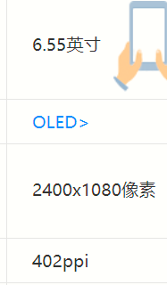

# CSS单位

CSS中到处都需要使用单位，各类属性也离不开单位，通过不同单位我们可以实现不同的效果，来达到预期结果

## 绝对单位

本身具有实际大小，而不是根据其他来适应

### px像素

先看看换算

`1in = 2.54cm = 25.4 mm = 101.6q = 72pt = 6pc = 96px`

- 一像素（pixel）。对于普通的屏幕，通常是一个设备像素（点）
- 对于打印机和高分辨率屏幕，一个 CSS 像素往往占多个设备像素
- 一般来说，每英寸的像素的数量保持在 96 左右， 1px = 1in 的 96 分之一
- 对于高 dpi 设备，英寸（in）、厘米（cm）和毫米（mm）与物理设备相同
- 对于低 dpi 设备，单位 px 表示物理参考像素;其他单位是相对于它定义的
- 也就是说，高dpi的设备上的CSS单位换算成实际单位，其表示的长度与现实单位长度一致

### cm厘米

一厘米。 1cm = 96px / 2.54

### mm毫米

一毫米。 1mm = 1/10 * 1cm

### in英寸

一英寸。1in = 2.54cm = 96px

### pc派卡

一十二点活字（pica），六分之一英寸。 1pc = 12pt = 1/6 * 1in
十二点活字（印刷中使用的），相当于我国新四号铅字的尺寸

### pt磅

一磅（point），72 分之一英寸。1 pt = 1/12 * 1 pc = 1/72 * 1 in

## 相对单位(基于字体)

- 相对长度代表着以其它距离为单位的一种尺寸
- 这个单位可以是指定字符的大小，行高，或者是 viewport 的大小

### ch“0”的宽度

- ch文档数字“0”的的宽度
- 这一单位代表元素所用字体 font 中“0”这一字形的宽度（"0"，Unicode字符U+0030），更准确地说，是“0”这一字形的预测尺寸
- 如果无法确定“ 0”字形的大小，则必须假定其宽为 0.5em，高为 1em


如上图，都定义了10ch的宽度，上面一个无法装下10个b，下面可以装下10个0，说明b比0宽。ch就是以当前字体中0的宽度为基准，即0的宽度=1ch

### em

- em单位相对于文档的`font-size`的大小
- 如果用在font-size 属性本身，它则表示元素继承的 font-size 值


```html em
<style>
  *{
    margin: 0;
    border: 0;
  }
  html{
    font-size: 16px;
  }
  .text1{
    position: absolute;
    font-size: 32px;
    width: 10em;
    background-color: bisque;
  }
  .text2{
    position: absolute;
    top: 50px;
    font-size: 2em;
    width: 10em;
    background-color: rgb(224, 168, 100);
  }
</style>
<span class="text1">0</span>
<span class="text2">0</span>
```

从上面可以看出，em的值是以当前元素的`font-size`值为基准，但是也可以基于继承的`font-size`值为基准，即1em=当前`font-size`值。

- 如果当前元素没有自己定义的`font-size`则从祖先元素继承`font-size`的值为基准,否则以自身`font-size`的值为基准
- 如果当前元素设置`font-size`的值为em单位，则此em是以最近的祖先元素为基准

### ex

- 此单位类似ch，这个单位是以当前字体的小写x的高度为基准，即1ex=当前字体x的高度
- 对于很多字体来说，1ex ≈ 0.5em

### rem

- 这个单位代表根元素的 font-size 大小（例如 `<html>` 元素的font-size）
- 当用在根元素的 font-size 上面时 ，它代表了它的初始值



```html rem
<style>
  *{
    margin: 0;
    border: 0;
  }
  html{
    font-size: 1rem; /* 也可以直接用px单位， 这里1rem=20px，浏览器默认比例 */
  }
  .text1{
    width: 20px;
    background-color: bisque;
  }
  .text2{
    width: 1rem;
    background-color: rgb(224, 168, 100);
  }
</style>
<div class="text1">x</div>
<div class="text2">x</div>
```

rem单位如果用在非根元素上则说明是以根元素设置的`font-size`为基准，即1rem=根元素的`font-size`大小，如果用在根元素的`font-size`上则说明是以浏览器的rem为基准

## 相对单位(基于视口)

以视口为比例的单位，随视口变化而变换
可以看成把视口的高宽分成100等份

### vh

- 视口的初始包含块的高度的 1%，即初始视口高度的1%，1vh=初始视口高度1%

### vw

- 视口的初始包含块的宽度的 1%，即初始视口宽度的1%，1vw=初始视口宽度1%

### vmin

- 视口高度 vw 和宽度 vh 两者之间的最小值
- vmin=以vw与vh中较小的一方为基准
- 比如1vw=20px，1vh=30px，那么1vmin=1vw=20px，以总大小较小的一方为准

### vmax

- 视口高度 vw 和宽度 vh 两者之间的最大值
- vmax=以vw与vh中较大的一方为基准
- 比如1vw=20px，1vh=30px，那么1vmax=1vh=30px，以总大小较大的一方为准

### %

- 最后一个单位%，是以父元素的值为基准
- 比如父元素的`height:20px`，那么子元素的`height:50%`相对于`height:10px`，即对应属性相对于父元素对应属性的值的%比例
- 这里注意是相对于父元素同属性值的%

以上这些就是目前已经标准化的单位了，对于一些还在实验的单位就不描述了

最常用的就是em，rem，px，vh、vw、%这些，不过由于需要适应各种设备，使用rem或者em更好些，修改起来也方便

## 像素/分辨率详解

针对于各种设备，以及各种物理单位之间的换算可能不太清楚，这里系统的讲解一下，就算是科普吧

### dpi

- dpi每英寸包含点的数量（dots per inch），又可分为水平dpi和垂直dpi
- 普通屏幕通常包含96dpi，一般将2倍于此的屏幕称之为高分屏，即大于等于192dpi的屏幕
- 比如Mac视网膜屏就达到了192dpi（即2dppx），打印时一般会需要更大的dpi
- 普通屏幕为96dpi，即1in(英寸)长度包含了96个点，此时1dppx=96dpi，1dppx就是每像素包含的点个数，1dpcm ≈ 2.54dpi，1dpcm就是每厘米包含的点数量
- 正常情况`1in = 2.54cm = 25.4 mm = 101.6q = 72pt = 6pc = 96px`



以上是关于dpi以及设备长宽、像素之间的计算

### ppi

- ppi每英寸像素数



接下来通过一个数据来验证公式



ppi=斜边总px/斜边总英寸

上图ppi=(2400^2+1080^2)^0.5/6.55=402,看来公式没错，就是为斜边像素与英寸数之比，由于有些设备的像素点不是正方形，所以统一使用斜边计算

### dppx

- dppx每像素包含的点数
- 一般的显示器每一个px用一个物理点来表示，比较好的屏幕可能会使用2个点来表示1px
- 比如iphone手机，使用的是2dppx，即1px=2个物理点，这样一来屏幕显示的细腻程度越高

[推荐文章](https://juejin.im/post/5cddf289f265da038f77696c)

<Vssue title="CSS issue" />