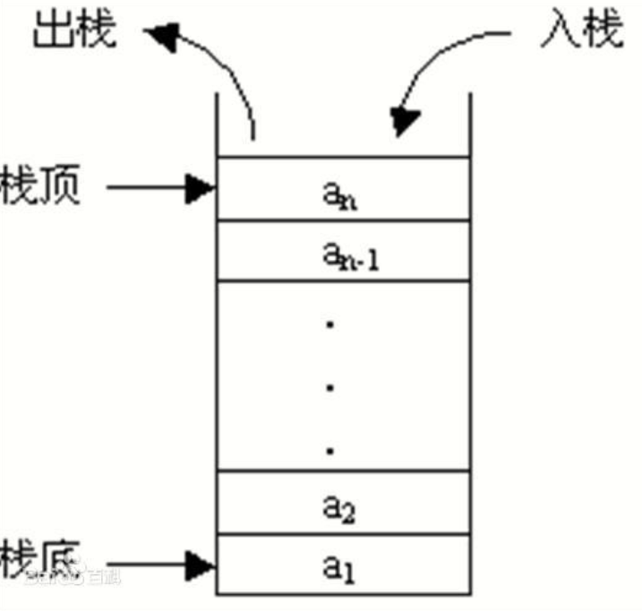
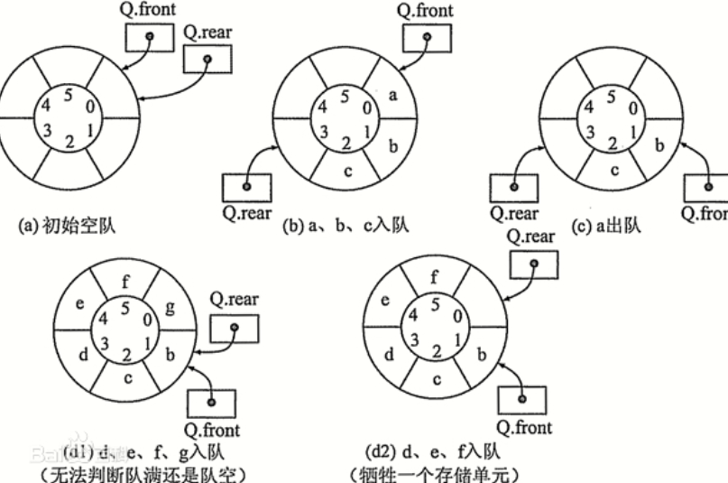
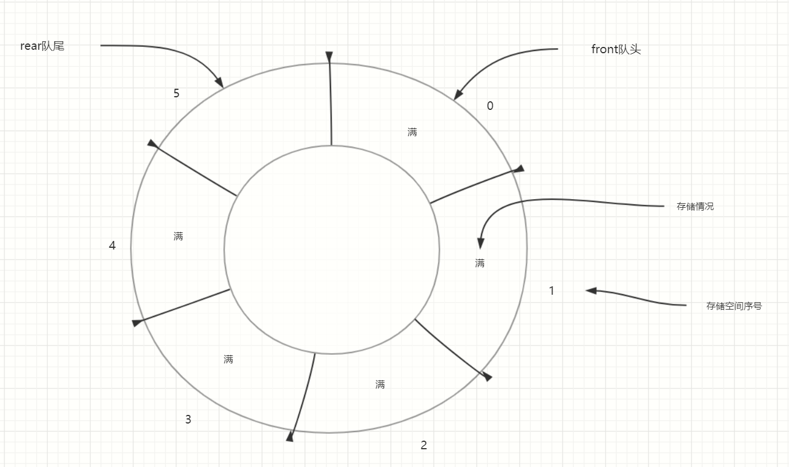
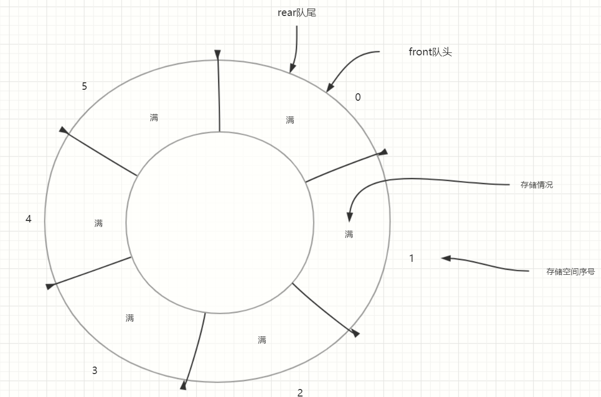
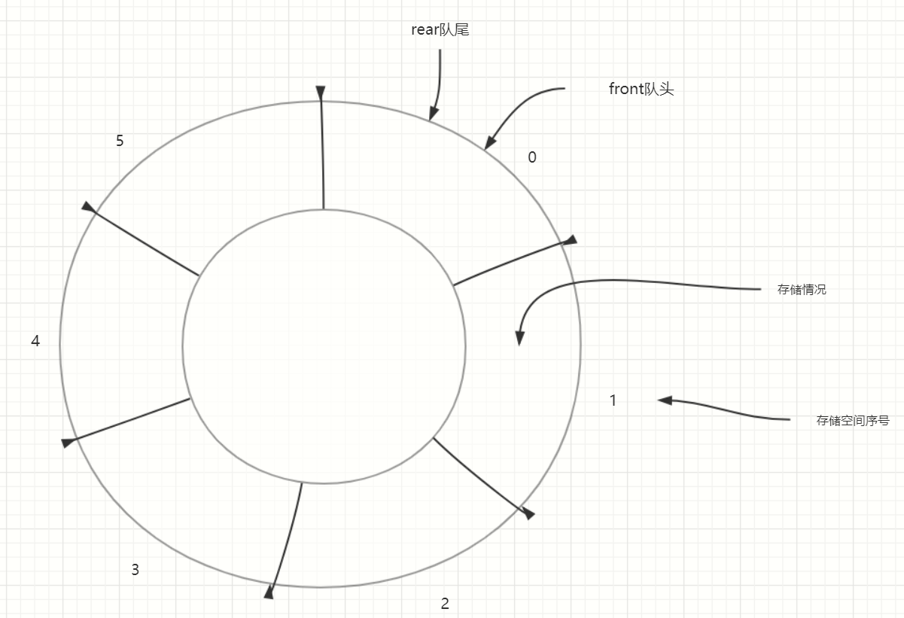
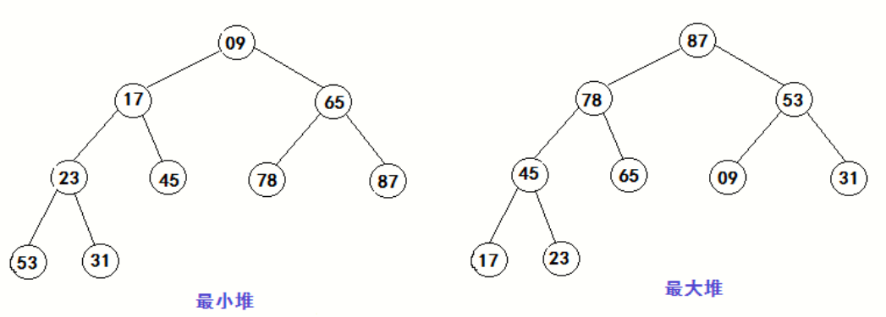
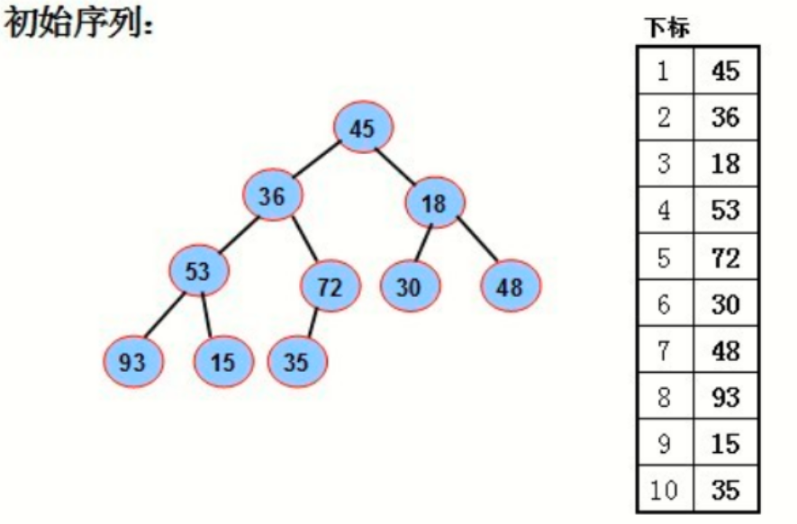

# 几种常见数据结构

## 栈

- 栈（stack）又名堆栈，它是一种运算受限的线性表
- 栈结构的数据遵循先进后出(后进先出LIFO)FILO
- 通常用在函数调用的时候保存断点，递归的时候也要用到栈
- 出入口只有一个，且必须按照先入后出顺序



由于栈结构可以保存之前入栈的数据，在没有弹出前一直保留，可以通过这个特性来实现一个括号验证题

验证输入字符串中括号是否匹配

- 如输入字符串`(vf[vf{vf(vf[v])}])`，验证为true
- 如`[fsaf9(fd{f)vfd)]`，验证为false

分析

- 通过栈结构来存储匹配左的括号，当栈顶匹配到对应的右括号则弹出
- 直到最后栈内还有括号，或者匹配到右括号且栈顶没有对应左括号，则表示括号匹配失败

代码实现

```匹配括号
// 验证字符串中括号是否匹配
const str = '[f](d)s{(f)[s]s}' // 可通过
const str1 = '[f](d)s{(f)(s]s}' // 不可通过
function check(str, stack = []) { // stack用于记录匹配的括号
  const checked = ['(', '[', '{', ')', ']', '}']
  const arr = str.split('')
  let flag
  for (let i = 0; i < arr.length; i++) {
    flag=null
    switch (arr[i]) {
      case checked[0]:
      case checked[1]:
      case checked[2]: stack.push(arr[i]) // 左括号统一入栈
        break;
      // 右括号匹配之后弹出，否则验证失败
      case checked[3]:  flag=checked[0]
        break;
      case checked[4]:  flag=checked[1]
        break;
      case checked[5]:  flag=checked[2]
        break;
      default:
        break;
    }
    // 验证括号
    if (flag) {
      if(stack[stack.length-1]===flag){ // 匹配成功弹出左括号
        stack.pop()
      }else{  // 匹配失败，验证失败
        return false
      }
    }
  }
  return true
}
console.log(check(str)) // true
console.log(check(str1)) // false
```

需求：限制括号，低优先级的括号必须在高优先级括号之外，比如数学运算中的大、中、小括号，大括号可以包含中括号可以包含小客户，但是小括号不能包含大、中括号，且同等级括号可以相互包含

分析

- 此时不仅要判断右括号是否匹配
- 还需要在入栈的时候匹配当前栈顶括号优先级，是否是低于当前要入栈的括号

代码实现

```限制括号匹配
const str = '{[d((d))f[d(g)]]{fd}s(f)}' // 可通过
const str1 = '{[d((d))f[d(g[d]])]{fd}s(f)}' // 不可通过
function check(str, i = 0, stack = []) {
  if (typeof str === 'string') str = str.split('') // 转数组
  if (i >= str.length && !stack.length) return true // 出口
  if (str[i] === '}' && stack[stack.length - 1] !== '{') return false // 判断是否匹配
  if (str[i] === ']' && stack[stack.length - 1] !== '[') return false // 判断是否匹配
  if (str[i] === ')' && stack[stack.length - 1] !== '(') return false // 判断是否匹配
  // 判断是否可包含
  if (str[i] === '{') {
    if (stack[stack.length - 1] === '[' || stack[stack.length - 1] === '(') return false
  } else if (str[i] === '[') {
    if (stack[stack.length - 1] === '(') return false
  }
  // 出入栈判断
  if ('{[('.includes(str[i])) {
    stack.push(str[i])
  } else if (')]}'.includes(str[i])) {
    stack.pop()
  }
  // 下一轮判断
  return check(str, ++i, stack)
}
console.log(check(str)) // true
console.log(check(str1)) // false
```

## 队列

- 队列是一种特殊的线性表，特殊之处在于它只允许在表的前端（front）进行删除操作，而在表的后端（rear）进行插入操作，和栈一样，队列是一种操作受限制的线性表
- 队列不同栈，队列是尾插入，头取出，栈是只有一个出入口，只能在栈顶操作
- 队列遵循先进先出FIFO


```队列
// 直线队列
const obj={
  queue:[],
  shift(){ // 出队列
    if(!this.queue.length) throw new RangeError('Queue is Empty')
    const ele=this.queue[0]
    for (let i = 1; i < this.queue.length; i++) { // 移动队列
      this.queue[i-1]=this.queue[i]
    }
    this.queue.length-=1
    return ele
  },
  push(ele){  // 入队列
    this.queue[this.queue.length]=ele
  }
}
obj.push('1')
obj.push('1')
console.log(obj.queue);
obj.shift()
obj.shift()
obj.shift() // error
```

### 循环队列

- 为充分利用向量空间，克服"假溢出"现象的方法是：将向量空间想象为一个首尾相接的圆环，并称这种向量为循环向量
- 循环队列是把顺序队列首尾相连，把存储队列元素的表从逻辑上看成一个环，成为循环队列
- 固定队列大小



以下为非满队列



- 队头指针front永远只需队头元素，队尾rear指针永远指向将要插入的位置即队尾元素的后一个空间



- 满队列时队尾与队头指向同一个空间



- 空队列时队尾与队头也指向同一个空间

代码演示循环队列

```循环队列
// 循环队列
const loopQueue = (function () {
  // 定义容量
  const cap = 3
  // 创建固定容量队列
  const queue = Array(cap)
  // 初始头尾指针
  let front = 0,
    rear = 0
  // 尾插入
  function push(ele) {
    if (isFull()) throw new RangeError('队列已满，无法插入')
    // 插入队尾，队尾指针后移
    queue[rear++ % cap] = ele
    return queue
  }
  // 队头取出
  function shift() {
    if (isEmpty()) throw new RangeError('队列为空，无法取出')
    // 队头指针后移+1
    return queue[front++ % cap]
  }
  // 判断满
  function isFull() {
    // 判断队尾指针所指向的空间是否为队头指针指向空间
    if (rear != front) {
      return (rear % cap) == (front % cap)
    }
    return false
  }
  // 判断空
  function isEmpty() {
    return front == rear
  }
  // 获取头指针
  function getFront() {
    return front % cap
  }
  // 获取尾指针
  function getRear() {
    return rear % cap
  }
  return {
    queue,
    push,
    shift,
    isFull,
    isEmpty,
    getFront,
    getRear
  }
})()
loopQueue.push('0')
loopQueue.push('1')
console.log(loopQueue.getRear()) // 2
console.log(loopQueue.push('2')) // ["0", "1", "2"]
console.log(loopQueue.isFull()) // true
loopQueue.shift()
console.log(loopQueue.getFront()) // 1
loopQueue.shift()
console.log(loopQueue.isEmpty()) // false
console.log(loopQueue.shift()) // 2
console.log(loopQueue.isEmpty()) // true
```

## 堆

- 堆其实就是一棵完全二叉树（若设二叉树的深度为h，除第 h 层外，其它各层 (1～h-1) 的结点数都达到最大个数，第 h 层所有的结点都连续集中在最左边）
- 具有n个元素的序列（h1,h2,...hn），当且仅当满足（hi>=h2i,hi>=h2i+1）或（hi<=h2i,hi<=2i+1） (i=1,2,...,n/2)时称之为堆

大根堆：父节点总是大于其子节点，
小根堆：父节点总是小于其子节点。



连续空间在堆中的存储结构



代码演示实现堆操作

```堆操作
// 堆排序
function heapSort(arr, sort = 1) {
  const sortDown = function (arr, i, length, sort) {
    // 执行子叶排序
    for (let j = i * 2 + 1; j < length; j = j * 2 + 1) {
      // 左子节点小
      if (j + 1 < length && (arr[j + 1] - arr[j]) * sort >= 0) {
        j++
      }
      // 右子节点大或者左子节点大
      if ((arr[j] - arr[i]) * sort >= 0) {
        // 把大的交换到符节点
        arr[i] = [arr[j], arr[j] = arr[i], i = j][0]
      } else {
        break
      }
    }
  }
  // 第一个非子叶节点
  const first = ~~(arr.length / 2 - 1)
  // 所有非子叶节点排序一遍，从后往前
  for (let i = first; i >= 0; i--) {
    sortDown(arr, i, arr.length, sort)
  }
  for (let j = arr.length - 1; j > 0; j--) {
    arr[j] = [arr[0], arr[0] = arr[j]][0]
    sortDown(arr, 0, j, sort)
  }
}
// 大堆叠
const bigHeap = [8, 6, 10, 18, 16, 2, 4, 12, 14, 20]
heapSort(bigHeap, -1) // 倒序
console.log(bigHeap) // [20, 18, 16, 14, 12, 10, 8, 6, 4, 2]
const Heap = (function (heap) {
  // 获取父节点元素
  function getParent(pos, getIndex = false) {
    // pos%2判断左右节点，左节点奇数，右节点偶数，((pos+pos%2)-2)>>>1获取父节点索引
    const p = ((pos + pos % 2) - 2) >> 1
    // 如果为根或者不存在节点直接返回null
    return !pos || pos >= heap.length ? null : (getIndex ? p : heap[p])
  }
  // 获取左子节点元素
  function getLChild(pos, getIndex = false) {
    // 获取左子节点索引
    const p = pos * 2 + 1
    // 超出范围返回null
    return p >= heap.length ? null : (getIndex ? p : heap[p])
  }
  // 获取右子节点元素
  function getRChild(pos, getIndex = false) {
    // 获取左子节点索引
    const p = pos * 2 + 2
    // 超出范围返回null
    return p >= heap.length ? null : (getIndex ? p : heap[p])
  }
  // 删除节点
  function removeNode(pos, isOnly = true, el = [], last = true) {
    if (!heap[pos]) return
    // 记录要删除的值
    el.push(heap[pos])
    // 删除
    heap[pos] = null
    if (isOnly) { // 只删除当前元素
      // 重新排序
      heapSort(heap, -1)
      // 长度减一
      heap.length -= 1
    } else { // 删除节点以及其子节点
      removeNode(pos * 2 + 1, isOnly, el, false)
      removeNode(pos * 2 + 2, isOnly, el, false)
      if (last) {
        heapSort(heap, -1)
        while (heap[heap.length - 1] === null) heap.length -= 1
      }
    }
    return el
  }
  return {
    heap,
    getParent,
    getLChild,
    getRChild,
    removeNode
  }
})(bigHeap)
const i = 2
console.log(Heap.getParent(i));
console.log(Heap.getLChild(i));
console.log(Heap.getRChild(i, true));
console.log(Heap.removeNode(i, false));
console.log(bigHeap)
```