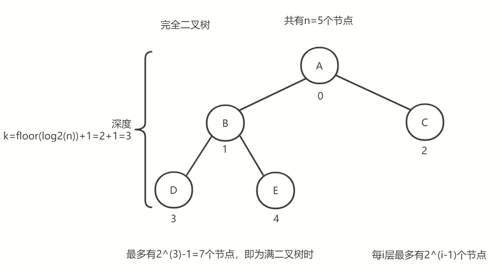
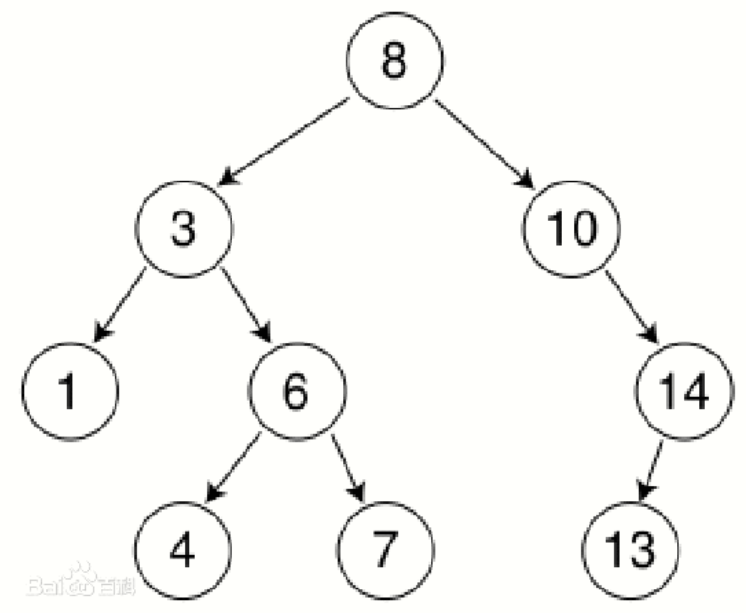
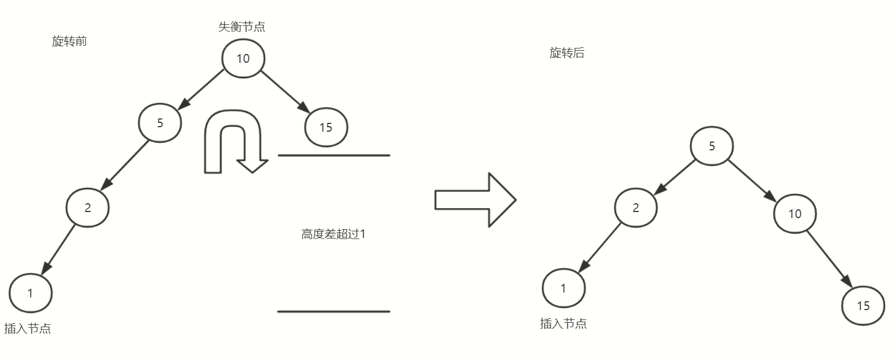
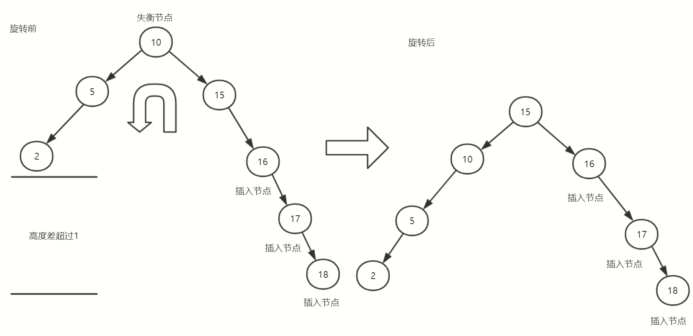
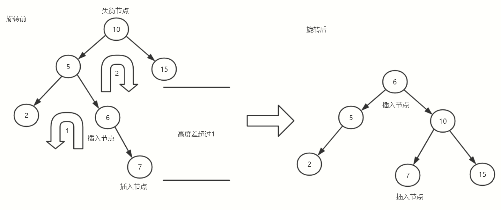
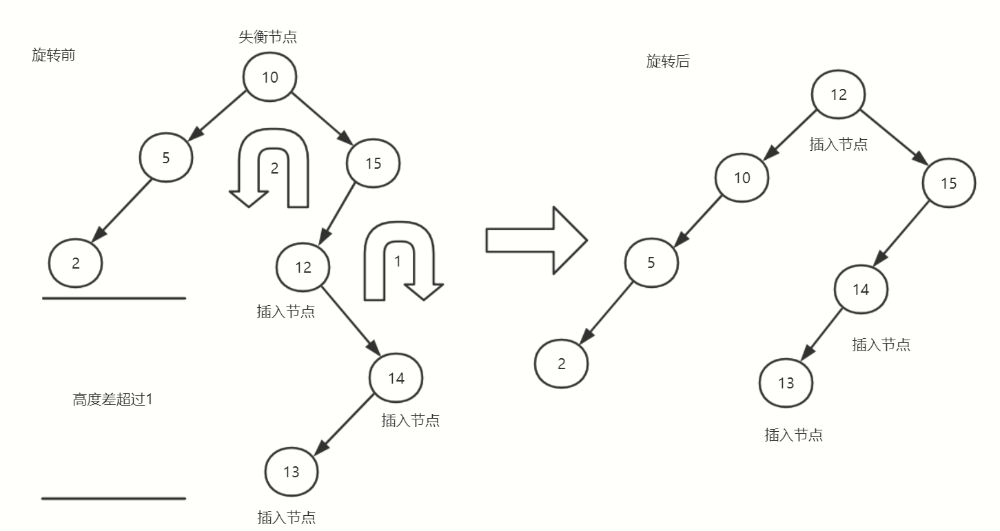
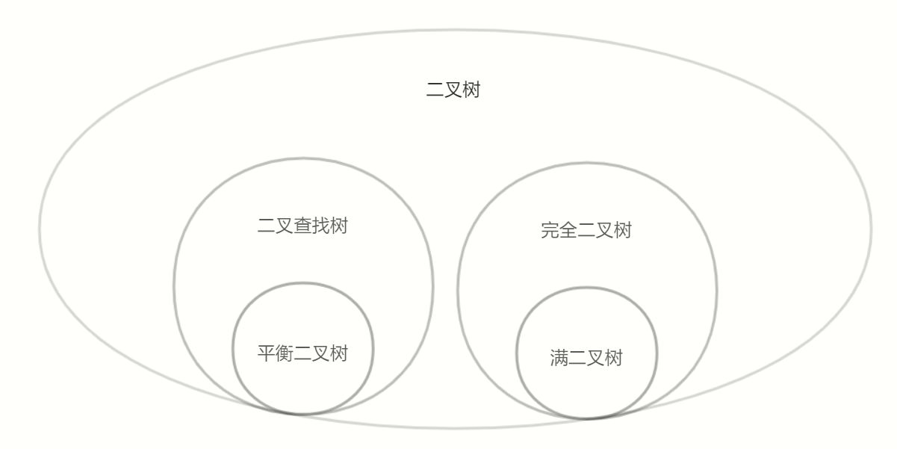
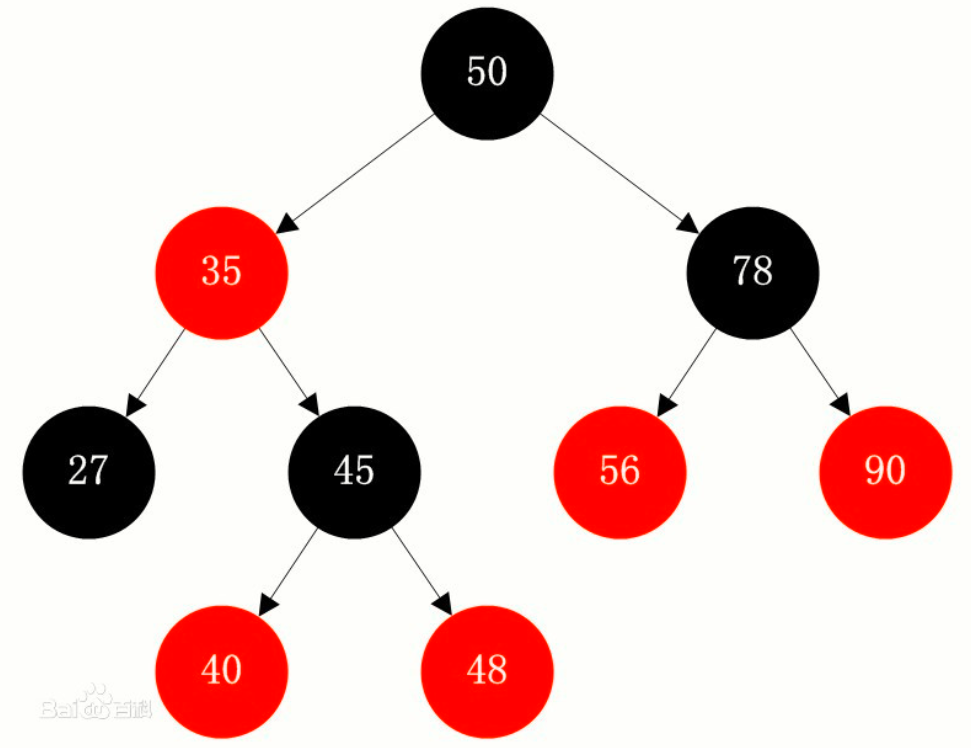

# 各种树

## 二叉树

- 二叉树是每个结点最多有两个子树的树结构
- 通常子树被称作“左子树”（left subtree）和“右子树”（right subtree）
- 二叉树常被用于实现二叉查找树和二叉堆


### 满二叉树

- 一棵深度为k，且有2^k-1个结点的二叉树，称为满二叉树
- 这种树的特点是每一层上的结点数都是最大结点数，每层节点都填满


### 完全二叉树

- 在一棵二叉树中，除最后一层外，若其余层都是满的，并且或者最后一层是满的，或者是在右边缺少连续若干结点，则此二叉树为完全二叉树
- 具有n个结点的完全二叉树的深度为floor(log2(n))+1
- 深度为k的完全二叉树，至少有2^(k-1)个叶子结点，至多有2^(k)-1个结点
- 堆就是利用完全二叉树的性质



### 二叉查找树

- 二叉排序树（Binary Sort Tree），又称二叉查找树（Binary Search Tree），亦称二叉搜索树
- 一棵空树，或者是具有下列性质的二叉树：
  - （1）若左子树不空，则左子树上所有结点的值均小于它的根结点的值；
  - （2）若右子树不空，则右子树上所有结点的值均大于它的根结点的值；
  - （3）左、右子树也分别为二叉排序树；
  - （4）没有键值相等的结点。
- 简单说二叉查找树的每个节点都要满足大于其左子树的值，小于右子树的值



步骤：

- 若根结点的关键字值等于查找的关键字，成功。
- 否则，若小于根结点的关键字值，递归查左子树。
- 若大于根结点的关键字值，递归查右子树。
- 若子树为空，查找不成功。
- 查找时间复杂度O(logn)

代码演示

```js 二叉查找树
//构造节点
class Node {
  constructor(value, left = null, right = null) {
    this.value = value
    this.left = left
    this.right = right
  }
  // 设置左子节点
  static setLeft(origin, target) {
    origin.left = target
  }
  // 设置右子节点
  static setRight(origin, target) {
    origin.right = target
  }
}
// 构造树
class Tree {
  constructor(root) {
    // 设置根节点
    this.root = root
  }
  // 获取父节点
  getParent(node, cur = this.root, res = null) {
    if (cur) {
      if (cur.left == node || cur.right == node) return cur
      res = this.getParent(node, cur.left, res)
      res = this.getParent(node, cur.right, res)
    }
    return res
  }
  // 最大值节点
  max(node = this.root) {
    if (!node.right) {
      return node
    }
    return this.max(node.right)
  }
  // min 最小值节点
  min(node = this.root) {
    if (!node.left) {
      return node
    }
    return this.min(node.left)
  }
  // 插入节点
  insert(node, cur = this.root, pre = null, wm = new WeakMap()) {
    // 指定位置插入
    if (wm.get(cur)) {
      let d = 'right'
      if (cur.value < node.value) d = 'left'
      node[d] = pre[d] = cur
      return
    } else {
      wm.set(cur, true)
    }
    // 左寻找
    if (node.value < cur.value) {
      if (!cur.left) {
        cur.left = node
        return
      }
      this.insert(node, cur.left, cur, wm)
    }
    // 右寻找
    if (node.value >= cur.value) {
      if (!cur.right) {
        cur.right = node
        return
      }
      this.insert(node, cur.right, cur, wm)
    }
  }
  // 删除节点
  remove(node) {
    const p = this.getParent(node)
    let d = 'right'
    // 没有孩子
    if (!node.left && !node.right) {
      if (p.left == node) d = 'left'
      p[d] = null
      return
    }
    // 只有一个孩子
    if (!(node.left && node.right)) {
      if (p.left == node) d = 'left'
      if (node.left) {
        p[d] = node.left
      } else {
        p[d] = node.right
      }
      return
    }
    // 都有的情况
    let LMax = this.max(node.left)
    const mp = this.getParent(LMax)
    if (p.left == node) d = 'left'
    p[d] = LMax
    d = 'right'
    if (mp == node) {
      LMax.right = mp.right
      return
    }
    if (mp.left == LMax) d = 'left'
    mp[d] = null
  }
  // 最大深度
  maxDepth(node = this.root) {
    if (node === null) return 0
    // 左右递归计算
    return Math.max(this.maxDepth(node.left) + 1, this.maxDepth(node.right) + 1)
  }
  // 最小深度
  minDepth(node = this.root) {
    // 根
    if (node === null) return 0
    // 左右都存在
    if (node.left && node.right) return Math.min(this.minDepth(node.left), this.minDepth(node.right)) + 1
    // 左存在
    if (node.left) return this.minDepth(node.left) + 1
    // 右存在
    if (node.right) return this.minDepth(node.right) + 1
    // 子叶
    return 1
  }
  // 层次遍历
  Layer(queue = [this.root], arr = []) {
    const node = queue.shift() // 取队列头
    arr.push(node.value) // 保存取出的节点
    if (node.left) { // 判断左子节点
      queue.push(node.left) // 加入队列
    }
    if (node.right) { // 判断右子节点
      queue.push(node.right) // 加入队列
    }
    if (!queue.length) return arr // 队列空，即可返回
    return this.Layer(queue, arr)
  }
}
const node1 = new Node(8)
const node2 = new Node(3)
const node3 = new Node(10)
const node4 = new Node(1)
const node5 = new Node(6)
const node6 = new Node(14)
const node7 = new Node(4)
const node8 = new Node(7)
const node9 = new Node(13)
const tree = new Tree(node1)

Node.setLeft(tree.root, node2)
Node.setRight(tree.root, node3)
Node.setLeft(node2, node4)
Node.setRight(node2, node5)
Node.setRight(node3, node6)
Node.setLeft(node5, node7)
Node.setRight(node5, node8)
Node.setLeft(node6, node9)

// console.log(tree.Layer()) 

// const node10 = new Node(9)
// tree.insert(node10)

// console.log(tree.min());
// console.log(tree.max());

// tree.remove(node5)

// console.log(tree.maxDepth());
// console.log(tree.minDepth());

console.log(tree.Layer()) // [8, 3, 10, 1, 6, 14, 4, 7, 13]
```

### 平衡二叉树

- 平衡二叉树(AVL)要么是一棵空树
- 要么保证左右子树的高度之差不大于1
- 最大高度：节点到其子叶节点的最长路径
- 最小高度：节点到其子叶节点的最段路径
- 子树也必须是一颗平衡二叉树
- 平衡二叉树，是对二叉搜索树的一种优化
- 给定节点数n，则最大高度为O(log2(n))
- 平衡二叉树插入导致失去平衡：
  - 在结点的左子树的左子树插入元素,LL 插入；
  - 在结点的左子树的右子树插入元素,LR 插入；
  - 在结点的右子树的左子树插入元素,RL 插入；
  - 在结点的右子树的右子树插入元素,RR 插入。


初始化平衡二叉树

```js 平衡二叉树
// 平衡二叉树
// 创建节点
class CreateNode {
  constructor(value, left = null, right = null) {
    this.value = value
    this.left = left
    this.right = right
  }
}
// 创建平衡二叉树
class Tree {
  constructor(root = new CreateNode('root')) {
    this.root = root
  }
  // 左孩子
  setLeft(childNode, node = this.root) {
    return node.left = childNode
  }
  // 右孩子
  setRight(childNode, node = this.root) {
    return node.right = childNode
  }
  // 层次遍历
  Layer(queue = [this.root], arr = []) {
    const node = queue.shift() // 取队列头
    arr.push(node.value) // 保存取出的节点
    if (node.left) { // 判断左子节点
      queue.push(node.left) // 加入队列
    }
    if (node.right) { // 判断右子节点
      queue.push(node.right) // 加入队列
    }
    if (!queue.length) return arr // 队列空，即可返回
    return this.Layer(queue, arr)
  }
  // 插入节点
  insert(node, cur = this.root, pre = null, wm = new WeakMap()) {
    // 指定位置插入
    if (wm.get(cur)) {
      let d = 'right'
      if (cur.value < node.value) d = 'left'
      node[d] = pre[d] = cur
      return
    } else {
      wm.set(cur, true)
    }
    // 左寻找
    if (node.value < cur.value) {
      if (!cur.left) {
        cur.left = node
        return
      }
      this.insert(node, cur.left, cur, wm)
    }
    // 右寻找
    if (node.value >= cur.value) {
      if (!cur.right) {
        cur.right = node
        return
      }
      this.insert(node, cur.right, cur, wm)
    }
  }
  // 最大深度
  maxDepth(node = this.root) {
    if (node === null) return 0
    // 左右递归计算
    return Math.max(this.maxDepth(node.left) + 1, this.maxDepth(node.right) + 1)
  }
  // 最小深度
  minDepth(node = this.root) {
    // 不存在
    if (node === null) return 0
    // 左右都存在
    if (node.left && node.right) return Math.min(this.minDepth(node.left), this.minDepth(node.right)) + 1
    // 左存在
    if (node.left) return this.minDepth(node.left) + 1
    // 右存在
    if (node.right) return this.minDepth(node.right) + 1
    // 子叶
    return 1
  }
  // 获取父节点
  getParent(node, cur = this.root, res = null) {
    if (node === this.root) return null
    if (cur) {
      if (cur.left == node || cur.right == node) return cur
      res = this.getParent(node, cur.left, res)
      res = this.getParent(node, cur.right, res)
    }
    return res
  }
  // 左左旋
  LL() {}
  // 左右旋
  LR() {}
  // 右左旋
  RL() {}
  // 右右旋
  RR() {}
}
// 创建树与节点
const node1 = new CreateNode(10)
const node2 = new CreateNode(5)
const node3 = new CreateNode(15)
const node4 = new CreateNode(2)
const tree = new Tree(node1)
// 构建平衡二叉树
tree.setLeft(node2)
tree.setRight(node3)
tree.setLeft(node4, node2)
// 查看平衡树当前构成,层次遍历
console.log(tree.Layer()) // [10, 5, 15, 2]
// 高度差
console.log(tree.maxDepth() - tree.minDepth()) // 1
```

#### 左左旋

左子节点的左子节点插入，左左插入LL



```js 左左插入LL
// 插入节点，失衡
tree.insert(new CreateNode(1))
console.log(tree.Layer()) // [10, 5, 15, 2, 1]
// 高度差
console.log(tree.maxDepth() - tree.minDepth()) // 2  失去平衡
```

左左旋实现

```js 左左旋实现
// 左左旋
LL(node) {
  // 取失衡节点左孩子
  const newNode = node.left
  // 左孩子的左孩子，作为失衡节点的左孩子
  node.left = newNode.right
  // 失衡节点作为左孩子的右孩子，这样一来就实现了旋转，且降低高度差
  newNode.right = node
  // 获取父节点,更新父节点的子节点
  const p = this.getParent(node)
  if (p)
    if (p.left === node) {
      p.left = newNode
    } else {
      p.right = newNode
    }
  // 如果是根节点旋转，需要更新平衡树的root
  this.root = node === this.root ? newNode : this.root
  return node
}
------------------------------------------------
// 左左旋调整
tree.LL(node1)
console.log(tree.Layer()) // [5, 2, 10, 1, 15]
// 高度差
console.log(tree.maxDepth() - tree.minDepth()) // 0  恢复平衡
```

#### 右右旋

右子节点的右子节点插入，右右插入RR



```js RR插入节点
// 插入节点，失衡
tree.insert(new CreateNode(16))
tree.insert(new CreateNode(17))
tree.insert(new CreateNode(18))
console.log(tree.Layer()) // [10, 5, 15, 2, 16, 17, 18]
// 高度差
console.log(tree.maxDepth() - tree.minDepth()) // 2  失去平衡
```

右右旋实现

```js 右右旋实现
// 右右旋
RR(node) {
  // 取右孩子
  const newNode = node.right
  // 转换孩子
  node.right = newNode.left
  // 转换孩子
  newNode.left = node
  // 获取父节点,更新父节点的子节点
  const p = this.getParent(node)
  if (p)
    if (p.left === node) {
      p.left = newNode
    } else {
      p.right = newNode
    }
  // 如果是根节点旋转，需要更新平衡树的root
  this.root = node === this.root ? newNode : this.root
  return node
}
------------------------------------------------
// 右右旋调整
tree.RR(node1)
console.log(tree.Layer()) // [15, 10, 16, 5, 17, 2, 18]
// 高度差
console.log(tree.maxDepth() - tree.minDepth()) // 0  恢复平衡
```

#### 左右旋

左子节点的右子节点插入，左右插入LR



```js LR插入节点
// 插入节点，失衡
tree.insert(new CreateNode(6))
tree.insert(new CreateNode(7))
console.log(tree.Layer()) // [10, 5, 12, 2, 6, 7]
// 高度差
console.log(tree.maxDepth() - tree.minDepth()) // 2  失去平衡
```

左右旋实现

```js 左右旋实现
// 左右旋
LR(node) {
  node.left = this.RR(node.left)
  return this.LL(node)
}
------------------------------------------------
// 左右旋调整
tree.LR(node1)
console.log(tree.Layer()) // [6, 5, 10, 2, 7, 15]
// 高度差
console.log(tree.maxDepth() - tree.minDepth()) // 0  恢复平衡
```

#### 右左旋

右子节点的左子节点插入，右左插入RL



```js RL插入节点
// 插入节点，失衡
tree.insert(new CreateNode(12))
tree.insert(new CreateNode(14))
tree.insert(new CreateNode(13))
console.log(tree.Layer()) // [10, 5, 15, 2, 12, 14, 13]
// 高度差
console.log(tree.maxDepth() - tree.minDepth()) // 2  失去平衡
```

右左旋实现

```js 右左旋实现
// 右左旋
RL(node) {
  node.right = this.LL(node.right)
  return this.RR(node)
}
------------------------------------------------
// 右左旋调整
tree.RL(node1)
console.log(tree.Layer()) // [12, 10, 15, 5, 14, 2, 13]
// 高度差
console.log(tree.maxDepth() - tree.minDepth()) // 0  恢复平衡
```

#### 全部代码

```js 平衡二叉树
// 平衡二叉树
// 创建节点
class CreateNode {
  constructor(value, left = null, right = null) {
    this.value = value
    this.left = left
    this.right = right
  }
}
// 创建平衡二叉树
class Tree {
  constructor(root = new CreateNode('root')) {
    this.root = root
  }
  // 左孩子
  setLeft(childNode, node = this.root) {
    return node.left = childNode
  }
  // 右孩子
  setRight(childNode, node = this.root) {
    return node.right = childNode
  }
  // 设置节点数据
  setValue(value, node = this.root) {
    return node.value = value
  }
  // 层次遍历
  Layer(queue = [this.root], arr = []) {
    const node = queue.shift() // 取队列头
    arr.push(node.value) // 保存取出的节点
    if (node.left) { // 判断左子节点
      queue.push(node.left) // 加入队列
    }
    if (node.right) { // 判断右子节点
      queue.push(node.right) // 加入队列
    }
    if (!queue.length) return arr // 队列空，即可返回
    return this.Layer(queue, arr)
  }
  // 插入节点
  insert(node, cur = this.root, pre = null, wm = new WeakMap()) {
    // 指定位置插入
    if (wm.get(cur)) {
      let d = 'right'
      if (cur.value < node.value) d = 'left'
      node[d] = pre[d] = cur
      return
    } else {
      wm.set(cur, true)
    }
    // 左寻找
    if (node.value < cur.value) {
      if (!cur.left) {
        cur.left = node
        return
      }
      this.insert(node, cur.left, cur, wm)
    }
    // 右寻找
    if (node.value >= cur.value) {
      if (!cur.right) {
        cur.right = node
        return
      }
      this.insert(node, cur.right, cur, wm)
    }
  }
  // 最大深度
  maxDepth(node = this.root) {
    if (node === null) return 0
    // 左右递归计算
    return Math.max(this.maxDepth(node.left) + 1, this.maxDepth(node.right) + 1)
  }
  // 最小深度
  minDepth(node = this.root) {
    // 不存在
    if (node === null) return 0
    // 左右都存在
    if (node.left && node.right) return Math.min(this.minDepth(node.left), this.minDepth(node.right)) + 1
    // 左存在
    if (node.left) return this.minDepth(node.left) + 1
    // 右存在
    if (node.right) return this.minDepth(node.right) + 1
    // 子叶
    return 1
  }
  // 获取父节点
  getParent(node, cur = this.root, res = null) {
    if (node === this.root) return null
    if (cur) {
      if (cur.left == node || cur.right == node) return cur
      res = this.getParent(node, cur.left, res)
      res = this.getParent(node, cur.right, res)
    }
    return res
  }
  // 左左旋
  LL(node) {
    // 取失衡节点左孩子
    const newNode = node.left
    // 左孩子的左孩子，作为失衡节点的左孩子
    node.left = newNode.right
    // 失衡节点作为左孩子的右孩子，这样一来就实现了旋转，且降低高度差
    newNode.right = node
    // 获取父节点,更新父节点的子节点
    const p = this.getParent(node)
    if (p)
      if (p.left === node) {
        p.left = newNode
      } else {
        p.right = newNode
      }
    // 如果是根节点旋转，需要更新平衡树的root
    this.root = node === this.root ? newNode : this.root
    return newNode
  }
  // 左右旋
  LR(node) {
    node.left = this.RR(node.left)
    return this.LL(node)
  }
  // 右左旋
  RL(node) {
    node.right = this.LL(node.right)
    return this.RR(node)
  }
  // 右右旋
  RR(node) {
    // 取右孩子
    const newNode = node.right
    // 转换孩子
    node.right = newNode.left
    // 转换孩子
    newNode.left = node
    // 获取父节点,更新父节点的子节点
    const p = this.getParent(node)
    if (p)
      if (p.left === node) {
        p.left = newNode
      } else {
        p.right = newNode
      }
    // 如果是根节点旋转，需要更新平衡树的root
    this.root = node === this.root ? newNode : this.root
    return newNode
  }
}
// 创建树与节点
const node1 = new CreateNode(10)
const node2 = new CreateNode(5)
const node3 = new CreateNode(15)
const node4 = new CreateNode(2)
const tree = new Tree(node1)
// 构建平衡二叉树
tree.setLeft(node2)
tree.setRight(node3)
tree.setLeft(node4, node2)
// 查看平衡树当前构成,层次遍历
console.log(tree.Layer()) // [10, 5, 15, 2]
// 高度差
console.log(tree.maxDepth() - tree.minDepth()) // 1

// // 插入节点，失衡
// tree.insert(new CreateNode(1))
// console.log(tree.Layer()) // [10, 5, 15, 2, 1]
// // 高度差
// console.log(tree.maxDepth() - tree.minDepth()) // 2  失去平衡

// // 左左旋调整
// tree.LL(node1)
// console.log(tree.Layer()) // [5, 2, 10, 1, 15]
// // 高度差
// console.log(tree.maxDepth() - tree.minDepth()) // 0  恢复平衡

// // 插入节点，失衡
// tree.insert(new CreateNode(16))
// tree.insert(new CreateNode(17))
// tree.insert(new CreateNode(18))
// console.log(tree.Layer()) // [10, 5, 15, 2, 16, 17, 18]
// // 高度差
// console.log(tree.maxDepth() - tree.minDepth()) // 2  失去平衡

// // 右右旋调整
// tree.RR(node1)
// console.log(tree.Layer()) // [15, 10, 16, 5, 17, 2, 18]
// // 高度差
// console.log(tree.maxDepth() - tree.minDepth()) // 0  恢复平衡


// // 插入节点，失衡
// tree.insert(new CreateNode(6))
// tree.insert(new CreateNode(7))
// console.log(tree.Layer()) // [10, 5, 12, 2, 6, 7]
// // 高度差
// console.log(tree.maxDepth() - tree.minDepth()) // 2  失去平衡

// // 左右旋调整
// tree.LR(node1)
// console.log(tree.Layer()) // [6, 5, 10, 2, 7, 15]
// // 高度差
// console.log(tree.maxDepth() - tree.minDepth()) // 0  恢复平衡

// // 插入节点，失衡
// tree.insert(new CreateNode(12))
// tree.insert(new CreateNode(14))
// tree.insert(new CreateNode(13))
// console.log(tree.Layer()) // [10, 5, 15, 2, 12, 14, 13]
// // 高度差
// console.log(tree.maxDepth() - tree.minDepth()) // 2  失去平衡

// // 右左旋调整
// tree.RL(node1)
// console.log(tree.Layer()) // [12, 10, 15, 5, 14, 2, 13]
// // 高度差
// console.log(tree.maxDepth() - tree.minDepth()) // 0  恢复平衡
```

### 各种树之间的关系



### 树的遍历(基于数组)

#### 前序遍历

- 前序遍历（DLR），是二叉树遍历的一种，也叫做先根遍历、先序遍历、前序周游，可记做根左右
- 前序遍历首先访问根结点然后遍历左子树，最后遍历右子树


前序遍历结果：ABDECF

代码实现

```js 前序遍历
/*
      A
    /  \
    B    C
  / \  /
  D  E F
*/
const tree = ['A', 'B', 'C', 'D', 'E', 'F']
// 前序遍历
function DLR(tree, i = 0, arr = []) {
  // 判断当前节点是否有效
  if (i < tree.length && tree[i] !== null && tree[i] !== undefined) {
    // 有效加入
    arr.push(tree[i])
  } else { // 无效返回
    return
  }
  // 左遍历
  DLR(tree, i * 2 + 1, arr)
  // 右遍历
  DLR(tree, i * 2 + 2, arr)
  // 返回遍历结果
  return arr
}
console.log(DLR(tree)) // ["A", "B", "D", "E", "C", "F"]
-----------------------------------------------
// 非递归前序遍历
function DLR(tree) {
  // 定义遍历结果、临时节点索引
  const arr = [],
    stack = []
  let l = tree.length
  // 当前索引
  let i = 0
  while (l > 0) {
    // 判断当前节点是否有效
    if (i < tree.length && tree[i] !== null && tree[i] !== undefined) {
      // 有效、加入，记录节点
      arr.push(tree[i])
      stack.push(i)
      // 左子节点遍历
      i = 2 * i + 1
      // 遍历数-1
      l--
    } else {
      // 无效节点，获取上次记录的父节点，转到右子节点遍历
      i = 2 * stack.pop() + 2
    }
  }
  return arr
}
console.log(DLR(tree)) // ["A", "B", "D", "E", "C", "F"]
```

#### 中序遍历

- 中序遍历（LDR）是二叉树遍历的一种，也叫做中根遍历、中序周游
- 在二叉树中，中序遍历首先遍历左子树，然后访问根结点，最后遍历右子树
- 左根右遍历


中序遍历结果：DBEAFC

代码实现

```js 中序遍历
/*
      A
    /  \
    B    C
  / \  /
  D  E F
*/
const tree = ['A', 'B', 'C', 'D', 'E', 'F']
// 中序遍历
function LDR(tree, i = 0, arr = []) {
  // 判断当前节点是否有效
  if (i < tree.length && tree[i] !== null && tree[i] !== undefined) {
    // 有效，继续判断左子节点
    LDR(tree, i * 2 + 1, arr)
    // 第一个左子节点，拐点
    arr.push(tree[i])
  } else {
    // 无效
    return
  }
  // 判断右子节点
  LDR(tree, i * 2 + 2, arr)
  return arr
}
console.log(LDR(tree)) // ["D", "B", "E", "A", "F", "C"]
-----------------------------------------------
// 非递归中序遍历
function LDR(tree) {
  // 定义遍历结果、临时节点索引
  const arr = [],
    stack = []
  let l = tree.length
  // 当前索引
  let i = 0
  while (l > 0) {
    // 判断当前节点是否有效
    if (i < tree.length && tree[i] !== null && tree[i] !== undefined) {
      // 有效、进行左子节点判断，记录当前节点
      stack.push(i)
      // 左子节点遍历
      i = 2 * i + 1
    } else {
      const parent = stack.pop()
      // 无效节点，获取上次记录的父节点，保存父节点
      arr.push(tree[parent])
      // 遍历数-1
      l--
      // 转到右子节点遍历
      i = 2 * parent + 2
    }
  }
  return arr
}
console.log(LDR(tree)) // ["D", "B", "E", "A", "F", "C"]
```

#### 后序遍历

- 后序遍历（LRD）是二叉树遍历的一种，也叫做后根遍历、后序周游，可记做左右根
- 后序遍历有递归算法和非递归算法两种。在二叉树中，先左后右再根，即首先遍历左子树，然后遍历右子树，最后访问根结点


后序遍历结果：DEBFCA

代码实现

```js 后序遍历
/*
      A
    /  \
    B    C
  / \  /
  D  E F
*/
const tree = ['A', 'B', 'C', 'D', 'E', 'F']
// 后序遍历
function LRD(tree, i = 0, arr = []) {
  // 判断当前节点是否有效
  if (i < tree.length && tree[i] !== null && tree[i] !== undefined) {
    // 有效，先左子节点遍历
    LRD(tree, i * 2 + 1, arr)
    // 再右子节点遍历
    LRD(tree, i * 2 + 2, arr)
    // 最后保存当前值
    arr.push(tree[i])
  } else {
    // 无效返回
    return
  }
  return arr
}
console.log(LRD(tree)) // ["D", "E", "B", "F", "C", "A"]
-----------------------------------------------
// 非递归后序遍历
function LRD(tree) {
  // 定义遍历结果、临时节点索引
  const arr = [],
    stack = [],
    set = new Set()
  let l = tree.length
  // 当前索引
  let i = 0
  while (l > 0) {
    // 判断当前节点是否有效，以及是否记录过
    if (tree[i] !== null && tree[i] !== undefined && !set.has(i)) {
      stack.push(i)
      i = i * 2 + 1
    } else {
      // 查看当前栈顶索引，父节点
      i = stack[stack.length - 1]
      // 如果记录过则直接保存
      if (set.has(i)) {
        // 取出最近保存的节点
        const cur = stack.pop()
        // 保存当前栈顶元素
        arr.push(tree[cur])
        l--
      } else {
        // 不存在索引，记录栈顶父元素索引
        set.add(i)
        // 父节点的右子节点遍历
        i = i * 2 + 2
      }
    }
  }
  return arr
}
console.log(LRD(tree)) // ["D", "E", "B", "F", "C", "A"]
```

### 树的遍历(基于对象)

使用对象构建一个二叉树


```js 构建二叉树
/*
      A
    /  \
    B    C
  / \  /
  D  E F
*/
// 构造节点
class Node {
  constructor(value, left = null, right = null) {
    this.value = value
    this.left = left
    this.right = right
  }
  // 设置左子节点
  static setLeft(origin, target) {
    origin.left = target
  }
  // 设置右子节点
  static setRight(origin, target) {
    origin.right = target
  }
}
// 构造树
class Tree {
  constructor(root) {
    // 设置根节点
    this.root = root
  }
  // 前序遍历
  DLR() {}
  // 中序遍历
  LDR() {}
  // 后序遍历
  LRD() {}
  // 层次遍历
  Layer() {}
}
const nodeA = new Node('A')
const nodeB = new Node('B')
const nodeC = new Node('C')
const nodeD = new Node('D')
const nodeE = new Node('E')
const nodeF = new Node('F')
const tree = new Tree(nodeA)

Node.setLeft(tree.root, nodeB)
Node.setRight(tree.root, nodeC)
Node.setLeft(nodeB, nodeD)
Node.setRight(nodeB, nodeE)
Node.setLeft(nodeC, nodeF)
```

#### 前序

代码实现

```js 前序遍历
// 前序遍历
DLR(node = this.root, arr = []) {
  if (node) { // 判断当前节点是否存在
    arr.push(node)
    this.DLR(node.left, arr)  // 左遍历
    this.DLR(node.right, arr) // 右遍历
    return arr
  }
  return
}
```

#### 中序

代码实现

```js 中序遍历
LDR(node = this.root, arr = []) {
  if (node) { // 判断当前节点是否存在
    this.LDR(node.left, arr) // 左遍历
    arr.push(node)
    this.LDR(node.right, arr) // 右遍历
    return arr
  }
  return
}
```

#### 后序

代码实现

```js 后序遍历
// 后序遍历
LRD(node = this.root, arr = []) {
  if (node) { // 判断当前节点是否存在
    this.LRD(node.left, arr) // 左遍历
    this.LRD(node.right, arr) // 右遍历
    arr.push(node)
    return arr
  }
  return arr
}
```

#### 层次遍历

代码实现

```js 层次遍历
// 层次遍历
Layer(queue = [this.root], arr = []) {
  const node = queue.shift() // 取队列头
  arr.push(node) // 保存取出的节点
  if (node.left) { // 判断左子节点
    queue.push(node.left) // 加入队列
  }
  if (node.right) { // 判断右子节点
    queue.push(node.right) // 加入队列
  }
  if (!queue.length) return arr // 队列空，即可返回
  return this.Layer(queue, arr)
}
```

全部代码

```js 全部代码
/*
      A
    /  \
    B    C
  / \  /
  D  E F
*/
// 构造节点
class Node {
  constructor(value, left = null, right = null) {
    this.value = value
    this.left = left
    this.right = right
  }
  // 设置左子节点
  static setLeft(origin, target) {
    origin.left = target
  }
  // 设置右子节点
  static setRight(origin, target) {
    origin.right = target
  }
}
// 构造树
class Tree {
  constructor(root) {
    // 设置根节点
    this.root = root
  }
  // 前序遍历
  DLR(node = this.root, arr = []) {
    if (node) { // 判断当前节点是否存在
      arr.push(node)
      this.DLR(node.left, arr) // 左遍历
      this.DLR(node.right, arr) // 右遍历
      return arr
    }
    return
  }
  // 中序遍历
  LDR(node = this.root, arr = []) {
    if (node) { // 判断当前节点是否存在
      this.LDR(node.left, arr) // 左遍历
      arr.push(node)
      this.LDR(node.right, arr) // 右遍历
      return arr
    }
    return
  }
  // 后序遍历
  LRD(node = this.root, arr = []) {
    if (node) { // 判断当前节点是否存在
      this.LRD(node.left, arr) // 左遍历
      this.LRD(node.right, arr) // 右遍历
      arr.push(node)
      return arr
    }
    return arr
  }
  // 层次遍历
  Layer(queue = [this.root], arr = []) {
    const node = queue.shift() // 取队列头
    arr.push(node) // 保存取出的节点
    if (node.left) { // 判断左子节点
      queue.push(node.left) // 加入队列
    }
    if (node.right) { // 判断右子节点
      queue.push(node.right) // 加入队列
    }
    if (!queue.length) return arr // 队列空，即可返回
    return this.Layer(queue, arr)
  }
}
const nodeA = new Node('A')
const nodeB = new Node('B')
const nodeC = new Node('C')
const nodeD = new Node('D')
const nodeE = new Node('E')
const nodeF = new Node('F')
const tree = new Tree(nodeA)

Node.setLeft(tree.root, nodeB)
Node.setRight(tree.root, nodeC)
Node.setLeft(nodeB, nodeD)
Node.setRight(nodeB, nodeE)
Node.setLeft(nodeC, nodeF)

console.log(tree.DLR())
console.log(tree.LDR())
console.log(tree.LRD())
console.log(tree.Layer())
```

## b-树


1. 关键字集合分布在整颗树中；
2. 任何一个关键字出现且只出现在一个结点中；
3. 搜索有可能在非叶子结点结束；
4. 其搜索性能等价于在关键字全集内做一次二分查找；
5. 自动层次控制；

## b+树


1. 其定义基本与B-树同，除了：
2. 非叶子结点的子树指针与关键字个数相同；
3. 非叶子结点的子树指针P[i]，指向关键字值属于[K[i], K[i+1])的子树（B-树是开区间）；
4. 为所有叶子结点增加一个链指针；
5. 所有关键字都在叶子结点出现；

## b*树


- B+树的分裂：当一个结点满时，分配一个新的结点，并将原结点中1/2的数据复制到新结点，最后在父结点中增加新结点的指针；B+树的分裂只影响原结点和父结点，而不会影响兄弟结点，所以它不需要指向兄弟的指针；
- B*树的分裂：当一个结点满时，如果它的下一个兄弟结点未满，那么将一部分数据移到兄弟结点中，再在原结点插入关键字，最后修改父结点中兄弟结点的关键字（因为兄弟结点的关键字范围改变了）；如果兄弟也满了，则在原结点与兄弟结点之间增加新结点，并各复制1/3的数据到新结点，最后在父结点增加新结点的指针；
- 所以，B*树分配新结点的概率比B+树要低，空间使用率更高；

### 小结

B-树：
多路搜索树，每个结点存储M/2到M个关键字，非叶子结点存储指向关键字范围的子结点；所有关键字在整颗树中出现，且只出现一次，非叶子结点可以命中；

B+树：
在B-树基础上，为叶子结点增加链表指针，所有关键字都在叶子结点中出现，非叶子结点作为叶子结点的索引；B+树总是到叶子结点才命中；

B*树：
在B+树基础上，为非叶子结点也增加链表指针，将结点的最低利用率从1/2提高到2/3；

## 红黑树(二叉树)



1. 节点是红色或黑色
2. 根节点是黑色
3. 所有叶子都是黑色（叶子是NUIL节点）
4. 每个红色节点的两个子节点都是黑色（从每个叶子到根的所有路径上不能有两个连续的红色节点）
5. 从任一节点到其每个叶子的所有路径都包含相同数目的黑色节点

<Vssue title="数据结构 issue" />