# 深入JS

## 前言

本篇文章属于**知识总结**型，归纳出许多比较零散的知识点，都是**干货**噢~


如果你是小白那么这篇文章正好适合你，如果你是老手那么不妨巩固一下看看还有哪些边角料没补！


建议：适合**有js基础**的小伙伴观看，**篇幅较长**，建议先**收藏**再慢慢浏览


> 花了一周时间总结了一些比较重点也有些比较偏的知识，希望各位小伙伴慢慢品尝，如果有不对的地方或者是需要优化的地方望请告知，尽量给大家呈现最有价值的文章。个人水平有限，还请各位大佬指点迷津。希望各位看了这篇文章能有自己的想法，在前端道路上还很漫长，与我一同探索吧！


## 目录

一、 [变量类型](#1)

二、 [深拷贝与浅拷贝](#2)

三、 [原型与原型链](#3)

四、 [继承与实现](#4)

五、 [实现class与extends](#5)

六、 [作用域、执行上下文与闭包](#6)

七、 [this](#7)

八、 [apply、call、bind实现](#8)

九、 [同步与异步](#9)

十、 [AMD、CMD、CommonJS与ES6模块化](#10)

十一、 [script标签之async与defer](#11)

十二、 [改变数组本身的api](#12)

十三、 [window之location、navigator](#13)

十四、 [ajax与fetch](#14)

十五、 [WebSocket](#15)

十六、 [短轮询、长轮询与WebSocket](#16)

十七、 [长连接与短连接](#17)

十八、 [存储](#18)

十九、 [跨域](#19)

二十、 [setTimeout与setInterval](#20)

二十一、 [requestAnimationFrame](#21)

二十二、 [事件](#22)

二十三、 [总结](#23)

二十四、 [其他文章](#24)

## <span id="1">一、变量类型</span>

### **==与===**

#### 对于==的判断

- 并不是那么严谨的判断左右两端是否相等
- 它会优先对比数据的类型是否一致
- 不一致则**进行隐式转换**，一致则判断值的大小，得出结果
- 继续判断两个类型是否为null与undefined，如果是则返回true
- 接着判断是否为string与number，如果是把string转换为number再对比大小
- 判断其中一方是否为boolean，如果是就转为number再进一步判断
- 判断一方是否为object，另一方为string、number、symbol，如果是则把object转为原始类型再判断

##### 比较情况

1. 数组 == 值，(值类型指的是原始类型)会先转成数值再比较，与字符串比较会先转成字符串再比较
2. 引用 == 值，会把引用类型转成原始类型再比较
3. 值 == 值，直接比较类型再比较值的大小
4. 字符串 == 数字，则把字符串转为数值再比较
5. 其他类型 == boolean，则把boolean转成数值再进一步比较
6. undefined == null，也会发生隐式转换，且2者可以相互转换，即2者相等，与自身也相等
7. 对象 == 非对象，如果非对象为string或number，则返回ToPrimitive(对象) == 非对象，的结果；ToPrimitive方法的参数如果是原始类型则直接返回；如果是对象，则调用valueOf方法，如果是原始值再进行原始类型转换和大小对比；如果不是原始值则调用toString，且结果为原始值则进行原始类型比较，如果不是原始值则抛出错误

```比较
// 以下结果都为true
console.log([5]==5,['5']==5)
console.log({name:'5'}=='[object Object]')
console.log('5'==5,true==1,false==0)
console.log(undefined==null)
console.log([5,6]=='5,6',['5','6']=='5,6')
```

>大白话：优先比较类型，同类型，比大小，非原始，调ToPrimitive，为对象调valueOf，还非原始调toString，最后还非原始则报错，如果为原始则进行类型对比，如果不同类型再转换，之后对比大小。

所谓==比较就是要转换成同类型比较，如果无法转成同类型就报错

> 优先比类型，再比null与undefined，再比string和number，再比boolean与any，再比object与string、number、symbol；以上如果转为原始类型比较，则进行类型转换，直到类型相同再比较值的大小。这就是==的隐式转换对比，比较绕，给个图就清晰了！

如下为判断步骤

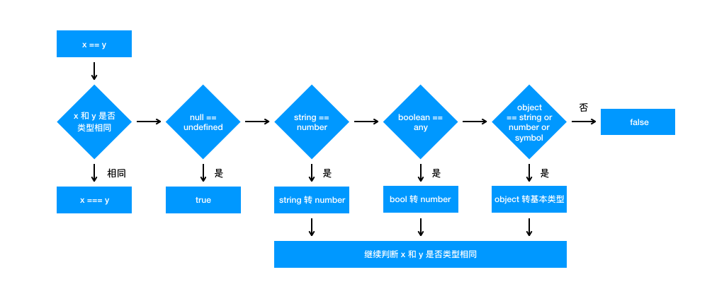

思考？如何判断此表达式（注意==!与!==）
**[]==![]**

- 基于运算符的优先级此式会先运算![]的结果
- !优先于==，且[]为真值(转成boolean，结果为true的就为真值，包括{}；转成false的就为假值)，![]结果为false，所以当前表达式转化为 []==false
- 通过之前总结的转换关系，任何类型与boolean类型比较，所以[]==false 转化为 []==0 比较
- 此时变为object与0比较，调用object的转换成原始类型的方法valueOf其结果还是valueOf
- 再调用toString结果为''，再进行string转成number，则[]转成数字类型0
- 表达式进一步转换成0==0，结果为true。

虽然过程复杂，记住判断的思路即可，非对象之间，先类型转换再比大小，对象比较则调用获取原始值方法再进一步比较。

如下为toString与valueOf转换

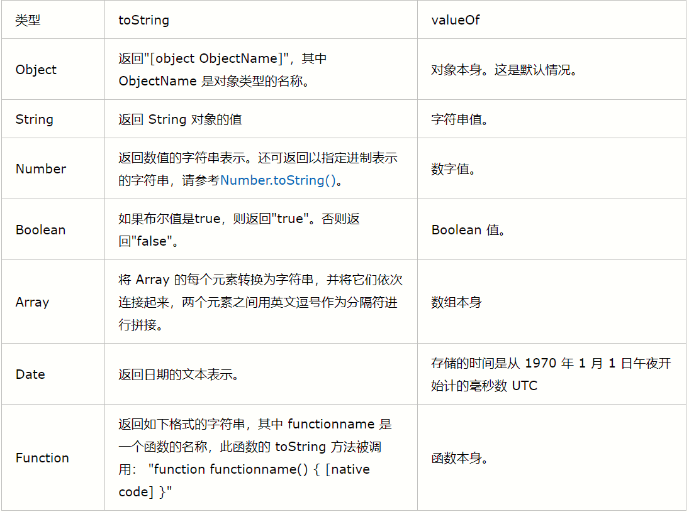

#### 对于===的判断

- ===属于**严格判断**，直接判断两者类型是否相同，不同则返回false
- 如果相同再比较大小，**不会进行任何隐式转换**
- 对于引用类型来说，比较的都是引用内存地址，所以===这种方式的比较，除非两者存储的内存地址相同才相等，反之false

```比较
const a=[]
const b=a
a===b //true
---------------
const a=[]
const b=[]
a===b //false
```

#### 7大原始类型与Object类型

1. Boolean
2. Null
3. Undefined
4. Number
5. BigInt
6. String
7. Symbol
8. **Object**

#### 类型判断

##### 原始类型判断

- **原始类型**string、number、undefined、boolean、symbol、bigint都能**通过typeof**(返回字符串形式)直接判断类型，还有对象类型function也可判断
- **除了null**无法通过typeof(为object)直接判断类型(历史遗留)，包括对象类型，typeof把null当作对象类型处理，所以typeof无法判断对象类型，**typeof也能判断function**

##### 非原始类型判断(以及null)

判断数组

- 使用`Array.isArray()`判断数组
- 使用`[] instanceof Array`判断是否在Array的原型链上，即可判断是否为数组
- `[].constructor === Array`通过其构造函数判断是否为数组
- 也可使用`Object.prototype.toString.call([])`判断值是否为'[object Array]'来判断数组

判断对象

- `Object.prototype.toString.call({})`结果为'[object Object]'则为对象
- `{} instanceof Object`判断是否在Object的原型链上，即可判断是否为对象
- `{}.constructor === Object`通过其构造函数判断是否为对象

判断函数

- 使用`func typeof function`判断func是否为函数
- 使用`func instanceof Function`判断func是否为函数
- 通过`func.constructor === Function`判断是否为函数
- 也可使用`Object.prototype.toString.call(func)`判断值是否为'[object Function]'来判断func

判断null

- 最简单的是通过`null===null`来判断是否为null
- `(!a && typeof (a) != 'undefined' && a != 0)`判断a是否为null
- `Object.prototype.__proto__===a`判断a是否为原始对象原型的原型即null

判断是否为NaN

- `isNaN(any)`直接调用此方法判断是否为非数值

一些其他判断

- `Object.is(a,b)`判断a与b是否完全相等，与===基本相同，不同点在于Object.is判断`+0不等于-0`，`NaN等于自身`
- 一些其他对象类型可以基于原型链判断和构造函数判断
- `prototypeObj.isPrototypeOf(object)`判断object的原型是否为prototypeObj，不同于instanceof，此方法直接判断原型，而非instanceof 判断的是右边的原型链

一个简单的类型验证函数

``` 简单的验证类型函数
function isWho(x) {
  // null
  if (x === null) return 'null'
  const primitive = ['number', 'string', 'undefined',
    'symbol', 'bigint', 'boolean', 'function'
  ]
  let type = typeof x
  //原始类型以及函数
  if (primitive.includes(type)) return type
  //对象类型
  if (Array.isArray(x)) return 'array'
  if (Object.prototype.toString.call(x) === '[object Object]') return 'object'
  if (x.hasOwnProperty('constructor')) return x.constructor.name
  const proto = Object.getPrototypeOf(x)
  if (proto) return proto.constructor.name
  // 无法判断
  return "can't get this type"
}
```

## <span id="2">二、深拷贝与浅拷贝</span>

在项目中有许多地方需要数据克隆，特别是引用类型对象，我们无法使用普通的赋值方式克隆，虽然我们一般使用第三方库如lodash来实现深拷贝，但是我们也需要知道一些其中的原理

### 浅拷贝

- `Object.assign({},obj)`浅拷贝object
- `obj1={...obj2}`通过spread展开运算符浅拷贝obj2
- `Object.fromEntries(Object.entries(obj))`通过生成迭代器再通过迭代器生成对象
- `Object.create({},Object.getOwnPropertyDescriptors(obj))`浅拷贝obj
- `Object.defineProperties({},Object.getOwnPropertyDescriptors(obj))`浅拷贝obj

简单实现浅拷贝

```浅拷贝
// a原拷贝对象，b新对象
for (const key in a) {
  b[key] = a[key]
}
------------------------------------------
for (const key of Object.keys(a)) {
  b[key] = a[key]
}
```

**浅拷贝**只拷贝一层属性对于**引用类型无法拷贝**

### 深拷贝

- `JSON.parse(JSON.stringify(obj))`通过**JSON的2次转换**深拷贝obj，不过无法拷贝**undefined**与**symbol**属性，无法拷贝**循环引用**对象
- 自己实现深拷贝

简单深拷贝

```简单深拷贝
//简单版深拷贝，只能拷贝基本原始类型和普通对象与数组，无法拷贝循环引用
function simpleDeepClone(a) {
  const b=Array.isArray(a) ? [] : {}
  for (const key of Object.keys(a)) {
    const type = typeof a[key]
    if (type !== 'object' || a[key] === null) {
      b[key] = a[key]
    } else {
      b[key] = simpleDeepClone(a[key])
    }
  }
  return b
}
//精简版深拷贝只能拷贝基本原始类型和普通对象与数组，可以拷贝循环引用
function deepClone(a, weakMap = new WeakMap()) {
  if (typeof a !== 'object' || a === null) return a
  if (s = weakMap.get(a)) return s
  const b = Array.isArray(a) ? [] : {}
  weakMap.set(a, b)
  for (const key of Object.keys(a)) b[key] = clone(a[key], weakMap)
  return b
}
//js原生深拷贝，无法拷贝Symbol、null、循环引用
function JSdeepClone(data) {
  if (!data || !(data instanceof Object) || (typeof data == "function")) {
    return data || undefined;
  }
  const constructor = data.constructor;
  const result = new constructor();
  for (const key in data) {
    if (data.hasOwnProperty(key)) {
      result[key] = deepClone(data[key]);
    }
  }
  return result;
}
```

比较完善的深拷贝

```具体深拷贝
//深拷贝具体版，非完全，但大部分都可以
function deepClonePlus(a, weakMap = new WeakMap()) {
  const type = typeof a
  if (a === null || type !== 'object') return a
  if (s = weakMap.get(a)) return s
  const allKeys = Reflect.ownKeys(a)
  const newObj = Array.isArray(a) ? [] : {}
  weakMap.set(a, newObj)
  for (const key of allKeys) {
    const value = a[key]
    const T = typeof value
    if (value === null || T !== 'object') {
      newObj[key] = value
      continue
    }
    const objT = Object.prototype.toString.call(value)
    if (objT === '[object Object]' || objT === '[object Array]') {
      newObj[key] = deepClonePlus(value, weakMap)
      continue
    }
    if (objT === '[object Set]' || objT === '[object Map]') {
      if (objT === '[object Set]') {
        newObj[key] = new Set()
        value.forEach(v => newObj[key].add(deepClonePlus(v, weakMap)))
      } else {
        newObj[key] = new Map()
        value.forEach((v, i) => newObj[key].set(i, deepClonePlus(v, weakMap)))
      }
      continue
    }
    if (objT === '[object Symbol]') {
      newObj[key] = Object(Symbol.prototype.valueOf.call(value))
      continue
    }
    newObj[key] = new a[key].constructor(value)
  }
  return newObj
}
```

刨析深拷贝(个人思路)

- 本人使用递归算法来实习深拷贝，由于使用递归，会让代码看起来更加易懂，在不触及调用栈溢出的情况下，推荐使用递归
- 深拷贝，其实考验的就是如何把引用类型给拷贝过来，还有Symbol类型比较特殊，如何实现一个比较完整的深拷贝就要涉及**不同类型**的拷贝方式

1. 首先考虑简单的**原始类型**，由于原始类型在内存中保存的是值可以直接通过值的赋值操作，先判断传入参数是否为原始类型，包括null这里归为原始类型来判断，没必要进入对象环节，函数直接赋值不影响使用
2. 经过原始类型的筛选，剩下**对象类型**，取出所有对象的键，通过`Reflect.OwnKeys(obj)`取出对象自身所有的键，包括Symbol的键也能取出
3. 由于对象有2种体现形式，**数组**和**普通对象**，对于这2者要单独判断，先生成一个拷贝容器即newObj
4. 接下来就可以开始遍历 步骤2 中获取到对象所有的键(仅自身包含的键),通过for..of 遍历，取出当前要拷贝的对象a，对应于当前遍历键的值，即a[key]
5. 对a[key]值的类型进行判断，此值类型的可能性包括所有的类型，所以又回到步骤1中先判断原始类型数据；如果是原始类型可以直接赋值跳过这一轮，进行下一轮遍历
6. 经过上一步的筛选，此时剩下的只是对象类型,由于对象类型无法通过typeof直接区分，所以可以借用原始对象原型方法 `Object.prototype.toString.call(obj)` 来进行**对象具体类型**的判断
7. toString判断的结果会以'[object xxx]'，xxx为对应对象类型形式体现，基于这种转换可以清晰判断对象的具体类型，之后再对各种类型进行相应的深拷贝即可
8. 以上并未使用递归，由于上述的拷贝，还未涉及多层次的嵌套关系并不需要使用递归
9. 接下来将要判断**嵌套类型**数据，(此顺序可变，不过出现频率高的尽量放在前头)首先判断普通对象和数组，如果是，则直接扔给递归处理，由于处理数组和普通对象的逻辑已经在这之前处理好了，现在只需重复上面的步骤，所以直接**递归调用**就好，递归到最后一层，应该是原始类型的数据，不会进入无限调用
10. 接下来是判断2种**特殊类型**Set和Map，由于这2种类型的拷贝方式不同，进一步通过if分支对其判断，遍历里边所存放的值，Set使用add方法向新的拷贝容器添加与拷贝对象相同的值，此处值的拷贝也应该使用深拷贝，即直接把值丢给递归函数，它就会返回一个拷贝好的值。Map类似，调用set方法设置键和值，不过正好Map的键可以存放各种类型
11. 到了拷贝Symbol环节，这个类型相对特殊一点，Symbol的值是唯一的，所以要获取原Symbol所对应的Symbol值，则必须通过借用Symbol的原型方法来指明要获取Symbol所对应Symbol的原始值，基于原始值创建一个包装器对象，则这个对象的值与原来相同
12. 筛选到这里，剩余的对象，基本上就是一些内置对象或者是不需要递归遍历属性的对象，那么就可以基于这些对象**原型的构造函数**来实例化相应的对象
13. 最后遍历完所有的属性就可以返回这个拷贝后的新容器对象，作为拷贝对象的替代
14. 基于循环引用对象的解析，由于循环引用对象会造成循环递归导致调用栈溢出，所以要考虑到一个对象不能被多次拷贝。基于这个条件可以使用Map对象来保存一个拷贝对应的表，因为Map的键的特殊效果可以保存对象，因此正好适用于对拷贝对象的记录，且值则是对应的新拷贝容器，当下次递归进来的时候先在拷贝表里查询这个键是否存在，如果存在说明已经拷贝过，则直接返回之前拷贝的结果，反之继续
15. 由于Map存放的键属于**强引用类型**，且深拷贝的数据量也不小，如果这些拷贝后的拷贝表不及时释放可能会造成垃圾堆积影响性能，因此需要使用到**weakMap方法代替Map**，weakMap存放的键为**弱引用类型**，且**键必须为对象类型**，正好之前的newObj就是对象类型可以存放，使用弱引用的好处，可以优化垃圾回收，weakMap存放的是拷贝表，此拷贝表在拷贝完成之后就没有作用了，之前存放的拷贝对象，经过深拷贝给新拷贝容器，则这些旧对象在销毁之后，对应于拷贝表里的对象也应该随之清除，不应该还保留，这就是使用弱引用来保存表的原因。

以上就是本人在实现过程中的思路，可能讲的比较啰嗦，但是我还是希望使用通俗的话让各位明白，表达能力有限，望谅解。

接下来让我们看看WeakMap的好处

```WeakMap
let obj = {
  name: {
    age: [{
      who: 'me'
    }]
  }
}
let wm = new WeakMap()
deepClonePlus(obj, wm)
obj=null
console.dir(wm) // No properties 即为空
```

从上面可以看出如果原拷贝对象被清空那么WeakMap保存的拷贝表也将被清空，总的来说方便一点，总比麻烦一点好

看看这种情况

```WeakMap
const obj = {
  name: {
    age: [{
      who: 'me'
    }]
  }
}
let wm = new WeakMap()
console.time('start')
for (let i = 0; i < 1000000; i++) {
  deepClonePlus(obj, wm) // wm为手动传入的weakmap
  // 此处为了与下面对比，这里故意重置weakmap存储的拷贝值
  wm = new WeakMap() 
}
console.timeEnd('start') // 耗时2645ms
------------------------------------------------
let wm = new WeakMap()
let m
console.time('start')
for (let i = 0; i < 1000000; i++) {
  deepClonePlus(obj, wm)
  // 此次为对照组，也执行创建WeakMap但是不重置之前拷贝的wm
  m = new WeakMap()
}
console.timeEnd('start') // 耗时73ms
```

从以上对比可以看出如果是多次拷贝同一对象，最好使用WeakMap来存储拷贝表，那么之后的每次拷贝只需从拷贝表中取出值即可，由于是浅拷贝所以时间较短(**注意：不过这种直接从WeakMap中取出的值属于浅拷贝，使用同一个wm对象拷贝出来的都是浅拷贝，如果每个都需要深拷贝那么只能每次重新创建WeakMap**)

## <span id="3">三、原型与原型链</span>

为了方便后续讲解，这里先介绍几个知识点：

**一、`__proto__`属性**

> 对象的`__proto__`属性并非ECMAScript标准，由于早期无法获取对象原型即对象内部[[Prototype]]属性，各大浏览器厂家对Object.prototype通过访问描述符实现`__proto__`的getter与setter来达到访问调用对象的[[Prototype]]，[[Prototype]]属性属于对象内部属性无法直接访问，此属性指向对象原型。

`__proto__`大致实现

```proto
Object.defineProperty(Object.prototype,'__proto__',{
  get: function(){
    return Object.getPrototypeOf(this)  // 获取引用对象的[[Prototype]]
  },
  set: function(o){
    Object.setPrototypeOf(this,o) // 设置引用对象[[Prototype]]属性关联的原型为o
    return o
  }
})
```

所以本质上是通过访问器属性来获取与设置对象关联的原型，可以理解通过`__proto__`能获取与设置原型的引用

这里先把**普通对象的`__proto__`属性就称呼为对象原型**，以便接下来的讲解

**二、函数的prototype属性**

>所有函数都有的prototype属性，js中函数也属于对象的子类型，所以函数也具备对象的`__proto__`与普通对象类似都指向其原型。而这里的prototype属性，是函数独有的。当函数使用new关键字修饰时，我们可以理解为此函数被当作构造函数使用也就是构造器。当函数被用作构造函数调用时，其prototype发挥了作用，使得由构造器new出来对象的`__proto__`指向构造函数的prototype。

以下演示函数prototype属性在实例化时的作用

```prototype属性作用
function Foo(){} // 定义构造函数
console.dir(Foo.prototype) // 定义Foo构造函数时，自动创建的“干净的实例原型”，在原型链第二幅图的左下角有体现

const obj = new Foo() //创建一个实例对象

console.dir(obj.__proto__===Foo.prototype) // true，表名实例关联的原型即为构造函数的prototype指向的原型对象
```

为了便于讲解，这里把**函数的prototype称呼为构造器原型**，以便接下来的讲解。这里要区分函数的`__proto__`属性是作为对象时，关联的原型(即对象原型)，函数的`prototype`作为构造函数调用时关联的原型(即构造器原型)，这里要先弄清楚其中的区别，以便接下来的讲解

**三、各类方法与属性的统称**

>构造函数中定义的方法，我们统称为**静态方法**，构造函数中定义的属性我们统称为**静态属性**。在原型中定义的属性，我们统称为**原型属性**，在原型中定义的方法，我们统称为**原型方法**。实例中的属性以及方法，我们也就称呼为**实例属性/方法**。当然方法也属于属性，只是我们通常把定义在对象中的函数称为方法

### 原型

- 只有对象类型才有原型概念
- 普通对象(即使用对象字面量或者Object构造器创建的对象)的原型为`__proto__`属性，此属性其实是个访问器属性，并不是真实存在的属性，或者可以使用es6的`Reflect.getPrototypeOf(obj)`和`Object.getPrototypeOf(obj)`方法获取对象的原型，其关系`Reflect.getPrototypeOf({}) === Object.getPrototypeOf({}) === {}.__proto__`
- 普通函数有2个属性，一个是是`__proto__`(与普通对象类似)，还有一个是函数专有的`prototype`属性，因为函数有双重身份，即可以是实例也可以是构造器，所以关系比较特殊
- 不是所有的对象都会有原型，比如对象原型`Object.prototype`的原型`Object.prototype.__proto__`就指向null，字典对象的原型也为null(把对象的`__proto__`设置为null，或者使用`Object.create(null)`创建一个没有原型的字典对象，但是这个对象还是属于对象类型)，所以原始对象原型(Object.prototype)就是最原始的原型，其他对象类型都要继承自它。
- 箭头函数虽然属于函数，由Function产生，但是没有prototype属性没有构造器特性，所以也就没有所谓的constructor，就不能作为构造器使用

### 原型链

这里会详细介绍原型、原型链、实例、构造器的关系
先看最原始的关系
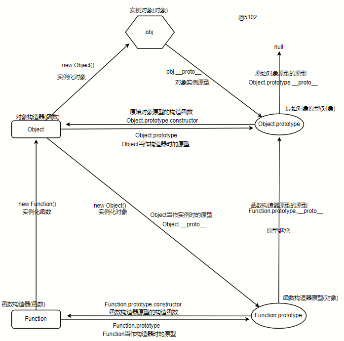
由如上关系可以验证`console.log(Function.prototype.__proto__.constructor.__proto__.constructor === Function) //true`

- 所有函数都是由Function函数构造器实例化而来
- 所有实例的原型都指向构造它的构造器的prototype
- 每个构造器自身特有的方法就是**静态方法**，原型上的方法可供所有继承它或间接继承它的实例使用
- 构造器也是函数，也是被Function实例化出来的，所以构造器的`__proto__`就是Function，但是构造器的prototype属性指向的原型，是此构造器实例化出来的实例所指向的原型；简单说构造器的prototype就是作为它的实例的原型

看看函数的原型链
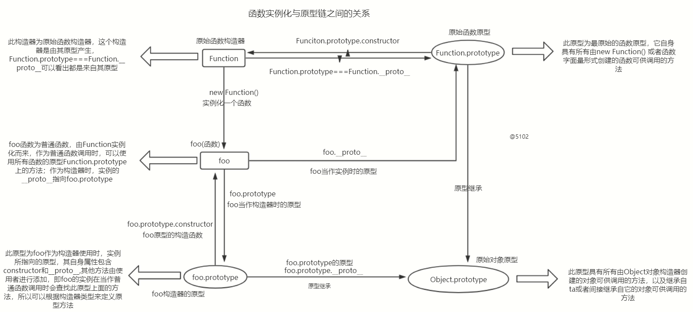

- 在js中函数有多重身份，函数可以作为类就是构造器使用，定义静态方法，作为普通函数调用，
- 只有由原始函数构造器(Function)实例化的函数才拥有直接使用函数原型(Function.prototype)上面的内置方法，创建函数只能通过原始函数构造器生成，
- 普通函数作为构造器使用(new)时相当于类(class)使用，类的prototype就是实例的原型，我们可以给原型添加属性，给类添加属性时就相当于给构造器添加静态属性
- 普通函数在创建实例的时候，会生成一个实例的原型，此原型指向Object.prototype即原始对象原型，也就是继承对象原型，这么一来实例也继承了对象的原型，则实例也属于对象类型

## <span id="4">四、继承与实现</span>

### 继承

- js中的继承一般分为三部分：原型属性继承、静态属性继承、实例属性继承，一个原型上面定义的方法一般都是基于其实例的用途来定义的，也就是说，原型的方法应该是实例经常用到的通用方法，而构造器方法一般是特定情况下可能会用到的方法，可按需调用，原型方法只能供其实例来使用
- 继承可以让原型链丰富，根据需求定制不同的原型链，不会存在内存浪费的情况，原型只会保留一份，用到的时候调用就行，还能节省空间

### 原型继承

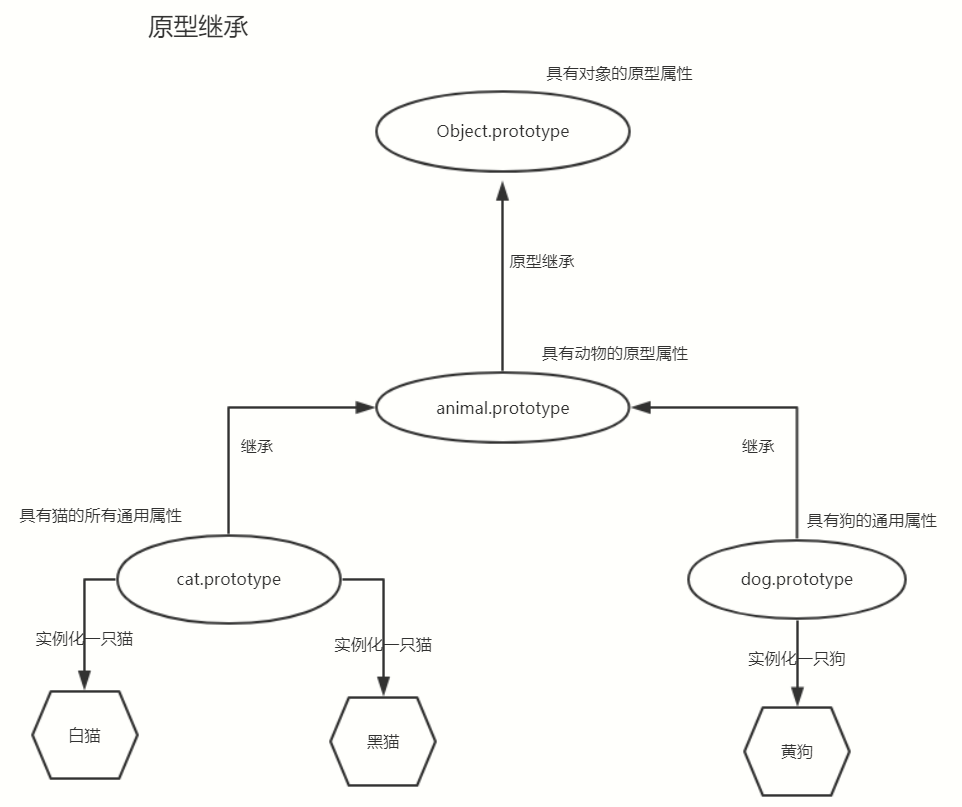

- 可以看出原型一般是一些共有的特性，实例是特有的特性，继承的越多越具体，原型链的最顶端是最抽象的，越底端越具体，这样一来我们可以根据需求在恰当位置继承来实现个性化的定制属性，统一而又有多样化

原型之间的继承

```原型继承
function Parent(){} // 定义父类构造器
function Children(){} // 定义子类构造器

let ChildPrototype = Children.prototype // 构造器原型
let ChildPrototypeProto = Children.prototype.__proto__ // 构造器原型的对象原型

// 方法一
ChildPrototypeProto = Parent.prototype // 父类构造器原型作为子类构造器原型(ChildPrototype)的对象原型(ChildPrototypeProto)

//方法二
ChildPrototype = Object.create(Parent.prototype) // Object.create返回一个对象，其__proto__指向传入的参数，也就实现返回的对象继承参数对象

//方法三
Object.setPrototypeOf(ChildPrototype, Parent.prototype) // 直接设置参数1的原型(__proto__)为参数2
```

以上仅实现了原型之间的继承

### 静态属性继承

- 静态属性的继承，意味着父构造器中定义的静态属性，在子构造器中可以直接调用。不仅实例可以通过对象原型实现继承，构造器也可以通过对象原型继承。之前提到过函数有`prototype`与`__proto__`，其中`prototype`是给实例用的，而`__proto__`是给自己用的。
- 默认的构造函数的对象原型都指向原始函数构造器原型(即Function.prototype)，可以理解所有函数都是由原始函数构造器生成
- 通过构造函数自身的对象原型(`__proto__`)，来实现静态属性继承

```构造器静态属性继承
function Parent() {} // 定义父构造函数
function Children() {} //定义子构造函数

// 定义父构造函数的静态方法
Parent.foo = function () {
  console.log(this.name)
}

// 方法一
Children.__proto__ = Parent // 子构造函数的对象原型指向父构造函数，也就实现继承

// 方法二
Object.setPrototypeOf(Children, Parent) // 同原型继承

console.log(Children.foo) // function(){ console.log(this.name) } ,实现继承
```

以上即为构造函数之间通过对象原型继承静态属性，注：函数也是对象

### 实例属性继承

- 实例自带的属性是由构造函数实例化时默认生成的，那么要实现实例属性的继承，势必要实现子构造函数中调用父构造函数，这样才能实现子构造函数实例化出来的对象也具备父构造函数给予的默认属性
- 在class语法糖的constructor中的super()函数就是实现这个继承

```super
// 定义父构造函数
function Parent(name) {
  this.name = name
}

//定义子构造函数
function Children(name,age) {
  Parent.call(this,name)  // 这里调用父构造器，实现实例属性继承
  this.age = age
}

const obj = new Children('tom', 5)

console.log(obj) // {name: 'tom', age: 5} ，实现实例属性继承
```

通过实例属性继承，可以把父构造器中默认生成的实例属性追加到子构造器实例化出来的对象上

综合以上继承，现在实现真正的继承

### 继承的实现

- 通过es6的extends关键字来继承原型
- 手动实现原型继承

```继承
// 定义父构造函数，功能：初始化实例name属性
function Parent(name) {
  'use strict'
  this.name = name
}
// 定义父构造函数的静态方法，功能：设置调用对象的name属性
Parent.setName = function setName(obj, name) {
  obj.name = name
}
// 定义父构造器原型(prototype)的方法，功能：获取调用对象的name属性
Parent.prototype.getName = function getName() {
  return this.name
}

/*-----以上已定义父类的原型方法(获取name)，父类静态方法(设置name)，以及构造器默认初始化的属性name------*/

// 定义子构造函数，功能：初始化实例age属性，以及通过父构造器初始化实例name属性
function Children(name, age) {
  'use strict'
  Parent.call(this, name) // 调用父构造器，初始化name属性
  this.age = age // 子构造器初始化age属性
}
// 定义子构造函数的静态方法，功能：设置调用对象的age属性
Children.setAge = function setAge(obj, age) {
  obj.age = age
}

// 原型继承
// 设置Children.prototype['[[Prototype]]']= Parent.prototype，此处的'[[Prototype]]'与设置__proto__相同
Children.prototype = Object.create(Parent.prototype)
// 注意此处原型继承之后，不带有constructor属性，应该手动指明为Children
Object.defineProperty(Children.prototype, 'constructor', {
  value: Children,
  writable: true, // 可写
  enumerable: false, // 不可枚举
  configurable: true, // 可配置
})
//以上2句可以直接写成一句
/*
Children.prototype = Object.create(Parent.prototype, {
  constructor: {
    value: Children,
    writable: true, // 可写
    enumerable: false, // 不可枚举
    configurable: true, // 可配置
  }
})
*/

// 由于子构造器原型方法必须在继承之后再定义，否则会被继承覆盖
// 定义子构造器原型(prototype)的方法，功能：获取调用对象的age属性
Children.prototype.getAge = function getAge() {
  return this.age
}

// 构造函数(继承静态属性)继承
// 设置Children.__proto__ = Parent，注意此处不能使用Children = Object.create(Parent)，因为Object.create返回的是一个对象不能替换构造函数
Object.setPrototypeOf(Children, Parent)

// 测试父级
const obj = new Parent('tom') // 实例化父级实例
console.log(obj.getName()) // tom
Parent.setName(obj, 'jerry') // 通过父级静态方法设置name
console.log(obj.getName()) // jerry
console.log(obj instanceof Parent) // true

// 测试子级
const obj1 = new Children(null, 5) // 实例化子级实例
console.log(obj1.getAge()) // 5
Children.setAge(obj1, 8) // 通过子级静态方法设置age
console.log(obj1.getAge()) // 8
console.log(obj1 instanceof Parent) // true
console.log(obj1 instanceof Children) // true

// 完整测试继承
const test = new Children('tom', 5) // 实例化子级实例,name='tom',age=5
console.log(test.getName()) // tom
Parent.setName(test, 'jerry') // 通过父级静态方法设置name=jerry
console.log(test.getName()) // jerry

console.log(test.getAge()) // 5
Children.setAge(test, 8) // 通过子级静态方法设置age=8
console.log(test.getAge()) // 8

class P {
  constructor(name) {
    this.name = name
  }
  static setName(obj, name) {
    obj.name = name
  }
  getName() {
    return this.name
  }
}
class C extends P {
  constructor(name, age) {
    super(name)
    this.age = age
  }
  static setAge(obj, age) {
    obj.age = age
  }
  getAge() {
    return this.age
  }
}

// 这里就不带测试了，可以自行验证，比对一下有什么区别
console.dir(Children)
console.dir(C)

```

实现继承，需要对原型、构造器、实例属性都加以实现继承

## <span id="5">五、实现class与extends</span>

### 实现class

- es6加入的class其实是为了开发者方便创建类，与其他语言在写法上尽量一致，但是js原生并没有类这个东西，为了实现类的效果，可以通过js的构造器来实现，class使用new关键字生成实例，构造器也是通过new来实例化，那么可以推断class本质也是个构造器
- 手动实现class

```实现class
const Class = (function () {
  function Constructor(name) {
    this.name = name
  }
  //添加原型方法
  Constructor.prototype.getName = function name(name) {
    console.log('原型方法getName:' + this.name);
  }
  //添加原型属性
  Constructor.prototype.age = '原型属性age'
  //添加静态方法
  Constructor.log = function log() {
    console.log('我是构造器的静态方法log');
  }
  //添加静态属性
  Constructor.isWho = '构造器静态属性isWho'
  return Constructor
})()
const i = new Class('我是实例')
```

实现class语法糖，只需封装一层函数，可参考继承小节代码演示。

- 返回的Constructor就是实例的构造器，其prototype是个空白的对象这是由于Function造成的
- new后面调用的函数必须是一个构造器函数，用于构造实例，此构造器的this指向实例
- 构造器内部需要实现依照传入的参数设置实例的属性
- 定义Class时需要实现原型属性和静态属性的挂载

以上只实现class的定义，接下来要实现能够兼容继承的写法

### 实现extends

- 继承需要满足原型的继承
- 还需要满足可调用父类构造器

```class继承实现
//父类
const Parent = (function () {
  function Constructor(age) {
    this.age = age
  }
  Constructor.prototype.getName = function () {
    console.log(this.name);
  }
  return Constructor
})()
//子类
const Class = (function (_Parent = null) {
  if (_Parent) {
    Constructor.prototype = Object.create(_Parent.prototype, {
      constructor: {
        value: Constructor,
        enumerable: false,
        writable: true,
        configurable: true
      }
    })
    Constructor.__proto__ = _Parent
  }
  function Constructor(name, age) {
    _Parent ? _Parent.call(this, age) : this
    this.name = name
  }
  Constructor.prototype.getAge = function () {
    console.log(this.age);
  }
  return Constructor
})(Parent)
```

- 实现原型继承，可以使用之前的继承写法，注意class形式的继承，会把父类设为子类的`__proto__`
- 在构造函数内判断是否有父类，如果有就要调用父类的构造函数，把当前的this传入，这样才能生成父类构造器中定义的属性，这才算是真正的继承。继承不单继承原型还能实现继承父类构造器中定义的属性
- 对于原型方法和静态方法也是类似定义，注意定义的方法如果用到this需要使用function关键字定义函数，不可使用匿名函数，否则this无法指向调用对象本身

## <span id="6">六、作用域、执行上下文与闭包</span>

### 作用域与作用域链

#### 作用域

- 所有未定义的变量直接赋值会自动声明为全局作用域的变量(隐式全局变量可以用delete删除，var定义的则不行)

```隐式全局变量
a=1 // 隐式全局变量 严格模式报错
var b=2 // 显式全局变量
console.log(a,b) //1 2
delete a  // 严格模式报错
delete b  // 严格模式报错
console.log(b,a) // 2   a is not defined 
```

- window对象的所有属性拥有全局作用域
- 内层作用域可以访问外层作用域，反之不行
- var声明的变量，在除了函数作用域之外，在其他块语句中不会创建独立作用域
- let和const声明的变量存在块语句作用域，且不会变量提升
- 同作用域下不能重复使用let、const声明同名变量，var可以，后者覆盖前者
- for循环的条件语句的作用域与其循环体的作用域不同，条件语句块属于循环体的父级作用域

```for语句作用域
// 以下语句使用let声明不报错，说明为不同作用域
for (let i = 0; i < 5; i++) {
  let i = 5
}
--------------------------------------------
// 此语句报错，说明循环体为条件语句块的子作用域
// for循环执行顺序为：条件语句块1->条件语句块2->循环体->条件语句块3->条件语句块2 依次类推
for (let i = 0; i < 5; i=x) { // x is not defined
  let x = 5
}
```

#### 作用域链

- 作用域链也就是所谓的变量查找的范围
- 在当前作用域引用变量时，如果没有此变量，则会一路往父级作用域查找此变量，直到全局作用域，如果都没有，在非严格情况下会自动声明，所以是undefined，在严格条件下则会报错
- 变量的查找路径依据的是在创建这个作用域的地方向上查找，并非是在执行时的作用域，如下 b变量的值为2。可以看出当执行到需要b变量时，当前作用域下并没有b，所以要到定义这个b变量的静态作用域中寻找，即创建时候的作用域链上查找b的值

```作用域链
b = 1
function a() {
  // 定义b，找到
  const b = 2
  function s() {
    // 使用到b，当前作用域并没有，向上找
    console.log(b);
  }
  return s
}
const s = a()
var b = 3
s() // 2
```

- 作用域在脚本解析阶段就已经规定好了，所以与执行阶段无关，且无法改变

### 执行上下文

- 执行上下文在运行时确定，随时可能改变
- 调用栈中存放多个执行上下文，按照后进先出的规则进行创建和销毁，最底部的执行上下文，也就是栈低的执行上下文为全局上下文，最早被压入栈中，其上下文中的this指向window，严格模式下为undefined
- 创建执行上下文时，会绑定当前this，确定词法环境，存储当前环境下函数声明内容，变量let与const绑定但未关联任何值，确认变量环境时，绑定var的初始值为undefined
- 在var声明之前，调用var声明的变量时值为undefined，因为创建了执行上下文，var声明的变量已经绑定初始undefined，而在let和const声明之前调用其声明的变量时，由于只绑定在了执行上下文中，但并未初始任何值，所以在声明之前调用则会抛出引用错误(即TDZ暂时性死区)，这也就是函数声明与var声明在执行上下文中的提升

这里了解一下函数、变量提升

```提升
console.dir(foo) // foo(){}
function foo() {}
var foo = 5
/*
console.dir(foo) // undefined
var foo = 5
*/
------------------------------
var foo = 5
function foo() {}
console.dir(foo) // 5
```

从以上代码结果可以得出结论：

- 上面代码块能够体现，在解析阶段会将函数与变量提升，且函数的优先级比var声明的变量高，因为打印的是函数声明，如果var声明的优先级高，那么应该是undefined
- 从下面的代码块中可以看出foo在代码执行的时候被赋值为5，而函数声明在解析阶段已经结束，在执行阶段没有效果
- 还有一点 个人认为在解析阶段，函数声明与变量声明提升之后在代码块中的位置顺序没什么关系

### 闭包

- 所谓闭包就是函数与其词法环境(创建当前作用时的任何局部变量)的引用。闭包可以使内部函数访问到外部函数的作用域，当函数被创建时即生成闭包

```闭包
function fn1() {
  var name = 'hi';
  function fn2() {
    console.log(name);
  }
  return fn2
}
fn1()() // hi
```

- 当你从函数内部返回一个内部函数时，返回的函数将会保留当前闭包，即当前词法环境
- 闭包只会保留环境中任何变量的最后一个值，这是因为闭包所保存的是整个变量的对象
- 闭包的作用域链包含着它自己的作用域，以及包含它父级函数的作用域和全局作用域
- 当返回一个闭包时，保留此闭包下的所有被外部引用的对象
- 闭包之间是独立的，在闭包环境下可以创建多个不同的闭包环境暴露给外部，从而实现不同的效果

```不同环境的闭包
function makeAdder(x) {
  return function(y) {
    return x + y;
  };
}
var add5 = makeAdder(5);
var add10 = makeAdder(10);
console.log(add5(2));  // 7
console.log(add10(2)); // 12
```

- 暴露闭包的方式不止返回内部函数一种，还可以使用回调函数产生闭包环境，或者把内部函数赋值给其他外部对象使用
- 闭包在没有被外部使用的情况下，随执行结束销毁，如何产生闭包并且保留闭包环境的关键就在于不让其环境被垃圾回收系统自动清除，那么就要使内部环境中的引用被外部保留，这样才能保留闭包
- 闭包虽然方便我们操作和保留内部环境，但是闭包在处理速度和内存消耗方面对脚本性能具有负面影响，除非在特定的情况下使用

这里看个有趣的东西

```闭包
function foo(){
  let a={name:'me'}
  let b={who:'isMe'}
  let wm=new WeakMap()
  function bar(){
    console.log(a)  // a被闭包保留
    wm.set(b,1) // 弱引用b对象
    return wm //wm被闭包保留
  }
  return bar
}
const wm=foo()()
console.dir(wm) // No properties 即为空
-------------------------------------------
function foo(){
  let a={name:'me'}
  let wm=new WeakMap()
  function bar(){
    console.log(a)
    wm.set(a,1)
    return wm
  }
  return bar
}
const wm=foo()()
console.dir(wm) // 保存了对象a与其值1
```

- 从上块代码中可以看出，bar被return到外部环境，所以其内部形成闭包，bar中使用到的变量(a,wm)都会被保留下来，但是最后打印wm的时候为空？这是因为外部并没有引用到b对象，只是通过wm弱引用保存b的值，从wm为空可以看出，闭包内部的b被清除，所以wm也自动清除b的弱引用，可以论证之前所说，闭包只保留外部用到的变量
- 从下块代码能直接看出a就是闭包中的a，bar在外部执行时需要用到a与wm所以保留了下来
- 有人可能会不解，为什么上块代码中的b也被wm.set(b,1)引用，但是最终就没有呢，那是因为WeakMap中保留的是b的弱引用，可以理解为，wm中的b是依赖原函数中的b而存在，当wm被return时，闭包中的b，没有被任何外部所依赖，而是别人依赖它。可以这么理解 b牵着别人走，因为b没有被外面人牵着走，所以b这个链子就被断开，也影响到b牵的人一块丢了

## <span id="7">七、this</span>

先看一张图
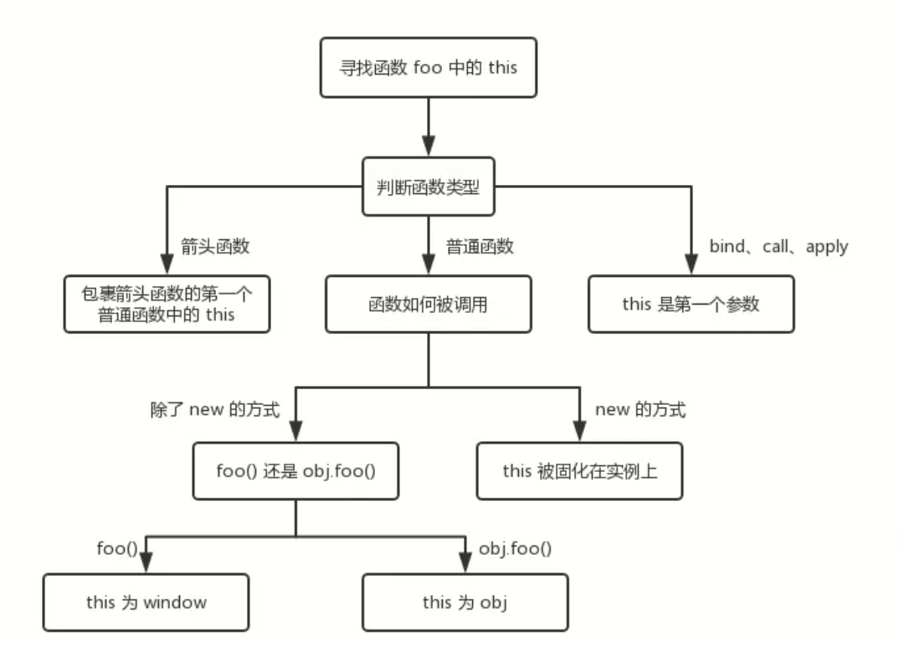

- this的绑定在创建执行上下文时确定
- 大多数情况函数调用的方式决定this的值，this在执行时无法赋值
- this的值为当前执行的环境对象，非严格下总是指向一个对象，严格下可以是任意值
- 全局环境下this始终指向window，严格模式下函数的调用没有明确调用对象的情况下，函数内部this指向undefined，非严格下指向window
- 箭头函数的this永远指向创建当前词法环境时的this
- 作为构造函数时，函数中的this指向实例对象
- this的绑定只受最靠近调用它的成员的引用
- 执行上下文在被执行的时候才会创建，创建执行上下文时才会绑定this，所以this的指向永远是在执行时确定

```this
function foo(){
  console.dir(this) // window ,严格下undefined
}
foo()
-----------------------------------------------
function foo(){
  console.dir(this) //非严格Number对象，严格模式 5
}
foo.call(5)
```

严格与非严格模式下的this指向是不同的，非严格总是指向一个对象，严格模式可以为任意值

执行前


执行后
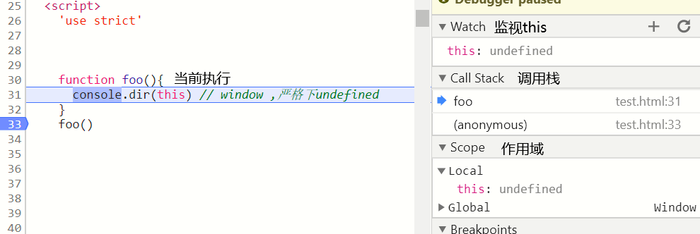

以上2图可以使用chrome开发工具来进行查看程序执行时的相关数据，可以看到严格模式下简单调用的函数内部的this指向undefined

### 普通函数中的this

#### 直接调用

在没有明确调用者情况下函数内部this指向window，严格模式下都为undefined，除非绑定函数的this指向，才会改变this

```普通调用
// 直接调用函数
function foo() {
  console.dir(this) //window,严格下 undefined
  function boo(){
    console.dir(this) //window,严格下 undefined
  }
  boo()
}
----------------------------------------------
// 取出对象中的函数，再进行调用
const obj = {
  foo: function foo() {
    console.dir(this) //window,严格下 undefined
    function boo() {
      console.dir(this) //window,严格下 undefined
    }
    return boo
  }
}
const foo = obj.foo
foo()()
----------------------------------------------
// 直接通过对象调用函数，再调用返回的函数，可以看出this的指向随调用对象改变
const obj = {
  foo: function foo() {
    console.dir(this) //obj,严格下 obj
    function boo() {
      console.dir(this) //window,严格下 undefined
    }
    return boo
  }
}
const foo = obj.foo()
foo()
----------------------------------------------
// 基于回调函数也是如此
function foo(func) {
  console.dir(this) // window ,严格下 undefined
  func()
}
foo(function () {
  console.dir(this) // window ,严格下 undefined
})
```

#### 基于调用者以及不同调用方式

函数调用也就是在函数名后面加个()，表示调用，如果函数名前没有加任何东西，那么默认为**简单调用**，在严格与非严格环境下，简单调用的函数内部this指向undefined与window，但是全局环境下的this永远为window

基于对象

当函数作为**对象的方法**调用时，不受函数定义方式或者位置影响

```基于对象
// 函数this指向调用者对象
const obj = {
  foo: function () {
    console.dir(this) // obj1,严格下 obj1
    function boo() {
      console.dir(this) // window,严格下 undefined
    }
    boo()
    return boo
  }
}
const obj1 = {}
obj1.boo = obj.foo
obj1.boo()
----------------------------------------------
// 不同调用对象时，this指向调用者
const obj = {
  foo: function () {
    console.dir(this) // obj,严格下 obj
    function boo() {
      console.dir(this)
    }
    boo() // window,严格下 undefined
    return boo
  }
}
const obj1 = {}
obj1.boo = obj.foo()
obj1.boo() // obj1,严格下 obj1
----------------------------------------------
// this指向最近的调用者
const obj = {
  name: 'obj',
  obj1: {
    name: 'obj1',
    foo: function () {
      console.dir(this.name) // obj1
    }
  }
}
obj.obj1.foo()
```

基于new关键字

```new
// 基于new关键字调用的函数内部this指向实例
function foo() {
  console.dir(this) // foo实例
  console.log(this instanceof foo) //true
  console.log(foo.prototype.isPrototypeOf(this)) //true
  that = this
}
var that
const f = new foo()
console.log(that === f) // true
----------------------------------------------
// 嵌套函数内部this与调用函数所在环境的this无关
function foo() {
  console.dir(this) // foo实例
  function boo() {
    console.dir(this) //window,严格下undefined
  }
  boo()
}
const f = new foo()
```

基于定时器与微任务

微任务中的简单调用的函数this指向window严格下指向undefined，而**定时器中的回调函数不管在严格还是非严格环境下this永远指向window**，说明一点，调用window对象的方法时this指向window也就是全局对象，换句话说，简单调用的函数如果属于window本身自带的方法那么这个方法的this指向window

```宏微任务
// 异步任务中简单调用的函数都是进入队列，最后由全局环境调用
const id = setInterval(function () {
  console.dir(this) // window ,严格下 window
  setTimeout(() => {
    console.dir(this) // window ,严格下 window
    clearInterval(id)
  });
})
----------------------------------------------
new Promise(function (resolve, reject) {
  console.dir(this) // window ,严格下 undefined
  resolve()
}).then(function (res) {
  console.dir(this) // window ,严格下 undefined
});
----------------------------------------------
(async function foo() {
  function boo() {
    console.dir(this) // window ,严格下 undefined
  }
  await boo()
  console.dir(this) // window ,严格下 undefined
})()
----------------------------------------------
// 定时器的回调最终都会被作为简单函数被执行，定时器属于window对象的方法
function foo(){
  setTimeout(function (){
    console.log(this) //window ,严格下window
  })
}
foo.call(5)
----------------------------------------------
// 函数内部的this就是指向调用者，并且可以看出简单调用的回调函数中的this也指向window
const obj = {
  foo(callback) {
    callback()
    console.log(this.foo === obj.foo) // true
    console.log(this === obj) // true
  }
}
obj.foo(function () {
  console.log(this) //window ,严格下undefined
})
----------------------------------------------
// 通过arguments调用的回调函数中的this指向调用者，注意严格与非严格下的arguments对象有所不同
const obj = {
  foo(callback) {
    arguments[0]()
    console.log(this.foo === obj.foo) // true
    console.log(this === obj) // true
  }
}
obj.foo(function () {
  console.log(this) //arguments对象 ，严格下 arguments对象
})
```

### 箭头函数中的this

es6引入的箭头函数，是不具有this绑定，不过在其函数体中可以使用this，而这个this指向的是箭头函数当前所处的词法环境中的this对象，可以理解为，this在箭头函数中是透明的，箭头函数包不住this，所以函数内部与外部的this为同一值

- 判断箭头函数的this指向，我们可以把箭头函数看成透明，其上下文中的this就是它的this
  
```箭头函数中的this
// 可以看出箭头函数中的this就是其所在环境的this，箭头函数无法固定this，由其环境决定
const foo = () => {
  console.dir(this) //window ,严格下还是window
}
foo()
----------------------------------------------
// 可见对象中的this指向window，箭头函数中的this指向对象中的this。由于只有创建执行上下文才会绑定this指向，而除了全局上下文，只有函数作用域才会创建上下文环境从而绑定this，创建对象不会绑定this，所以还是全局this
const obj={
  this:this,
  foo:()=>{
    console.dir(this) //window ，严格下 window
  }
}
console.dir(obj.this) //window ，严格下 window
obj.foo()
---------------------------------------------
// 对象方法内部嵌套箭头函数，则此箭头函数的this属于外部非箭头函数this。当调用obj.foo时foo函数创建的执行上下文中的this绑定对象obj，而箭头函数并不会绑定this，所以其this属于foo下的this，即对象obj
const obj = {
  foo: function () {
    return () => {
      console.dir(this) //obj ，严格下 obj
    }
  }
}
obj.foo()()
```

### 如何改变函数的this指向

最简单的方法通过apply、call、bind来给函数绑定this

- apply方法中第一个参数为被调用的函数中的this指向，传入你想要绑定的this值即可，第二个参数为被调用函数的参数集合，通常是个数组
- call与apply方法基本一致，区别在于传入参数形式不同，call传入的参数为可变参数列表，参数按逐个传入
- bind方法与以上不同的是不会直接调用函数，只是先绑定函数的this，到要使用的时候调用即可，此方法返回一个绑定this与参数之后的新函数，其传入参数形式同call
- 通过变量保留指定this来达到固定this

```改变this
// 通过变量保留父级this，进行对_this变量修改也就达到修改原this的效果
const obj = {
  name: 'obj',
  foo: function () {
    let _this = this
    function boo() {
      _this.name = 'OBJ'
      console.dir(obj.name) // OBJ
    }
    return boo
  }
}
obj.foo()()
```

## <span id="8">八、apply、call、bind实现</span>

这3者的实现其实差不多，bind实现可能会有点不一样，都要实现this的改变

### 手动实现apply

- 思路就是想办法使函数被传入的thisArg调用，那么函数的this就指向调用者

```手动apply
Function.prototype.Apply = function (thisArg, args = Symbol.for('args')) {
  console.dir(this)            //this为这个方法的调用者=>foo函数
  const fn = Symbol('fn')      //生成一个不重复的键
  thisArg[fn] = this || window //把foo函数作为传入this的一个方法
  args === Symbol.for('args') 
  ? thisArg[fn]()
  : thisArg[fn](...args)       //调用这方法，传参
  delete thisArg[fn]           //使用完删除
}
var name = 'foo'
var age = 5
function foo(age,height) {
  console.log(this.name) // obj
  console.log(age)       // 3
  console.log(height)    // null
}
const obj = {
  name: 'obj',
  age: 3
}
foo.Apply(obj,[obj.age,null])
```

### 手动实现call

基本思路同apply，就是传参形式改变一下,这里通过arguments获取参数列表

```call实现
Function.prototype.Call = function (thisArg) {
  console.dir(this)            //this为这个方法的调用者=>foo函数
  const fn = Symbol('fn')      //生成一个不重复的键
  thisArg[fn] = this || window //把foo函数作为传入this的一个方法
  const args = Array.from(arguments).slice(1)
  args.length ? thisArg[fn](...args) : thisArg[fn]()  //调用这方法，传参
  delete thisArg[fn]           //使用完删除
}
```

### 手动实现bind

bind函数要能够返回严格绑定this与参数后的函数，调用这个返回的函数时有可能还会传入参数，那么需要拼接参数

```bind实现
Function.prototype.Bind = function (thisArg) {
  const fn = Symbol('fn')       //生成一个不重复的键
  thisArg[fn] = this || window  //把foo函数作为传入this的一个方法
  const f = thisArg[fn]         // 负责一份函数
  delete thisArg[fn]            //删除原来对象上的函数，但是保留了this指向
  const args = Array.from(arguments).slice(1)
  return function () {
    const arg = args.concat(...arguments)
    f(...arg)
  }
}
var name = 'foo'
var age = 5
var height = 4
function foo(age, height) {
  console.log(this.name)       // obj
  console.log(age)             // 3
  console.log(height)          // 2
}
const obj = {
  name: 'obj',
  age: 3
}
foo.Bind(obj, obj.age)(2)
```

## <span id="9">九、同步与异步</span>

### 同步

- 基于js的单线程同时只能处理一件事情，而同步即是在主线程上排队执行的任务，只有当前任务执行完成，才会进入下一个任务。同步执行的函数会在预期得到结果，也就是可以清楚什么时候能得到返回值
- 所有同步代码只会进入调用栈，同步代码会阻塞主线程的执行，而且会优先与其他非同步代码执行

### 异步

- 异步是指当前执行的代码会进入异步线程处理之后才会再由主线程处理回调
- 异步的结果不是马上能够得到，而是会在将来的某个时间点获取到
- 通常异步代码所要经过的步骤比同步代码多，由于异步代码不是直接放在调用栈中执行，而是要派发(可能不需要)给其他线程处理，等处理完成后的回调放在某个地方存储(比如任务队列)，等到同步队列执行完成之后才会取回异步回调代码进行执行

#### 异步、单线程与EventLoop

先看一张图，有个大体架构


- js主线程处理当前正在执行的代码，它会执行当前调用栈栈顶的执行上下文，从堆空间(一般是存储对象)和栈空间(一般存储非对象值以及对象引用)取数据，进而处理当前调用栈所用到的数据
- 所有的同步代码会按照代码顺序压入调用栈中等待主线程执行，如果代码中遇到了异步代码，则会根据异步类型抛给异步线程执行
- 异步类型，主要分为微任务与宏任务
- 任务队列其实本质就是一块内存空间，里面的任务是依据FIFO先进先出的规则来执行，所有异步代码执行完毕的回调都是加入到异步任务队列中等待主线程的调用
- 异步可以提高cpu的利用率

##### 微任务

- 微任务队列与宏任务队列的区别就在于，主线程对于其中的任务调度的区别，主进程会优先执行微任务队列中的全部任务，当微任务中的全部任务执行完毕才会进而转到宏任务执行
- 微任务可以由这些方法关键字调用产生Promise、async、await、MutaionObserver、process.nextTick(Node.js环境）
- 如果调用微任务方法时，方法内部包含其他线程干预处理时，会抛给指定线程执行，而主线程继续执行下面的代码，等到其他线程处理完成之后，如果有回调函数则会把回调加入到指定异步类型(这里为微任务队列)的队列中排队等待主线程执行
- 微任务与宏任务的主要区别在于，主线程优先执行全部微任务，待执行完成之后才会挨个执行宏任务

##### 宏任务

- 一般的宏任务队列存放的是WebApis的回调，WebApis中包含许多线程，GUI渲染线程(与js主线程互斥不能同时执行)、事件触发线程、定时器线程、异步网络请求线程
- 宏任务存放由异步WebApis产生的回调函数，但优先级低于微任务

##### js单线程

- js单线程设计之初就是为了简化代码，解决DOM冲突，如果js为多线程语言，那么有可能产生多个线程同时操作DOM的情况，那么将会导致js操作同个DOM引起冲突，介于多线程的锁机制来解决冲突，但又使得js的代码复杂度提高
- 基于js单线程的设计，进而引出异步执行的方式，使得js具有类似多线程程的效果，但不管异步还是同步，js永远都只有一个线程在执行

##### EventLoop

- 事件循环机制是针对于主线程的调度方式
- 可以理解为主线程在寻找任务执行的过程就是事件循环，其寻找方式就是调用机制
- 先了解一下浏览器是如何执行js代码的
  - 通常浏览器在最开始运行js代码的入口就是html中的script标签所涵盖的代码
  - 当GUI渲染线程解析到script标签，则会把标签所涵盖的js代码加入到宏任务队列中
  - 首先js引擎(如V8引擎)先取第一个宏任务，即script的代码块，然后主线程在调用栈中解析js代码
  - 等所有代码解析完成之后开始运行js代码
  - 如果遇到同步代码直接执行
  - 遇到异步代码，如果是宏任务类型即异步WebApis处理的异步代码，那么将会通知WebApis在对应的线程中处理异步任务，此时js主线程继续执行下面的代码，在其他线程处理完毕之后如果有回调函数，则异步线程会将回调函数加入到宏任务队列尾部，
  - 如果是微任务类型的异步代码，也同宏任务处理，只不过是把回调函数加入到微任务队列中，其执行的优先级高于宏任务队列
  - 当同步代码全部执行完成，主线程将会一直检测任务队列，如果有异步微任务则执行完全部的微任务
  - 进一步执行浏览器渲染进程绘制页面，之后就是开始下一轮的事件循环，就又回到取宏任务执行
  - 这里注意，所有的微任务都是由宏任务中执行的代码产生，一开始只有宏任务队列有任务

以下展示的是事件循环大致流程


以下为主线程判断逻辑

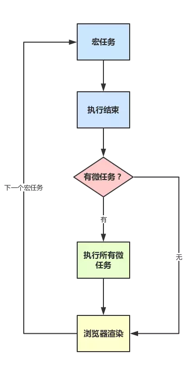

### 前端异步的场景

- 前端异步主要用于代码可能会发生等待，而且等待过程不能阻塞主线程运行的情况
- 通常WebApis接口都是异步调用的，由于需要其他线程的处理，就需要等待其返回结果，那么js主线程就没必要一直等待，这样就需要使用异步来进行处理
- 比如定时器任务setTimeout、setInterval、ajax请求、图片动态加载、DOM事件触发这些都属于浏览器执行的异步任务；如js中的Promise、async、await属于js语言自身的异步操作这些都可以实现异步
- 当需要动态加载图片的时候就需要用到异步；当需要执行的js的同步代码需要长时间占用的主线程时可以使用异步方式拆分为多个步骤执行，这样可以避免浏览器页面长时间无响应或者卡顿
- 当需要执行很长一段时间才能得到结果的代码时也可以使用html5中的Web worker在浏览器渲染进程下新开一个线程用来专门执行此代码，通过postMessage来返回运行结果这样也不会占用js主线程，但是这个线程无法操作DOM和BOM

### WebWorker多线程

- 基于js单线程的局限性，如果执行一个很耗时间的函数，那么主线程将会被长时间占用，因此导致事件循环暂停，使得浏览器无法及时渲染和响应，那么将会造成页面崩溃，用户体验下降，所以html5支持了webworker
- webwork简单理解就是可以让特定的js代码在其他线程中执行，等执行结束后返回结果给主线程接收即可
- 比如在js中需要实现一个识别图片的算法，而且此算法需要很长的计算时间，如果让js主线程来执行将会导致上述发生的事情，那么正好可以使用webwork技术来实现。
- 创建一个webworker文件，其中写入算法代码，在最后调用postMessage(result)方法返回结果给主线程，js主代码中通过w=new Worker(文件路径)来创建一个渲染进程的webworker子线程实例，通过w.onmessage=function(e){console.log(e.data)}给其添加一个事件监听器，当webworker中传递消息给js主线程时会在此回调函数中执行，通过调用w.terminate()终止webworker线程
- webworker线程与js主线程最大的区别就在于webworker线程无法操作window与document对象

```webworker
// test.html(主线程)
const w= new Worker('postMessage.js')
w.onmessage=function(e){
  console.log(e.data);
}
w.postMessage('b') // b is cat
w.terminate() // 手动关闭子线程
----------------------------------------------
// postMessage.js(worker线程)
this.addEventListener('message', (e) => {
  switch (e.data) {
    case 'a': this.postMessage(e.data+' is tom')
      break;
    case 'b': this.postMessage(e.data + ' is cat')
      break;
    default:  this.postMessage(e.data + " i don't know")
    this.close() // 自身关闭
      break;
  }
})
```

## <span id="10">十、AMD、CMD、CommonJS与ES6模块化</span>

模块化的引入主要是用于解决命名冲突、代码复用、代码可读性、依赖管理等

### AMD异步模块定义

- AMD全称Asynchronous Module Definition异步模块定义
- AMD并非原生js支持，是RequireJS模块化开发当中推广的产物，AMD依赖于RequireJS函数库，打包生成对应效果的js代码
- RequireJS主要用于解决多个js文件之间的依赖关系、浏览器加载大量js代码导致无响应、异步加载模块
- RequireJS通过`define(id?,dependencies?,factory)`定义模块，id可选，为定义模块的标识，默认为模块文件名不包括后缀，dependencies可选，是当前模块依赖的模块路径数组，factory为工厂方法，初始化模块的函数或者对象，如果为函数将会只执行一次，如果是对象将作为模块的输出
- 通过`require(dependencies,factory)`导入模块，其中dependencies为需要导入的模块路径数组，factory为当模块导入之后的回调函数，此函数的参数列表为对应导入的模块
- 通过require.config(配置对象)配置各模块路径和引用名

```配置AMD
require.config({
  baseUrl: "js/lib",
  paths: {
    "jquery": "jquery.min",  //实际路径为js/lib/jquery.min.js
    "underscore": "underscore.min",
  }
})
```

### CMD通用模块定义

- CMD全称Common Module Definition通用模块定义
- 同AMD，CMD也有一个函数库SeaJS与RequireJS类似的功能
- CMD推崇一个文件一个模块，推崇依赖就近，定义模块`define(id?,deps?,factory)`，id同AMD，deps一般不在其中写依赖，而是在factory中在需要使用的时候引入模块，factory函数接收3各参数，参数一require方法，用来内部引入模块的时候调用，参数二exports是一个对象，用来向外部提供模块接口，参数三module也是一个对象上面存储了与当前模块相关联的一些属性和方法
- 通过`seajs.use(deps,func)`加载模块，deps为引入到模块路径数组，func为加载完成后的回调函数

AMD、CMD的主要区别在于

AMD推崇依赖前置，在定义模块的时候就要声明其依赖的模块
CMD推崇就近依赖，只有在用到某个模块的时候再去require

### CommonJS

- CommonJS模块规范，通常用于Nodejs中的模块化
- 拥有4个环境变量modul、exports、require、global
- 通过`module.exports`(不推荐exports)导出模块对象，通过require(模块路径)加载模块
- 当一个模块同时存在exports和module.exports时后者覆盖前者
- 规范中`__dirname`代表当前模块文件所在的文件夹路径，`__filename`代表当前模块文件夹路径+文件名
- CommonJS通过同步的方式加载模块，其输出的模块是一个拷贝对象，所以修改原的模块不会对被引入的模块内部产生影响，且模块在代码运行的时候加载

### ES6模块化

- es6引入的export与import用于解决js自身不具备模块功能的缺陷
- 通过export或者export default导出模块接口，通过import xxx from '路径'，导入模块
- 对于export导出的接口可以使用import {接口} from '路径'，通过解构的方式按需导入
- 对于export default默认导出的，可以使用import xxx from '路径'，来导入默认导出的接口，xxx可以是自定义名称，且一个模块只能有一个默认导出，可以有多个export
- 还可以通过别名的方式设置导出和导入的接口名，如export {a as foo}，把foo作为a的别名导出，import foo as b from 路径，把b当作foo的别名导入
- es6模块是在代码编译时输出接口即编译时加载，es6是通过命令来指定导出和加载，且导出的是模块中的只读引用，如果原始模块中的值被改变了，那么加载的值也会随之改变，所以是动态引用

## <span id="11">十一、script标签之async与defer</span>

### 使用async属性

- 如果script标签设置了这个值，则说明引入的js需要异步加载和执行，注意此属性只适用于外部引入的js
- 在有async的情况下脚本异步加载和执行，并且不会阻塞页面加载，但是也并不会保证其加载的顺序，如果多个async优先执行，则先加载好的js文件，所以使用此方式加载的js文件最好不要包含其他依赖

### 使用defer属性

- 如果使用此属性，也将会使js异步加载执行，且会在文档被解析完成后执行，这样就不会阻塞页面加载，但是它将会按照原来的执行顺序执行，对于有依赖关系的也可使用
- html4.0中定义了defer，html5.0中定义了async

### 不同情况

- 如果只有async，那么脚本在下载完成后异步执行。
- 如果只有defer，那么脚本会在页面解析完毕之后执行。
- 如果都没有，那么脚本会在页面中马上解执行，停止文档解析阻塞页面加载
- 如果都有那么同async，当然此情况一般用于html的版本兼容下，如果没有async则defer生效
- 不过还是推荐直接把script标签放在body底部

## <span id="12">十二、改变数组本身的api</span>

1. `pop()`  尾部弹出一个元素
2. `push()` 尾部插入一个元素
3. `shift()`  头部弹出一个元素
4. `unshift()`  头部插入一个元素
5. `sort([func])` 对数组进行排序,func有2各参数，其返回值小于0，那么参数1被排列到参数2之前，反之参数2排在参数1之前
6. reverse() 原位反转数组中的元素
7. `splice(pos,deleteCount,...item)`  返回修改后的数组，从pos开始删除deleteCount个元素，并在当前位置插入items
8. `copyWithin(pos[, start[, end]])` 复制从start到end(不包括end)的元素，到pos开始的索引，返回改变后的数组，浅拷贝
9. `arr.fill(value[, start[, end]])` 从start到end默认到数组最后一个位置，不包括end，填充val，返回填充后的数组

其他数组api不改变原数组

## <span id="13">十三、window之location、navigator</span>

### location对象

- location为全局对象window的一个属性，且`window.location===document.location`，其中的属性都是可读写的，但是只有修改**href**和**hash**才有意义，href会重新定位到一个URL，hash会跳到当前页面中的anchor名字的标记(如果有)，而且页面不会被重新加载

```location
// 这行代码将会使当前页面重定向到http://www.baidu.com
window.location.href = 'http://www.baidu.com'
----------------------------------------------
// 如果使用hash并且配合input输入框，那么当页面刷新之后，鼠标将会自动聚焦到对应id的input输入框，
<input type="text" id="target">
<script>
  window.location.hash = '#target'
</script>
```

先看下其拥有的属性

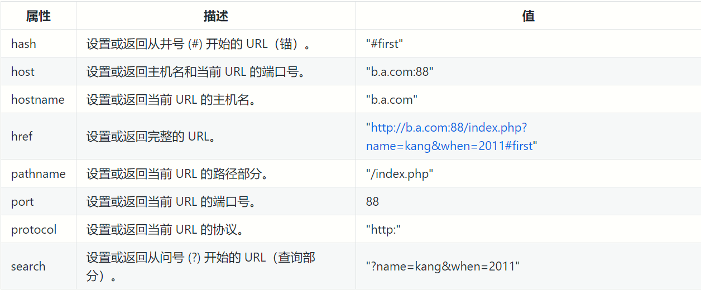
这里补充一个**origin**属性，`返回URL协议+服务器名称+端口号 (location.origin == location.protocol + '//' + location.host)`

- 可以通过上述属性来获取URL中的指定部分，或者修改href于hash达到重新定位与跳转
- 添加hash改变监听器，来控制hash改变时执行的代码

```添加hash改变事件
window.addEventListener("hashchange", funcRef);
// 或者
window.onhashchange = funcRef;
```

location方法
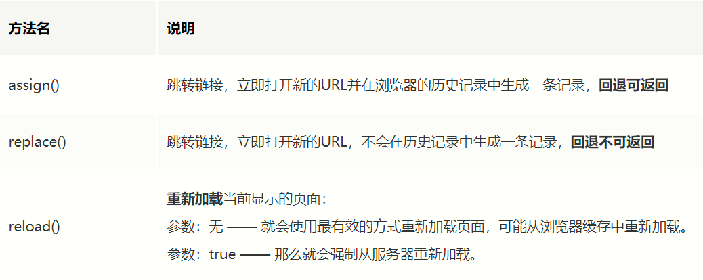

- `assign(url)`,通过调用`window.location.assign`方法来打开指定url的新页面`window.location.assign('http://www.baidu.com')`在当前页面打开百度，可回退
- `replace(url)`,在当前页面打开指定url，不可回退
- `reload([Boolean])`,调用此方法将会重新加载当前页面，如果参数为false或者不填，则会以最优的方式重新加载页面，可能从缓存中取资源，如果参数为true则会从服务器重新请求加载资源

### navigator对象

- `window.navigator`对象包含**有关浏览器的信息**，可以用它来查询一些关于运行当前脚本的应用程序的相关信息

```navigator
document.write("浏览器的代码名:" + navigator.appCodeName + "<br>");
document.write("浏览器的名称:" + navigator.appName + "<br>");
document.write("当前浏览器的语言:" + navigator.browserLanguage + "<br>");
document.write("浏览器的平台和版本信息:" + navigator.appVersion + "<br>");
document.write("浏览器中是否启用 cookie :" + navigator.cookieEnabled + "<br>");
document.write("运行浏览器的操作系统平台 :" + navigator.platform + "<br>");
```

- `navigator.appCodeName` 只读,任何浏览器中，总是返回 'Gecko'。该属性仅仅是为了保持兼容性。
- `navigator.appName` 只读,返回浏览器的官方名称。不要指望该属性返回正确的值。
- `navigator.appVersion` 只读,返回一个字符串，表示浏览器的版本。不要指望该属性返回正确的值。
- `navigator.platform` 只读,返回一个字符串，表示浏览器的所在系统平台。
- `navigator.product` 只读,返回当前浏览器的产品名称（如，"Gecko"）。
- `navigator.userAgent` 只读,返回当前浏览器的用户代理字符串（user agent string）

如下在不同浏览器打印的信息

```navigator.userAgent
/*
chrome:
    Mozilla/5.0
    (Macintosh; Intel Mac OS X 10_12_6)
    AppleWebKit/537.36 (KHTML, like Gecko)
    Chrome/61.0.3163.91 Safari/537.36
safari:
    Mozilla/5.0
    (Macintosh; Intel Mac OS X 10_12_6)
    AppleWebKit/604.1.38 (KHTML, like Gecko) Version/11.0
    Safari/604.1.38
ios11刘海X:
    Mozilla/5.0
    (iPhone; CPU iPhone OS 11_0 like Mac OS X)
    AppleWebKit/604.1.38 (KHTML, like Gecko)
    Version/11.0 Mobile/15A372 Safari/604.1
ipad：
    Mozilla/5.0
    (iPad; CPU OS 9_1 like Mac OS X)
    AppleWebKit/601.1.46 (KHTML, like Gecko)
    Version/9.0 Mobile/13B143 Safari/601.1
galxy sansum:
    Mozilla/5.0
    (Linux; Android 5.0; SM-G900P Build/LRX21T)
    AppleWebKit/537.36 (KHTML, like Gecko)
    Chrome/61.0.3163.91 Mobile Safari/537.36
安装uc浏览器：
    Mozilla/5.0
    (Linux; U; Android 6.0.1; zh-CN; Mi Note 2 Build/MXB48T)
    AppleWebKit/537.36 (KHTML, like Gecko) Version/4.0
    Chrome/40.0.2214.89 UCBrowser/11.4.9.941 Mobile Safari/537.36
winphone:
    Mozilla/5.0
    (Linux; Android 5.1.1; Nexus 6 Build/LYZ28E)
    AppleWebKit/537.36 (KHTML, like Gecko) 
    Chrome/61.0.3163.91 Mobile Safari/537.36
hybrid方法的可能：
    Mozilla/5.0
    (iPhone; CPU iPhone OS 11_0 like Mac OS X)
    AppleWebKit/604.1.38 (KHTML, like Gecko)
    Mobile/15A372 weibo/80011134
*/
```

## <span id="14">十四、ajax与fetch</span>

### ajax

- ajax全称Asynchronous JavaScript And XML也就是异步js与xml，它可以让页面在不刷新的情况下发起请求获取数据
- 使用`window.XMLHttpRequest`构造器实例化一个网络请求对象`const XHR = new XMLHttpRequest()`
- `XHR.open(method, url, [ async, [ user, [ password]]])`此方法用来发送一个请求，method为请求方法，url为请求地址，async为boolean值默认为true即使用异步请求，user和password在请求需要用户和密码的时候使用
- `XHR.send(body)`参数为发生请求主体内容，其格式可以为FormData、ArrayBuffer、Document、序列化字符串，在收到响应后，响应的数据会自动填充XHR对象的属性
- 当需要设置请求头时可以调用`XHR.setRequestHeader(header,value)`设置请求头的类型与值，当以post方式发起请求就用设置`XHR.setRequestHeader('Content-Type', 'application/x-www-form-urlencoded')`此请求头，值可更改
- 通过监听实例的onreadystatechange属性方法，当readyState的值改变的时候会触发onreadystatechange对应的回调函数`XHR.onreadystatechange = function () { }`
- 请求状态readyState有5个值，对应5个请求状态，只读
  - 0 表示 请求还未初始化，尚未调用 open() 方法。
  - 1 表示 已建立服务器链接，open() 方法已经被调用。
  - 2 表示 请求已接受，send() 方法已经被调用，并且头部和状态已经可获得。
  - 3 表示 正在处理请求，下载中； responseText 属性已经包含部分数据。
  - 4 表示 完成，下载操作已完成。
- 还有status属性，它是这次请求中的响应数字状态码，即为我们平时看到的1xx、2xx、3xx、4xx、5xx表示此次请求的状态结果，在还未发起请求和出错时都为0，只读
- `XHR.responseText`属性为此次响应的数据，为字符串，可能是JSON格式需要JSON.parse解析
- `XHR.responseXML`属性为xml形式的数据，可以通过`XHR.responseType = 'document'`和`XHR.overrideMimeType('text/xml')`来解析为XML
- `XHR.withCredentials`属性设置为boolean值，通过此属性来设置是否使用cookies、authorization等凭证字段
- `XHR.timeout`通过此属性来设置请求超时时间
- `XHR.ontimeout`通过此属性来设置请求超时的回调函数,函数的参数为事件对象
- `XHR.abort()`此方法用来终止网络请求
- `XHR.getAllResponseHeaders()`此方法用来获取所有的响应头
- `XHR.getResponseHeader(name)`此方法用来获取指定的响应头
- 还有6个关于进度的事件
  - loadstart 在收到响应的第一个字节触发
  - progress 在接收期间不断触发
  - error 发生错误
  - abort 调用abort方法而终止
  - load 接收到完整数据，可代替readystatechange与readyState判断
  - loadend 在通信完成或abort error load事件后触发
- 通过`XHR.addEventListener(eventname,callback)`方法添加对应的事件监听，其回调函数接收一个事件对象参数
- progress事件对象有3个属性用于查看当前进度相关信息，lengthComputable为boolean值，表示进度是否可用，position表示已经接收的字节数，totalSize表示总需要传输的内容长度即Content-Length字节数，通常在分片传输内容的时候用到

简单的发起一次请求

```简单使用
// 最简单的发起一个请求
const XHR = new XMLHttpRequest()
XHR.open('get','http://127.0.0.1:3000/test?key=value')
XHR.send()
XHR.addEventListener('load',(e)=>{
  // 服务端返回的是查询参数
  console.log(XHR.response) // {"key":"value"}
})
```

基于XMLHttpRequest封装一个请求方法

```封装网络请求
// 发送的数据
const data = {
  name: 'tom'
}
// 请求配置
const config = {
  type: "post",
  url: "http://127.0.0.1:3000/test",
  data: data,
  dataType: 'application/json',
  success: function (res) {
    console.log(res);
  },
  error: function (e) {
    console.log(e);
  }
}
// 请求构造器
function Ajax(conf) {
  this.type = conf.type || 'get'
  this.url = conf.url || ''
  this.data = conf.data || {}
  this.dataType = conf.dataType || ''
  this.success = conf.success || null
  this.error = conf.error || null
}
// send方法
Ajax.prototype.send = function () {
  if (this.url === '') return
  const XHR = new XMLHttpRequest()
  XHR.addEventListener('load', () => {
    if (XHR.status >= 200 && XHR.status < 300 || XHR.status == 304) {
      typeof this.success === 'function' && this.success(XHR.response)
    }
  })
  XHR.addEventListener('error', (e) => {
    typeof this.error === 'function' && this.error(e)
  })
  if (this.type.toLowerCase() === 'get') {
    XHR.open('get', this.url)
    XHR.send(null)
  } else {
    XHR.open(this.type, this.url)
    XHR.setRequestHeader('Content-Type', this.dataType || 'application/x-www-form-urlencoded')
    let data = this.data
    if (this.dataType === 'application/json') {
      data = JSON.stringify(this.data)
    }
    XHR.send(data)
  }
}
// 发送请求
const ajax = new Ajax(config).send()
```

由于网络请求模块封装较繁琐，这里就简单封装了一下，仅供参考（。＾▽＾）

### fetch

- fetch API提供了js接口，用于替代XMLHttpRequest方式的网络请求，fetch()全局方法使用起来比XHR更加方便
- fetch方法接受2个参数，参数1为请求url或 Request 对象，参数2为可选配置对象

```fetch
// fetch方法返回一个Promise对象，可用then方法接收结果，用catch方法捕获异常，同Promise使用
// 配置对象具体配置
const config = {
  method: 'GET',      // 请求方法
  headers: {          // 头信息
    'user-agent': 'Mozilla/4.0 MDN Example',
    'content-type': 'application/json'
  },
  body: JSON.stringify({  // 请求的 body 信息，Blob, FormData 等
    data: 1
  }),
  mode: 'cors',             // 请求的模式，cors、 no-cors 或 same-origin
  credentials: 'include',   // omit、same-origin 或 include。为了在当前域名内自动发送 cookie, 必须提供这个选项
  cache: 'no-cache',        // default 、 no-store 、 reload 、 no-cache 、 force-cache 或者 only-if-cached
  redirect: 'follow',       // 可用的 redirect 模式: follow (自动重定向), error (如果产生重定向将自动终止并且抛出一个错误), 或者 manual (手动处理重定向).
  referrer: 'no-referrer',  // no-referrer、client或一个 URL。默认是 client。
  referrerPolicy: 'no-referrer', // 指定 referer HTTP头
  integrity: 'sha256-BpfBw7ivV8q2jLiT13fxDYAe2tJllusRSZ273h2nFSE=', // 包括请求的  subresource integrity 值
}
// 发起请求
fetch('http://biadu.com' [, config])
```

- then的回调函数接受一个Response对象参数，其对象拥有9个属性，8个方法
- 9个属性
  - type 只读 包含Response的类型 (例如, basic, cors)
  - url 只读 包含Response的URL
  - useFinalURL 包含了一个布尔值来标示这是否是该Response的最终URL
  - status 只读 包含Response的状态码
  - ok 只读 包含了一个布尔值来标示该Response成功(状态码200-299)
  - redirected 只读 表示该Response是否来自一个重定向，如果是的话，它的URL列表将会有多个
  - statusText 只读 包含了与该Response状态码一致的状态信息
  - headers 只读 包含此Response所关联的Headers 对象
  - bodyUsed Body 只读 包含了一个布尔值来标示该Response是否读取过Body

- 8个方法
  - clone 创建一个Response对象的克隆
  - error 返回一个绑定了网络错误的新的Response对象
  - redirect(url, status) 用另一个URL创建一个新的 response
  - arrayBuffer 接受一个 Response 流, 并等待其读取完成. 并 resolve 一个 ArrayBuffer 对象
  - blob  blob()方法使用一个 Response 流，并将其读取完成
  - formData 将 Response 对象中的所承载的数据流读取并封装成为一个对象
  - json 使用一个 Response 流，并将其读取完成。解析结果是将文本体解析为 JSON
  - text 提供了一个可供读取的"返回流", 它返回一个包含USVString对象，编码为UTF-8

## <span id="15">十五、WebSocket</span>

- WebSocket是一种在单个TCP连接上进行全双工通信的协议，即连接双方可以同时实时收发数据，它可以在用户的浏览器和服务器之间打开双工、双向通讯会话。
- WebSocket API提供全局方法`WebSocket(url[, protocols])`创建实例,参数1 对方绝对url其url以`ws://`或者`wss://(加密)`开头，参数2 protocols是单协议或者包含协议的字符串数组

```websocket
// 必须传入绝对URL，可以是任何网站
const s = new WebSocket('ws://www.baidu.com') 
s.readyState    // 0 建立连接 1 已经建立 2 正在关闭 3 连接已关闭或者没有链接成功
s.send('hello') // 发送的数据必须是纯文本
s.onopen = function () {}
s.onerror = function () {}
s.onmessage = function (event) {
  // 当接收到消息时
  console.log(event.data) // 数据是纯字符
}
s.close()   // 关闭连接
s.onclose = function (event) {
  /*
    * event.wasClean 是否明确的关闭 
    * event.code 服务器返回的数值状态码
    * event.reason 字符串，服务器返回的消息
    */
}
```

- 10个属性
  - binaryType 返回websocket连接所传输二进制数据的类型（blob, arraybuffer）
  - bufferedAmount 只读 返回已经被send()方法放入队列中但还没有被发送到网络中的数据的字节数。一旦队列中的所有数据被发送至网络，则该属性值将被重置为0。但是，若在发送过程中连接被关闭，则属性值不会重置为0。
  - extensions 只读 返回服务器选择的扩展名。这当前只是空字符串或连接协商的扩展列表
  - onclose 用于指定连接失败后的回调函数
  - onmessage 用于指定当从服务器接受到信息时的回调函数
  - onopen 用于指定连接成功后的回调函数
  - protocol 只读 服务器选择的下属协议
  - readyState 只读 当前的链接状态，共4个
    - 0 建立连接
    - 1 已经连接
    - 2 正在关闭
    - 3 连接已经关闭或者没有连接成功
  - url 只读 WebSocket 的绝对路径
- 2个方法
  - close(code, reason) 数字状态码 可选 默认 1005和一个可选的类可读的字符串，它解释了连接关闭的原因。
  - send(data) 向服务器发送数据（ArrayBuffer，Blob等）

## <span id="16">十六、短轮询、长轮询与WebSocket</span>

### 短轮询

- http 短轮询是server收到请求不管是否有数据到达都直接响应http请求，服务端响应完成，就会关闭这个TCP连接；如果浏览器收到的数据为空，则隔一段时间，浏览器又会发送相同的http请求到server以获取数据响应
- 缺点：消息交互的实时性较低（server端到浏览器端的数据反馈效率低）

简单演示

```短轮询
const xhr = new XMLHttpRequest()
// 每秒发送一次短轮询
const id = setInterval(() => {
  xhr.open('GET', 'http://127.0.0.1:3000/test?key=value')
  xhr.addEventListener('load', (e) => {
    if (xhr.status == 200) {
      // 处理数据
      console.log(xhr.response)
      // 如果不需要可以关闭
      clearInterval(id)
    }
  })
  xhr.send()
}, 1000)
```

### 长轮询

- http 长轮询是server收到请求后如果有数据，立刻响应请求；如果没有数据就会停留一段时间，这段时间内，如果server请求的数据到达（如查询数据库或数据的逻辑处理完成），就会立刻响应；如果这段时间过后，还没有数据到达，则以空数据的形式响应http请求；若浏览器收到的数据为空，会再次发送同样的http请求到server
- 缺点：server 没有数据到达时，http连接会停留一段时间，这会造成服务器资源浪费

简单演示

```长轮询
function ajax() {
  const xhr = new XMLHttpRequest();
  xhr.open('GET', 'http://127.0.0.1:3000/test?key=value');
  xhr.addEventListener('load', (e) => {
    if (xhr.status == 200) {
      // 处理数据
      console.log(xhr.response)
      // 如果不需要可以关闭
      if (xhr.response != '') return
      ajax()
    }
  })
  xhr.send();
}
```

### 相同点

- 当server的数据不可达时，基于http长轮询和短轮询的http请求，都会停留一段时间
- 都是用于实时从服务器获取数据更新

### 不同点

- http长轮询是在服务器端的停留，而http短轮询是在浏览器端的停留
- 短轮询隔一段时间向服务器发起请求，不管服务器数据有没有变化都直接返回结果，长轮询则在服务器数据有发生变化的时候才返回结果，如果在一定时间没有变化那么将会超时自动关闭连接

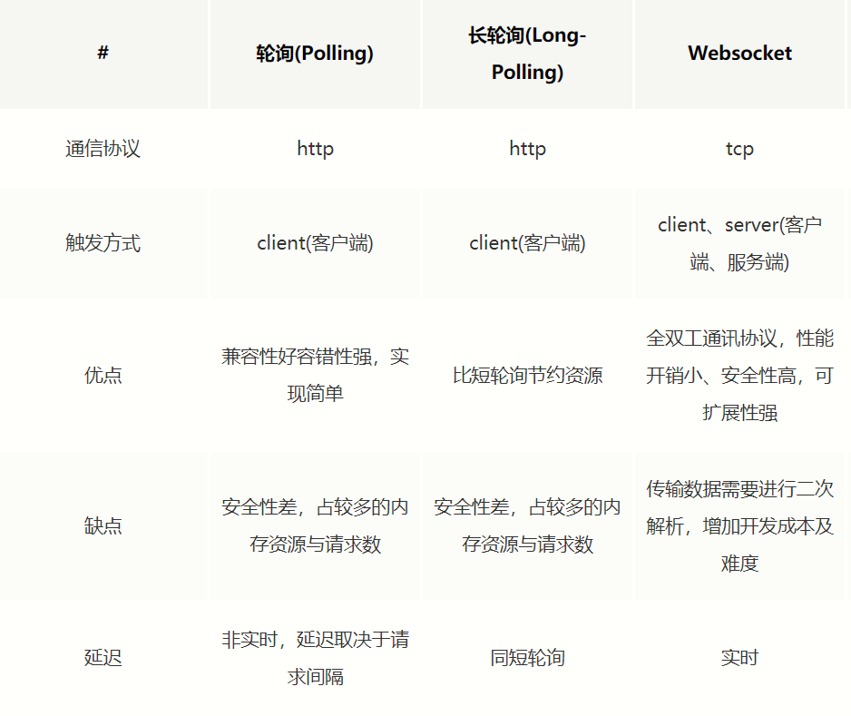

### Web Socket

- 为了解决http无状态，被动性，以及轮询问题，html5新推出了websocket协议，浏览器和服务器只需完成一次握手，两者即可建立持久性连接，并进行双向通信
- 基于http进行握手，发生加密数据，保持连接不断开
- 优点：
  - 较少的控制开销，在进行客户端与服务器的数据交换时，用于协议控制的数据包头较小
  - 更强的实时性，全双工通信，不必局限于一方发起的请求，服务器与客户端可以随时发送数据，延迟更少
  - 有状态的连接，websocket在通信之前需要双方建立连接，才能进行通信，而http协议在每次请求都要携带状态信息
  - 基于二进制数据传输，websocket定义了二进制帧，可以处理二进制内容，相比于文本传输，提高了效率
  - 支持自定义子协议，可以自行扩展协议，如部分浏览器支持压缩等
  - 更好的压缩效果，Websocket在适当的扩展支持下，可以沿用之前内容的上下文，在传递类似的数据时，可以显著地提高压缩率

## <span id="17">十七、长连接与短连接</span>

### 短连接

- HTTP/1.0中默认使用短连接，也就是说，客户端和服务器每进行一次HTTP操作，就建立一次连接，任务结束就中断连接
- 当客户端浏览器访问的某个HTML或其他类型的Web页中包含有其他的Web资源（如JavaScript文件、图像文件、CSS文件等），每遇到这样一个Web资源，浏览器就会重新建立一个HTTP会话
- 短连接的操作步骤是：建立连接——数据传输——关闭连接...建立连接——数据传输——关闭连接
- 像WEB网站的http服务一般都用短连接，并发量大，但每个用户无需频繁操作情况下需用短连接

### 长连接

- 从HTTP/1.1起，默认使用长连接，用以保持连接特性。使用长连接的HTTP协议，会在响应头加入这行代码`Connection:keep-alive`
- 在使用长连接的情况下，当一个网页打开完成后，客户端和服务器之间用于传输HTTP数据的TCP连接不会关闭，客户端再次访问这个服务器时，会继续使用这一条已经建立的连接
- keep-alive不会永久保持连接，它有一个保持时间，可以在不同的服务器软件（如Apache）中设定这个时间。实现长连接需要客户端和服务端都支持长连接
- 长连接的操作步骤是：建立连接——数据传输...（保持连接）...数据传输——关闭连接
- 长连接多用于操作频繁，点对点的通讯，而且连接数不能太多情况

### 长短轮询和长短连接区别

- HTTP协议的长连接和短连接，实质上是TCP协议的长连接和短连接
- 长短连接通过双方请求响应头是否设置`Connection:keep-alive`来决定使用，而是否轮询，是根据服务端的处理方式来决定的，与客户端没有关系
- 实现方式不同，长短连接通过协议来实现，而长短轮询通过服务器编程手动实现

## <span id="18">*十八、存储</span>

### Cookie

- cookie是由服务器发送给客户端用于存储少量信息，以键值对形式存储{key：value}
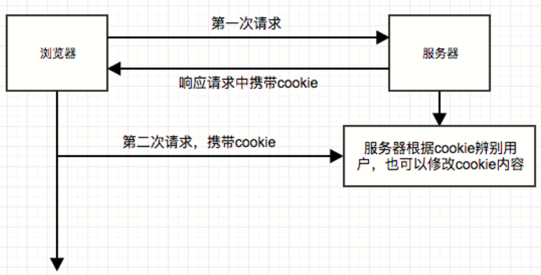
- 客户端请求服务器时，如果服务器需要记录该用户状态，就使用response向客户端浏览器颁发一个Cookie。而客户端浏览器会把Cookie保存起来。当浏览器再请求 服务器时，浏览器把请求的网址连同该Cookie一同提交给服务器。服务器通过检查该Cookie来获取用户状态
- cookie是不可跨域，但是只在域名不同的情况下不支持跨域，忽略协议与端口，`https://localhost:80/`和`http://localhost:8080/`的Cookie是共享的，可以通过domain设置域，path设置域下的共享路径
- cookie属性
  - name 表示设置的cookie名也就是key，不能重复，不可更改
  - value 表示设置cookie的值
  - domain 表示cookie绑定的域名，默认绑定当前域，多级域名不可交换cookie，如果设置以点开头的域名，则所有子域名可以访问，如设置`.baidu.com`，则`a.baidu.com`可访问其上级域名的cookie
  - path 表示cookie所能使用的路径，默认'/'路径，只要满足当前匹配路径以及子路径都可以共享cookie
  - maxAge 表示cookie失效时间，单位秒，正数为失效时间，负数表示当前cookie在浏览器关闭时失效，0表示删除cookie
  - secure 表示cookie是否使用安全协议传输如HTTPS、SSL，默认不使用，只在HTTPS等安全协议下有效，这个属性并不能对客户端的cookie进行加密，不能保证绝对的安全性
  - version 当前cookie使用的版本号，0 表示遵循Netscape的Cookie规范(多数)，1表示遵循W3C的RFC2109规范(较严格)，默认为0
  - same-site 规定浏览器不能在跨域请求中携带 Cookie，减少CSRF攻击
  - HttpOnly 如果这个属性设置为true，就不能通过js脚本来获取cookie的值，用来限制非HTTP协议程序接口对客户端Cookie进行访问，可以有效防止XSS攻击(跨站脚本攻击，代码注入攻击)
- 前端通过document.cookie对cookie进行读写操作
- 创建cookie就是后端的事情了

### Session

- session 表示服务器与客户端的一次会话过程，session对象存储特定用户的属性及配置信息
- 当用户在应用程序的 Web 页之间跳转时，存储在session 对象中的变量将不会丢失，而是在整个用户会话中一直存在下去。当客户端关闭会话，或者 session 超时失效时会话结束

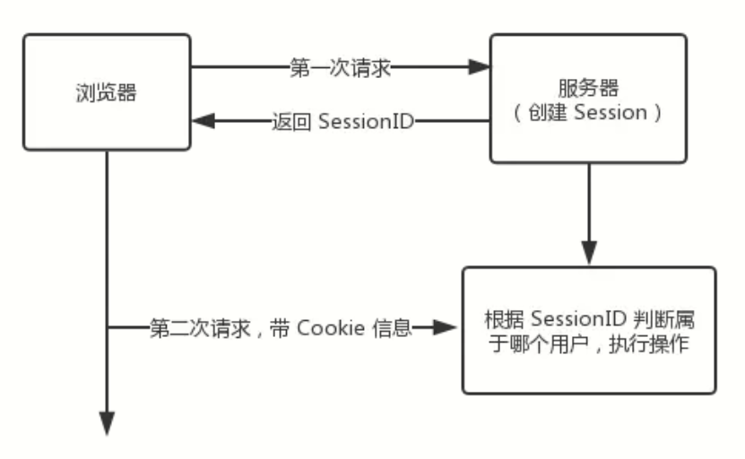

- 用户第一次请求服务器的时候，服务器根据用户提交的相关信息，创建创建对应的 session ，请求返回时将此 session 的唯一标识信息 sessionID 返回给浏览器，浏览器接收到服务器返回的 sessionID 信息后，会将此信息存入到 Cookie 中，同时 Cookie 记录此 sessionID 属于哪个域名
- 当用户第二次访问服务器的时候，请求会自动判断此域名下是否存在 Cookie 信息，如果存在自动将 Cookie 信息也发送给服务端，服务端会从 Cookie 中获取 sessionID，再根据 sessionID 查找对应的 session 信息，如果没有找到说明用户没有登录或者登录失效，如果找到 session 证明用户已经登录可执行后面操作
- session 的运行依赖 session id，而 session id 是存在 Cookie中的

### cookie与session的区别

- cookie数据存放在客户的浏览器上，session数据放在服务器上
- cookie不是很安全，别人可以分析存放在本地的cookie并进行cookie欺骗，考虑到安全应当使用session。用户验证这种场合一般会用 session
- session保存在服务器，客户端不知道其中的信息；反之，cookie保存在客户端，服务器能够知道其中的信息
- session会在一定时间内保存在服务器上，当访问增多，会比较占用你服务器的性能，考虑到减轻服务器性能方面，应当使用cookie
- session中保存的是对象，cookie中保存的是字符串
- session不能区分路径，同一个用户在访问一个网站期间，所有的session在任何一个地方都可以访问到，而cookie中如果设置了路径参数，那么同一个网站中不同路径下的cookie互相是访问不到的
- session: 是在服务端保存的一个数据结构，用来跟踪用户的状态，这个数据可以保存在集群、数据库、文件中
- cookie: 是客户端保存用户信息的一种机制，用来记录用户的一些信息，也是实现session的一种方式

### 本地存储localStorage与sessionStorage

#### localStorage

- localStorage浏览器api，用于存储本地数据，可持久化，永不过期，除非主动删除

基本使用

```localStorage
localStorage.setItem("b", "isaac");  //设置b为"isaac"
localStorage.getItem("b");           //获取b的值,为"isaac"
localStorage.key(0);                 //获取第0个数据项的键名，此处即为“b”
localStorage.removeItem("b");        //清除c的值
localStorage.clear();                //清除当前域名下的所有localStorage数据
```

- localStorage只要在相同的协议、相同的主机名、相同的端口下，就能读取/修改到同一份localStorage数据，一般用于跨页面共享数据
- 可通过`window.addEventListener("storage", function(e){}`设置localStorage事件监听，当存储区域的内容发生改变时，将会调用回调

#### sessionStorage

- sessionStorage用于本地存储一个会话（session）中的数据，这些数据只有在同一个会话中的页面才能访问并且当会话结束后数据也随之销毁。因此sessionStorage不是一种持久化的本地存储，仅仅是会话级别的存储

```sessionStorage
sessionStorage.setItem(name, num);    //存储数据
sessionStorage.setItem('value2', 119);
sessionStorage.valueOf();             //获取全部数据
sessionStorage.getItem(name);         //获取指定键名数据
sessionStorage.sessionData;           //sessionStorage是js对象，也可以使用key的方式来获取值
sessionStorage.removeItem(name);      //删除指定键名数据
sessionStorage.clear();
```

- 使用方式与localStorage类似
- 仅在当前网页会话下有效，关闭页面或浏览器后就会被清除
- 主要用于存储当前页面独有的数据，不与浏览器其他页面共享

#### 区别

- 数据存储方面
  - cookie数据始终在同源的http请求中携带（即使不需要），即cookie在浏览器和服务器间来回传递。cookie数据还有路径（path）的概念，可以限制cookie只属于某个路径下
  - sessionStorage和localStorage不会自动把数据发送给服务器，仅在本地保存。
- 存储数据大小
  - 存储大小限制也不同，cookie数据不能超过4K，同时因为每次http请求都会携带cookie、所以cookie只适合保存很小的数据，如会话标识。
  - sessionStorage和localStorage虽然也有存储大小的限制，但比cookie大得多，可以达到5M或更大
- 数据存储有效期
  - sessionStorage：仅在当前浏览器窗口关闭之前有效；
localStorage：始终有效，窗口或浏览器关闭也一直保存，本地存储，因此用作持久数据；
  - cookie：只在设置的cookie过期时间之前有效，即使窗口关闭或浏览器关闭
- 作用域不同
  - sessionStorage不在不同的浏览器窗口中共享，即使是同一个页面；
  - localStorage在所有同源窗口中都是共享的；也就是说只要浏览器不关闭，数据仍然存在
  - cookie: 也是在所有同源窗口中都是共享的.也就是说只要浏览器不关闭，数据仍然存在

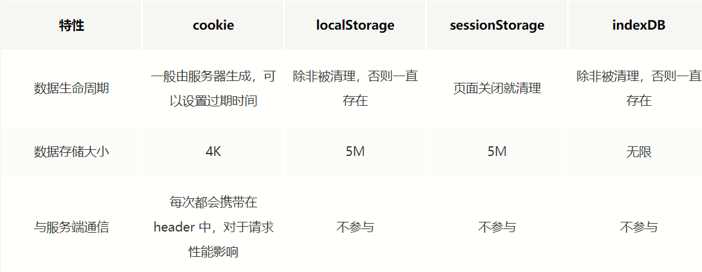

## <span id="19">十九、跨域</span>

### jsonp

- jsonp是一种跨域通信手段，通过script标签的src属性实现跨域，由于浏览器同源策略，并不会截断script的跨域响应
- 通过将前端方法名作为参数传递到服务器端，然后由服务器端注入参数之后再返回，实现服务器端向客户端通信
- 由于使用script标签的src属性，因此只支持get方法

来实现一下吧

```jsonp
// 前端准备
// 定义回调函数
function fn(arg) {
  // arg为服务端传来的数据
  console.log(`客户端获取的数据：${arg}`)
}
// 创建script标签
const s = document.createElement('script')
// 给script标签的src属性赋值，值为请求url，查询参数callback，需与后端对应
// fn为前端回调函数名
s.src = `http://127.0.0.1:3000/test?callback=fn`
// 向html添加此标签，添加完成之后浏览器自动请求script的src对应的网址
document.getElementsByTagName('head')[0].appendChild(s);
// 等待浏览器收到响应之后，将会自动执行响应内容的代码
----------------------------------------------
// 后端准备
// nestjs(ts)处理
@Controller('test') //api
export class TestController {
  @Get() //get方式请求
  //取url中的查询参数，即?之后的键值对，键与值对应query对象参数的键与值
  callback(@Query() query) {  
    // 返回的数据
    const data = '我是服务端返回的数据';
    // 取查询参数，这里的callback要与前端?之后的键名一致，fn即fn函数名
    const fn = query.callback;
    // 返回结果，格式：函数名(服务器的数据)，注意这里需要序列化成字符串，如果参数本身是字符串那么要加引号，前端并不知道data是字符串
    return `${fn}('${data}')`;
  }
}

// express(js)处理，同上
router.get('/test', async (req, res) => {
  const data = '我是服务器返回的数据'
  // req.query为查询参数列表
  const fn = req.query.callback
  // 返回数据
  res.send(`${fn}('${data}')`)
})
```

响应内容


### CORS

- 跨域资源共享cors，它使用额外的 HTTP 头来告诉浏览器，让运行在一个 origin (domain) 上的Web应用被准许访问来自不同源服务器上的指定的资源
- 需要服务端与客户端同时支持cors跨域方式才能进行跨域请求，服务端通过设置`Access-Control-Allow-Origin:*`即可开启cors允许跨域请求，使用通配符*表示允许所有不同域的源访问资源，也可单独设置指定允许的源域名
- 使用cors跨域时，将会在发起请求时出现2种情况：
- 简单请求，需满足以下条件
  - 使用get、head、post方式发起的请求
  - Content-Type 的值仅限于下列三者之一：
    - text/plain
    - multipart/form-data
    - application/x-www-form-urlencoded
  - 不满足这些条件即为预检请求
- 预检请求
  - 需预检的请求要求必须首先使用OPTIONS方法发起一个预检请求到服务器，以获知服务器是否允许该实际请求
  - 预检请求的使用，可以避免跨域请求对服务器的用户数据产生未预期的影响
  - 当满足以下条件之一，将会发送预检请求
    - 使用了下面任一 HTTP 方法：
    - PUT
    - DELETE
    - CONNECT
    - OPTIONS
    - TRACE
    - PATCH
  - 人为设置了对 CORS 安全的首部字段集合之外的其他首部字段。该集合为：
    - Accept
    - Accept-Language
    - Content-Language
    - Content-Type (需要注意额外的限制)
    - DPR
    - Downlink
    - Save-Data
    - Viewport-Width
    - Width
  - Content-Type 的值不属于下列之一:
    - application/x-www-form-urlencoded
    - multipart/form-data
    - text/plain
  - 满足以上条件之一将会发起预检请求，总共会发起2次请求，第一次为OPTIONS方式的请求，用来确定服务器是否支持跨域，如果支持，再发起第二次实际请求，否则不发送第二次请求

### postMessage

- postMessage可用于不同页面之间的跨域传递数据
- `postMessage(data,origin[, source])`data为发送的数据只能发送字符串信息，origin发送目标源，指定哪些窗口能接收到消息事件，如果origin设置为*则表示无限制，source为发送消息窗口的window对象引用，

```postMessage
<!-- test.html -->
<iframe src="http://127.0.0.1:5501/postMessage.html"
name="postIframe" onload="messageLoad()"></iframe>
<script>
// 定义加载之后执行的函数，给postMessage.html发送数据
function messageLoad() {
  const url = 'http://127.0.0.1:5501/postMessage.html'
  window.postIframe.postMessage('给postMessage的数据', url)
}
// 用于监听postMessage.html的回馈，执行回调
window.addEventListener('message', (event) => {
  console.log(event.data);
})
</script>
----------------------------------------------
<!-- postMessage.html -->
<script>
  // 监听test.html发来的数据，延迟1秒返回数据
  window.addEventListener('message', (event) => {
    setTimeout(() => {
      event.source.postMessage('给test的数据', event.origin)
    },1000)
  })
</script>
```

- event对象的几个重要属性
  - data 指的是从其他窗口发送过来的消息对象
  - type 指的是发送消息的类型
  - source 指的是发送消息的窗口对象
  - origin 指的是发送消息的窗口的源

### window.name

- 由于`window.name`属于全局属性，在html中的iframe加载新页面(可以是跨域)，通过iframe设置的src指向的源中更改name的值，同时主页面中的name也随之更改，但是需要给iframe中的window设置为`about:blank`或者同源页面即可
- iframe使用之后应该删除，name的值只能为string类型，且数据量最大支持2MB

```window.name
<!-- test.html -->
// 封装应该用于获取数据的函数
function foo(url, func) {
  let isFirst = true
  const ifr = document.createElement('iframe')
  loadFunc = () => {
    if (isFirst) {
      // 设置为同源
      ifr.contentWindow.location = 'about:blank'
      isFirst = false
    } else {
      func(ifr.contentWindow.name)
      ifr.contentWindow.close()
      document.body.removeChild(ifr)
    }
  }
  ifr.src = url
  ifr.style.display = 'none'
  document.body.appendChild(ifr)
  // 加载之后的回调
  ifr.onload = loadFunc
}
foo(`http://127.0.0.1:5501/name.html`, (data) => {
  console.log(data) //
})
----------------------------------------------
<!-- name.html -->
const obj = { name: "iframe" }
// 修改name的值，必须为string类型
window.name = JSON.stringify(obj);
```

### document.domain

- `document.domain`的值对应当前页面的域名
- 通过对domain设置当前域名来实现跨域，不过仅限于域名不同，但是又要属于同一个基础域名下，如`http://a.baidu.com`与`http://b.baidu.com`这2个子域名之间才能使用domain跨域，一般用于子域名之间的跨域访问
- domain只能赋值为当前域名或者其基础域名，即上级域名

```domain
<!-- test.html -->
<script>
document.domain = 'baidu.com';
const ifr = document.createElement('iframe');
ifr.src = 'a.baidu.com/test.html';
ifr.style.display = 'none';
document.body.appendChild(ifr);
ifr.onload = function(){
  var doc = ifr.contentDocument || ifr.contentWindow.document;
  // 此处即可操作domain.html的document
  ifr.onload = null;
};
</script>
----------------------------------------------
<!-- domain.html -->
<script>
  // domain.html下设置为与test.html中的domain一致
  document.domain = 'baidu.com';
</script>
```

- 主要就是通过设置为同源域名(只能为其基础域名)，通过iframe操作另一个页面的内容

### nginx反向代理

- nginx反向代理，代理从客户端来的请求，转发到其代理源
- 通过配置nginx的配置文件实现代理到不同源

```nginx
// nginx.conf配置
server {
  listen 80;  // 监听端口
  server_name  www.baidu.com; // 匹配来源
  location / {  //匹配路径
    // 反向代理到http://127.0.0.1:3000
    proxy_pass http://127.0.0.1:3000;
    // 默认入口文件
    index  index.html index.htm index.jsp;
}
```

- nginx反向代理还能实现负载均衡

## <span id="20">二十、setTimeout与setInterval</span>

### setTimeout

- setTimeout属于webApi的一部分，可以实现延时调用，属于异步宏任务，一次性使用
- `setTimeout(func|code, [delay], [arg1], [arg2], ...)` 参数1为想要执行的函数或代码字符串，参数2为延迟执行时间，单位毫秒默认0，参数3及之后的参数为参数1为函数时传入的参数，调用之后会返回一个定时器id
- 此方法只执行一次，可以使用`clearTimeout(id)`清除定时器来取消回调
- 看一下setTimeout的延迟执行机制


- 以上使用嵌套setTimeout来实现循环调用，可以从中看出setTimeout计时是从上一个setTimeout回调执行之后开始的，看看代码效果

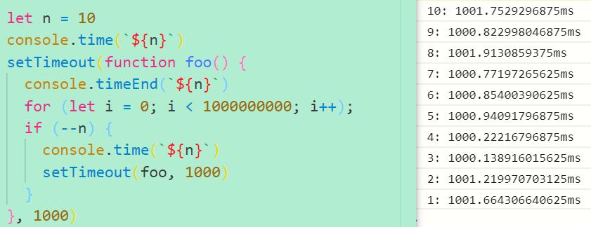

- 上图计算的是2次调用回调之间的间隔，不包括回调执行时间，可以看出在开启定时器之后到执行回调的时间确实是参数2所设置的值，延迟时间与回调函数执行时间无关；
- 简单来讲setTimeout的延迟时间不包括自身回调所占用的时间

也就是说setTimeout是在上一次回调执行之后才开启的定时

### setInterval

- setInterval同样也是webApi的一部分，主要用来定时循环执行代码
- 不同于setTimeout，此定时器的延迟执行机制有所不同
- `setInterval(func|code, [delay], [arg1], [arg2], ...)`，参数列表同setTimeout，参数2为每次循环时间


- 从上图可以先得出结论，setInterval的延迟执行时间包含自身回调执行所占用的时间，看看代码效果

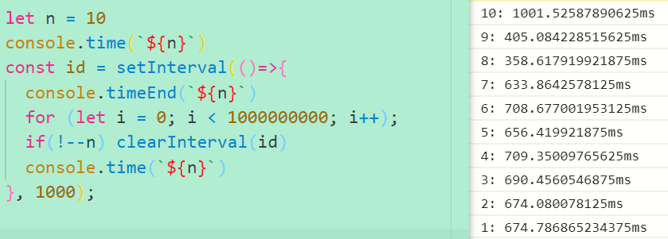

- 上图计算的是2次调用回调之间的间隔，不包括回调执行时间，可以看出setInterval在2次执行之间的延迟受到了回调的影响，再验证一下

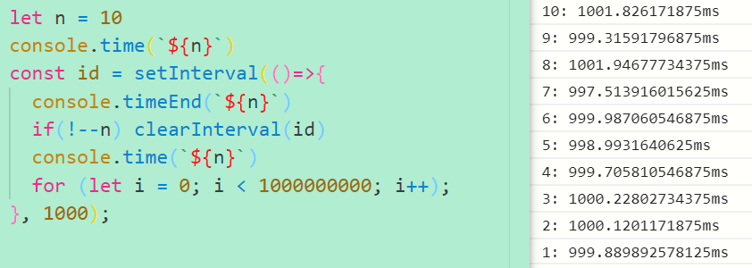

- 此次我把回调执行时间也算在计时之内，现在看来setInterval的定时时间确实包含了自身回调所占用的时间

由于这2个api都属于异步宏任务，在执行的时候都会进入任务队列，如果队列前的任务执行时间较长，那么也会影响到定时器的执行时机

在浏览器中alert、confirm、prompt都会阻塞js主线程执行，直到弹窗消失，但是定时器还会继续执行；定时器并不能达到0延迟，最小延迟限制在4ms

## <span id="21">二十一、requestAnimationFrame</span>

- 在requestAnimationFrame还未出来之前，大多数使用定时器完成js动画，但是由于定时器不准确，而且每次更新动画的时候不能保证与浏览器渲染同步，这样将会导致画面的不流畅
- 由于目前主流屏幕的固定刷新频率一般为60HZ即一秒60帧，每次刷新间隔为1000/60ms，为了使浏览器得到最好的渲染效果，浏览器每次渲染应该与屏幕刷新率保持一致，那么对于js动画而言，最好的更新时机应该与浏览器尽量保持一致
- 当每次浏览器将要重绘之前，把要执行更新的动画更新完成，那么当浏览器渲染的时候将会保持最新的动画，这就是requestAnimationFrame所做的事情
- `requestAnimationFrame(callback)` 的参数就是每次渲染前需要执行的动画更新函数，当浏览器将要重绘画面时就会执行这个回调函数，这个回调函数接受一个参数，即从当前页面加载之后到现在所经过的毫秒数
- 此api将会与浏览器渲染同步，即浏览器渲染几次这个api将会执行几次，那么就达到了不掉帧的效果，画面效果就更加流程
- requestAnimationFrame执行时机在事件循环机制中处于微任务队列之后，浏览器渲染之前，浏览器渲染之后就会进入下一次的事件循环(宏任务开始，浏览器渲染结束)
- 如果使用定时器进行js动画操作，那么首先将会导致动画更新与浏览器每次重绘时机不匹配，造成卡顿，其次过于频繁的更新动画还会导致不必要的性能开销，且并非能够达到更好的效果
- 简单说使用requestAnimationFrame更新的动画与浏览器保持同步，不会掉帧，除非浏览器掉帧或者，js主线程阻塞导致浏览器无法正常渲染，使用定时器更新动画，如果频率高了会影响性能，且达不到更好的效果，如果频率低了将会有不连贯的感觉


- 从上图可以看出确实是每帧执行一次，不过要注意，调用一次requestAnimationFrame只会执行一次，如果需要持续执行需要在回调函数内继续调用

## <span id="22">二十二、事件</span>

### DOM0事件

- DOM0事件并非w3c标准，在DOM标准形成之前的事件模型就是我们所说的0级DOM
- 添加DOM0事件，都是把一个函数赋值给文档元素，在事件监听函数被调用时，将会做为产生事件的元素方法调用，所以this指向目标元素，简单说就是直接把回调函数作为文档元素的一个方法调用
- 删除DOM0事件只需把事件赋值为null即可

```DOM0
document.getElementById("btn").onclick = function () {}
----------------------------------------------
<input type="button" onclick="alert('hi!');">
```

- 如果回调方法返回一个false则会阻止浏览器事件的默认行为
- DOM0事件在事件捕获阶段，无法接收事件，即没无法触发事件捕获，但是能够正常触发冒泡
- 由于DOM0事件的回调属于文档元素的方法，导致无法添加多个同名事件，不过看来兼容性最好

### DOM2事件

- 由于w3c推出的1级DOM标准中并没有定义事件相关的内容，所以没有所谓的1级DOM事件模型
- 在2级DOM中除了定义了一些DOM相关的操作之外还定义了一个事件模型 ，这个标准下的事件模型就是我们所说的2级DOM事件模型
- 2级DOM定义了事件传播，在事件传播过程中将会经历3个阶段：
  1. capturing阶段，即事件捕获阶段，在某个DOM上触发事件时，事件会先从Document对象 沿着dom数向下传递直到触发节点，此过程就是事件捕获阶段，在此过程中可以捕获传播的事件
  2. 目标元素的事件处理阶段，此阶段事件到达触发目标，调用回调处理事件
  3. bubbling阶段，即事件冒泡阶段，在目标元素处理完成之后，此事件还会向上冒泡，回传到Document，此阶段与捕获阶段相反
- 以上就是事件在触发之后的传播过程，可以配合下图理解

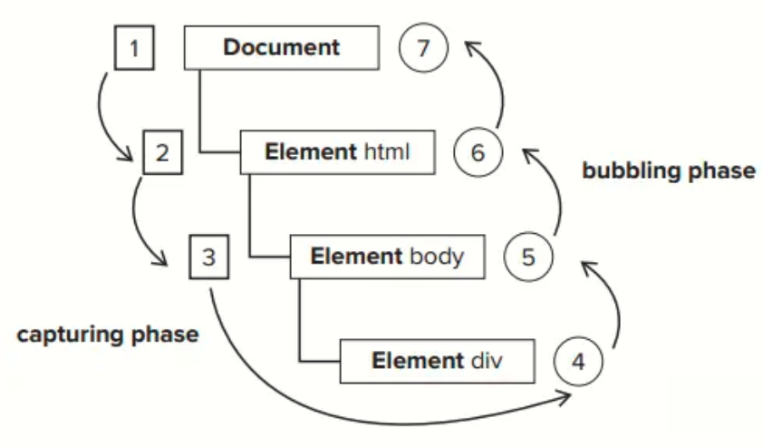

- DOM2 注册事件，可以通过`addEventListener(eventName,callback,isCapturing)`方法为元素设置事件监听器，参数1为注册事件名不带on开头的string类型，参数2为触发事件的回调函数，接受一个事件对象参数，参数3为是否在捕获阶段触发，默认为false
- 通过`removeEventListener(eventName,callback,isCapturing)`方法移除指定事件名、回调、是否捕获的事件，匿名回调无法删除
- 可给一个元素添加多个相同的事件，通过不同的回调实现不同效果
- DOM2中的回调函数中的this指向，由浏览器决定，w3c标准中并未规定其指向，一般情况this指向window
- 回调函数event对象参数
- 属性
  - type 发生事件的类型
  - target 发生事件的阶段，为触发事件的对象，可以与currentTarget不同
  - currentTarget 正在处理事件的节点，即注册此回调函数的元素
  - clientX，clientY鼠标相对浏览器的x坐标与y坐标
  - screenX，screenY鼠标相对于显示器左上角x，y坐标
- 方法
  - stopPropagation() 阻止当前事件的进一步传播
  - preventDefault() 阻止浏览器执行与世界相关的默认动作，与DOM0返回false相同
- 触发时机
  - document 往 target节点传播，捕获前进，遇到注册的捕获事件立即触发执行
  - 到达target节点，触发事件（对于target节点上，是先捕获还是先冒泡则捕获事件和冒泡事件的注册顺序，先注册先执行）
  - target节点 往 document 方向传播，冒泡前进，遇到注册的冒泡事件立即触发

### 事件代理

- 事件代理又或是事件委托，通过事件冒泡机制，使用单一父节点来操作多个子节点的响应，简单讲就是把所有子节点的事件去除，只给父节点注册事件，那么就可以通过事件冒泡机制来处理子节点的响应
- 基于事件委托可以减少事件注册，节省内存，简化dom节点于事件的更新

```事件委托
<ul id="f">
  <li>a</li>
  <li>b</li>
  <li>c</li>
</ul>
<script>
  const ul = document.querySelector('#f')
  // 点击li时触发事件委托
  ul.addEventListener('click',function foo(event){
    // 处理元素为父元素
    console.dir(event.currentTarget)  // ul#f
    // 触发元素为子元素，event.target为具体触发对象
    console.dir(event.target)         // li
  })
//--------------------------------------------
  // 通过点击添加子元素
  ul.addEventListener('click',function foo(event){
    const child = document.createElement('li')
    child.innerText = '我是新增的子元素'
    event.currentTarget.appendChild(child)
  })
//--------------------------------------------
  // 通过点击删除子元素
  ul.addEventListener('click',function foo(event){
    event.currentTarget.removeChild(event.target)
  })
</script>
----------------------------------------------
<!-- 如果点击span 想知道是哪个li下面的元素 -->
<ul id="f">
  <li>a</li>
  <li>
    <span>b</span>
  </li>
  <li>
    <span>c</span>
  </li>
</ul>
<script>
  const ul = document.querySelector('#f')
  ul.addEventListener('click', function foo(event) {
    let target = event.target
    // 一级级向上寻找直到找到满足条件的元素
    while (target.nodeName.toLowerCase() !== 'li') {
      target.target.parentNode
    }
    console.dir(target) // li
    console.dir(target.parentNode === event.currentTarget) //true
  })
</script>
```

- 以上就是几个简单的事件代理的例子，事件代理能够在我们平时开发中减少很多不必要的代码，优化事件系统，但是在使用的过程也要注意相应的问题
- 事件代理基于冒泡机制，如果代理层级过多，且在冒泡阶段如果被某层阻止冒泡那么父级将不会收到事件
- 理论上委托会导致浏览器频繁调用处理函数，虽然很可能不需要处理，所以建议就近委托
- 如果事件代理了许多情况那么要做好完善逻辑分析，避免一些误判的情况

## <span id="23">总结</span>

以上总结可能没有什么顺序，但是每章节都是针对性的讲解，零散的知识点较多，希望看完这篇文章能扩展你的知识面，也许某方面讲的不是很详细，如果感兴趣可以找些针对性的文章进行深入了解。

部分内容并非原创，还是要感谢前辈的总结，如果本文影响到您的利益，那么还请事先告知，在写本文时的初衷就是想给更多学习前端的小伙伴拓展知识，夯实基础，共同进步，也为了以后方便复习使用

总结不易，如需转载请注明出处，感谢！

## 求点赞

如果本文对你有所帮助，就请点个赞支持一下吧，让更多人看到，你的支持就是我坚持写作下去的动力，如果喜欢我的文章，那么还请关注后续的文章吧~  ψ(｀∇´)ψ

## <span id="24">其他文章</span>

### js系列

[浅谈ES6新特性](https://juejin.im/post/5e6c5d6f6fb9a07c7f608813)

### css系列

[css之flex布局、常用水平垂直居中](https://juejin.im/post/5e75a9a7f265da572e4f4c35)

### 速记系列

[速记之数组api](https://juejin.im/post/5e6daec76fb9a07cc200e4a4)

[速记之字符串api](https://juejin.im/post/5e6e177ef265da5762134b8a)

[速记之对象api](https://juejin.im/post/5e6e30ec6fb9a07c8e6a4afc)