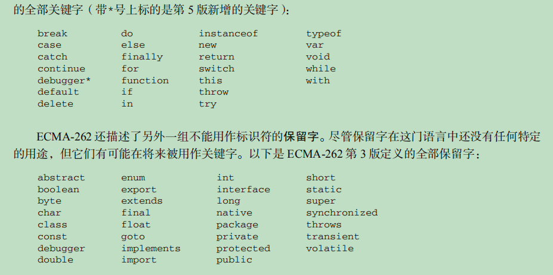
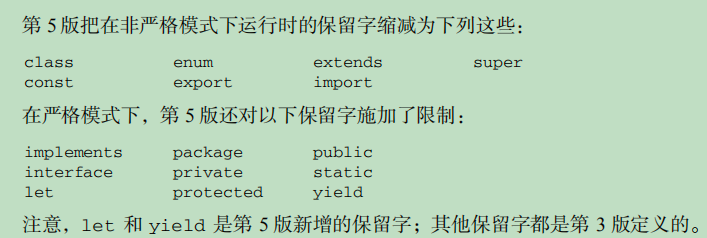
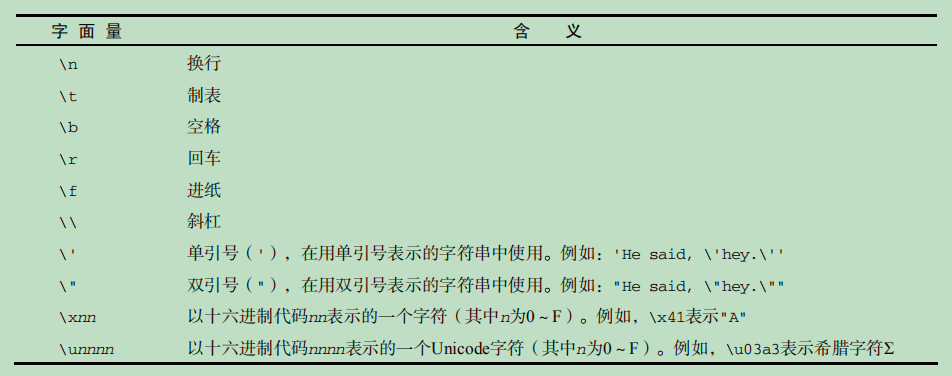
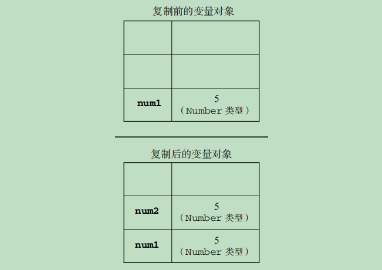
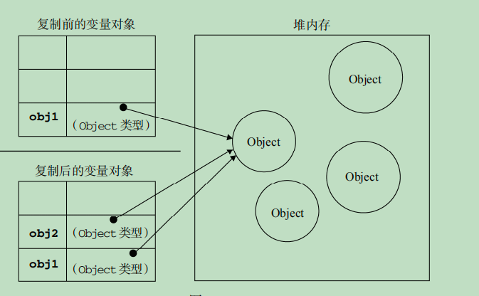

# 一刷红宝石知识点归纳

## 第一章JavaScript介绍

### 浏览器战争

这一章主要讲的就是关于netscapet(网景)与微软的战争，还有关于JavaScript的诞生和ECMAScript的出现

- js于1995年诞生于网景公司，当时主要用来处理以前由服务器端处理的输入验证操作。
- 微软也不甘示弱，在ie中实现自己的js
- 网景公司的布兰登·艾奇，也就是js的创始人，当时的js叫做LiveScript，后来网景与sun公司合作，建立了开发联盟，于Netsscape Navigator 2(网景浏览器)发布前夕，想蹭Java的热炒，把LiveScript改名为JavaScript，其实js与java根本是两码事，前者是凑热度改的名(话糙理不糙，哈哈)。
- 之后两方各自发展自己的js，后来微软推出自己的js叫做JScript，由于没有标准组织来管理，所以出现了两个派别
- 后来以js1.1为蓝本的建议被提交到了欧洲计算机制造商协会即ECMA，该组织就是专门来，制定标准化一种通用、跨平台、供应商中立的脚本语言的语法和语义。总之这个协会由各大nb公司的程序员组成，后来定制了ECMA-262的新脚本语言标准，此后为了公平性，就把js改为ECMAScript，但是大家 还是习惯叫JavaScript，其实这两个并不是同一个东西
- ECMAScript只是规定js的语法部分，不包括DOM(文档对象模型)和BOM(浏览器对象模型)，但是我们常说的js其实是ECMAScript+DOM+BOM的组合
- ECMAScript的宿主环境，可以理解为执行环境，一般为Web浏览器，还有Node环境，其实主要讲的就是V8引擎，在Web浏览器环境下js拥有DOM和BOM，这是浏览器提供的不是js语法本身具有
  
### DOM

- DOM即文档对象模型，简单讲就是用于html的应用程序编程接口(api)，DOM 把整个页面映射为一个多层节点结构。DOM就是html中的标签按照关系组成的一棵对象树，js可以对这个树进行删除、添加、替换、修改其中的任何节点。

### DOM级别

- 在w3c还未对DOM制定标准前，不同浏览器厂家对DOM的操作各有不同，这个时期的DOM操作，一般就被称为DOM0，0级DOM是非标准的，其api受浏览器厂家影响。
- 1998年w3c(万维网联盟，也是个制定标准的组织，主要制定万维网通信标准)推出DOM1级标准，其标准主要包括DOM核心与DOM HTML，核心是规定如何映射基于xml的文档结构，就是简化对文档中任意的访问和操作。DOM HTML就是在核心上，添加了对html的对象和方法，当然DOM并不只针对js一种语言
- DOM2级，
  - 主要引入DOM视图DOM 视图（DOM Views）：定义了跟踪不同文档（例如，应用 CSS 之前和之后的文档）视图的接口；
  - DOM 事件（DOM Events）：定义了事件和事件处理的接口；
  - DOM 样式（DOM Style）：定义了基于 CSS 为元素应用样式的接口；
  - DOM 遍历和范围（DOM Traversal and Range）：定义了遍历和操作文档树的接口。
- DOM3级主要引入统一的加载和保存文档的方法，以及验证文档的方法


### BOM

- BOM浏览器对象模型，从根本上讲，BOM 只处理浏览器窗口和框架；但人们习惯上也把所有针对浏览器的JavaScript 扩展算作 BOM 的一部分。
- 扩展：
  - 弹出新浏览器窗口的功能；
  - 移动、缩放和关闭浏览器窗口的功能；
  - 提供浏览器详细信息的 navigator 对象；
  - 提供浏览器所加载页面的详细信息的 location 对象；
  - 提供用户显示器分辨率详细信息的 screen 对象；
  - 对 cookies 的支持；
  - 像 XMLHttpRequest 和 IE 的 ActiveXObject 这样的自定义对象。
- BOM没有标准遵循，根据浏览器厂家不同会有不同的api

## 第二章HTML中使用JavaScript

从这章开始，不瞎聊了，只记录重点

### `<script>`标签

- html 4.01中script规定了6个属性：
  - async：可选。表示应该立即下载脚本，但不应妨碍页面中的其他操作，比如下载其他资源或
等待加载其他脚本。只对外部脚本文件有效。
  - charset：可选。表示通过 src 属性指定的代码的字符集。由于大多数浏览器会忽略它的值，
因此这个属性很少有人用。
  - defer：可选。表示脚本可以延迟到文档完全被解析和显示之后再执行。只对外部脚本文件有
效。IE7 及更早版本对嵌入脚本也支持这个属性。
  - language：已废弃。原来用于表示编写代码使用的脚本语言（如 JavaScript、JavaScript1.2
或 VBScript）。大多数浏览器会忽略这个属性，因此也没有必要再用了。
  - src：可选。表示包含要执行代码的外部文件。
  - type：可选。可以看成是 language 的替代属性；实际上，服务器在传送 JavaScript 文件时使用的MIME 类型通常是 application/x–javascript，考虑到约定俗成和最大限度的浏览器兼容性，目前 type 属性的值依旧还是text/javascript。不过不是必须，默认值就为text/javascript

使用script嵌入js有2种方式:

- 直接在script标签包含中写入js代码
  - 代码自上而下执行
  - 如果代码中遇到结束标签`</script>`会被默认认为是结束，所以不要在js代码中包含结束标签的语句，如果需要加入，那么需要给/转义成\/即<\/script>
- 使用script的属性src填入来自外部域的 JavaScript 文件
  - 使用外部js时写在标签中的代码不会生效，且建议使用外部载入js，这样对于维护性和可读性更强
  - 可在XHTML(可扩展超文本标记)中使用单标签即`<script />`，但是在html不能使用单标签，无法解析
  - 导入的js文件扩展名不是必须的，可以通过服务端返回MIME类型来确保是js
  - script的src是可跨源的与img类似，但是不推荐跨源导入js，除非此源的所有者可信任，或者是你自己

按照传统做法一般都把script放在head中，不过这种做法会导致浏览器，等待js下载并且执行后才会继续解析html内容，那么导致浏览器响应缓慢

现代做法是把script的js导入放在body结束标签上方，即body中的最底部，这样可以先渲染html的内容，不会导致用户体验差

### 延迟脚本

#### defer

- html 4.01中定义了defer，用于js延迟执行，但是还是会异步下载，当整个页面都解析完成后才会执行script有defer属性的js代码
- 虽然在html5中规定defer的script需要按照脚本出现的顺序来执行，而且还要先于DOMContentLoaded事件前执行，但是在现实中并不一定会顺序执行也不一定会在DOMContentLoaded前执行，所以最好只包含一个defer的script脚本
- defer只适用于外部载入的js，ie4~ie7支持defer属性，ie8以后支持html5的规定行为
- 在 XHTML 文档中，要把 defer 属性设置为 defer="defer"

#### async

- async的script不一定按照出现顺序执行，谁先下载完成谁先执行
- 其标识的script载入的js会异步下载和执行，且不会阻塞页面加载，建议异步脚本不要在加载期间修改 DOM，影响渲染，异步脚本会在页面load事件前执行，但可能会在 DOMContentLoaded 事件触发之前或之后执行
- 在 XHTML 文档中，要把 async 属性设置为async="async"。

#### XHTML跳过

#### 不推荐使用的语法

有些浏览器不支持js？所以为了不让不支持的浏览器显示js代码只需如下操作

```js 不支持js
<script><!-- 
 function sayHi(){ 
 alert("Hi!"); 
 } 
//--></script>
```

#### js使用外部载入的优点

- 可维护性：遍及不同 HTML 页面的 JavaScript 会造成维护问题。但把所有 JavaScript 文件都放在
一个文件夹中，维护起来就轻松多了。而且开发人员因此也能够在不触及 HTML 标记的情况下，
集中精力编辑 JavaScript 代码。
- 可缓存：浏览器能够根据具体的设置缓存链接的所有外部 JavaScript 文件。也就是说，如果有两个
页面都使用同一个文件，那么这个文件只需下载一次。因此，最终结果就是能够加快页面加载的
速度。
- 适应未来：通过外部文件来包含 JavaScript 无须使用前面提到 XHTML 或注释 hack。HTML 和
XHTML 包含外部文件的语法是相同的。

所以还是尽量使用外部载入js文件

#### 文档模式

- 最初2种模型，混杂模式于标准模式，混杂模式可使ie与ie5的行为相同，标准模式使ie的行为更接近标准，这2种主要影响css的呈现，有时候也会影响js的解析执行
- 其他浏览器也效防使用文档模式，后来ie就提出准标准模式，但是还有些不标准的地方

标准模式开启方式，重点记忆html5的标准模式

```js 文档模式
<!-- HTML 4.01 严格型 --> 
<!DOCTYPE HTML PUBLIC "-//W3C//DTD HTML 4.01//EN"
"http://www.w3.org/TR/html4/strict.dtd"> 
<!-- XHTML 1.0 严格型 --> 
<!DOCTYPE html PUBLIC 
"-//W3C//DTD XHTML 1.0 Strict//EN" 
"http://www.w3.org/TR/xhtml1/DTD/xhtml1-strict.dtd">
<!-- HTML 5 -->
<!DOCTYPE html>
```

准标准模式

```js 文档模式1
<!-- HTML 4.01 过渡型 --> 
<!DOCTYPE HTML PUBLIC 
"-//W3C//DTD HTML 4.01 Transitional//EN" 
"http://www.w3.org/TR/html4/loose.dtd"> 
<!-- HTML 4.01 框架集型 --> 
<!DOCTYPE HTML PUBLIC 
"-//W3C//DTD HTML 4.01 Frameset//EN" 
"http://www.w3.org/TR/html4/frameset.dtd"> 
<!-- XHTML 1.0 过渡型 --> 
<!DOCTYPE html PUBLIC 
"-//W3C//DTD XHTML 1.0 Transitional//EN" 
"http://www.w3.org/TR/xhtml1/DTD/xhtml1-transitional.dtd"> 
<!-- XHTML 1.0 框架集型 --> 
<!DOCTYPE html PUBLIC 
"-//W3C//DTD XHTML 1.0 Frameset//EN" 
"http://www.w3.org/TR/xhtml1/DTD/xhtml1-frameset.dtd">
```

现在一般都是开启标准模式，让浏览器正确解析运行，除非特定场景

#### `<noscript>`

此标签主要用在不支持js的浏览器中，默认显示的内容，即浏览器不支持脚本，浏览器支持脚本，但脚本被禁用，就会显示noscript的内容，也就类似img的占位图片

## 第三章基本概念

### ECMAScript语法

- ECMAScript语法大量借鉴了c以及其他语言比如java、perl
- 此书主要讲的是es5，之后我就简称es5了
- js中是区分大小写的
- typeof可区分所有原始类型除了null，但是对于函数特别对待，由于函数在js中属于一等公民，所有typeof也能直接判断函数

#### 标识符

- 以字符、下划线、美元符开头，其他字符可以是字母、下划线、美元符、数字组成
标识符一般是程序员自己定义的变量或者函数名，推荐使用驼峰命名规则，即首字母小写，之后每一个单词的首字母大写如userName
- 标识符包括ascii与unicode的字符但是不推荐，比如笑脸什么的
- 不能把关键字、保留字、true、false、null作为标识符

#### 注释

- 沿用c语言风格
- //单行注释
- `/*多行注释*/`

以下注释同多行注释，不过如下注释可增强可读性，一般在大企业有规定此方式来注释说明，一些函数参数等描述

```js 注释
/*
 * 这是一个多行
 * （块级）注释
 */
```

#### 严格模式

- es5引入严格模式，其模式就是一种不同的解析与执行模型
- 此模式下一般会规避一些不安全以及不确定的行为操作
- 使用`'use strict'`这是一段编译指示，指示浏览器js引擎启用严格模式来解析与执行js代码
- 也可只在函数内部使用，表明在此函数内部使用严格模式来处理代码，如果在全局环境下标明，则整个代码都使用严格模式

#### 语句

- es中语句结尾可加可不加分号；但是推荐加？主要原因是怕代码打包的时候会导致压缩错误，不过注意一下哪些情况下需要分号就行了
- 如if语句如果只由一条执行语句可以省略语句块{},但是不推荐，因为可读性差了

#### 关键字与保留字

- 关键字不能作与保留字都不能作为标识符





主要记忆关键字，2个模式下的保留着也要看看，还有es5加入的let与yield保留字，现在是关键字了吧，其他是es3定义，es5还限制了es5在严格环境下eval与arguments使用会抛出异常

#### 变量

- js中的变量是松散类型的，也就是弱类型，变量可以保存任何类型，var声明的变量未初始化默认为undefined
- 不推荐一个变量被多种类型赋值，虽然可以被不同类型赋值，但是最好让这个变量保存一种类型
- 函数内的var声明的变量为局部变量，var声明的变量只有函数内与全局环境下的作用域
- 可以不用关键字声明变量，其会默认定义成全局变量，不论在哪里定义，不推荐，严格模式下，此方式定义会报错

```js 隐式全局变量
function test(){
 message = "hi"; // 全局变量
}
test();
alert(message); // "hi"
```

- 不推荐定义为全局变量，因为会污染全局环境，由于全局环境哪里都能访问

- 可以一次性定义多个变量，使用逗号分隔定义即可，在严格模式下，不能定义名为 eval 或 arguments 的变量，貌似现在不会

#### 数据类型

- es5目前有5个基本数据类型Undefined、Null、Boolean、Number、String，还有一种复杂数据类型Object
- typeof操作符，可以返回指定数据的类型，能够自己判断出undefined、boolean、string、number、object、function，返回的是字符串形式`typeof 5 // 'number'`由于null属于对象类型所以无法直接区分null与真正对象，函数在js中地位特殊，所以也能直接判断函数，虽然函数不算一个数据类型(隶属于对象)

#### undefined

- Undefined类型只有一个值，即undefined，用var在给变量定义之后如果没有赋值，则变量默认初始化为undefined
- 未声明与未初始化不同，未声明是指变量没有使用关键字来声明，未初始化是指，变量用关键字声明了但是没有赋值，此时默认为undefined，let与const不同，不会默认赋值undefined
- 一般尽量给变量声明的时候赋值，对于明确不需要初始化的变量，我们有必要给其赋为undefined，尽管默认就为undefined，对于对象类型如果声明的时候不初始化，我们也应该赋值为null，这么说明此对象已经声明但是没有赋值使用罢了，能够清晰看出变量的声明与使用

#### Null

- Null类型也只有一个值null，表示为空，其本质是表示一个空的对象指针，所以使用typeof为object
- 如果准备定义对象，但不想初始化那么应该赋值为null，指明为对象，但是还没初始化
- indefined值是派生于null值，所以在==测试下`null==undefined // true`

#### Boolean

- Boolean类型只有2个值true与false，值是区分大小写的
- 即使Boolean只有2个值，但是其他类型的值都有与这2个值等价的值
- 要将其他类型转成Boolean值，可以调用转型函数Boolean()


上图为其他类型转成boolean的等价值

#### Number

- 普通十进制
- 八进制以0开头的数字，eg:076，其中每个数字不能超过7，即0~7表示，八进制在严格模式下无效，如果数字超过7那么最前面的0无效，表示为十进制
- 十六进制以0x开头，后面的为0~9，a~f，分别用一位来表示0~15的值，eg：0x1f表示十进制的31，a~f可大小写
- +0与-0相等
- 浮点数值
- 0.1、.5都有效，但是不推荐省略小数点前的0
- 浮点数需要的内存空间是整数的2倍，所以js会优先把数值转化为整数，eg：1.0=>1
- 对于很大或者很小的数可以使用科学计数法，即e表示10为底数，3e2=>300,负数同理
- js中小数点后超过6个0的会被自动使用科学计数法来表示
- 浮点数最高精度17位小数，且小数进度不如整数，这是因为IEEE754数值的浮点计算的通病，其他语言也有
- Number.MIN_VALUE表示最小的数Number.MAX_VALUE表示最大的数
- 如果值超过最大值时，会转为Infinity，即无穷大，如果值小于最小值，会转为-Infinity，即无穷小
- 确定一个数是否有限可用isFinite()函数来检测一个有穷数

##### NaN

- 非数值，表示，本来需要返回一个数值，结果未能返回(这样就避免了报错的情况)
- 用isNaN()来检测一是否为NaN，所以的NaN与自身都不等
- 任何数除以0都为NaN，NaN/10也为NaN

```js NaN
alert(isNaN(NaN)); //true 
alert(isNaN(10)); //false（10 是一个数值）
alert(isNaN("10")); //false（可以被转换成数值 10）
alert(isNaN("blue")); //true（不能转换成数值）
alert(isNaN(true)); //false（可以被转换成数值 1）
```

- isNaN也适用于对象，会先调用对象的valueOf()，如果不能转成数值，再调用toString()

#### 数值转化

- 3个函数用于非数值转化为数值，Number(),parseInt(),parseFloat(),第一个函数为转型函数，用于任何类型转成数值，后两个用于字符串转成数值
- Number转化规则：
  - boolean，true=>1,false=>0
  - 数值，直接返回
  - null，返回0
  - undefined，返回NaN
  - 字符串，
    - 如果只包含数字包括±号，直接转成十进制，前导0会忽略
    - 如果包含浮点，则转化为浮点数，前导0忽略
    - 十六进制转成十进制
    - 空字符串，转成0
    - 如果除以上情况则转成NaN
    - 如果是对象调用valueOf，如果为NaN则再调用toString
  - 一元操作符+与Number()功能相同
- parseInt(),转化字符串为数值，忽略前面的空格转成整数
  
```js parseInt
var num1 = parseInt("1234blue"); // 1234 
var num2 = parseInt(""); // NaN 
var num3 = parseInt("0xA"); // 10（十六进制数）
var num4 = parseInt(22.5); // 22 
var num5 = parseInt("070"); // 56（八进制数）
var num6 = parseInt("70"); // 70（十进制数）
var num7 = parseInt("0xf"); // 15（十六进制数）
```

- 可提供第二个参数，用于表示转换时的基数，即表名被转换的是以什么进制体现的，parseInt都只转换为十进制数
- parseInt('af',16),有基数可以省略进制格式，没基数不能省略进制格式即0x，前导0等，推荐传入基数
- parseFloat()类似，只是会只是会解析为十进制的小数形式，如果可用用整数体现那就用整数形式

```js parseFloat
var num1 = parseFloat("1234blue"); //1234 （整数）
var num2 = parseFloat("0xA"); //0 
var num3 = parseFloat("22.5"); //22.5 
var num4 = parseFloat("22.34.5"); //22.34 
var num5 = parseFloat("0908.5"); //908.5 
var num6 = parseFloat("3.125e7"); //31250000
```

#### String

- 字符串类型表示0或多个Unicode字符组成的字符序列
- '或",包裹，在js2格方法没有任何区别



- 对于使用字面量的形式表示字符时，也只表示1格字符
- 可用length获取字符串长度
- 如果是双字节字符，length可能不会精确
- 每个字符串都是独立的，不能在原字符串上修改，都是返回新的字符串，在拼接字符串时会场景新字符串，最后赋值给变量，销毁之前的字符串
- 其他类型转成字符串，一般调用toString()返回对应形式的字符串，在数值时toString可以传入一个参数，表示要转换成多少进制的字符串形式数值,其参数也类似parse的基数，默认转成10进制

```js toString
var num = 10; 
alert(num.toString()); // "10" 
alert(num.toString(2)); // "1010" 
alert(num.toString(8)); // "12" 
alert(num.toString(10)); // "10" 
alert(num.toString(16)); // "a"
```

在不知道类型情况下，可以使用String转型函数，
String()函数遵循下列转换规则：

- 如果值有 toString()方法，则调用该方法（没有参数）并返回相应的结果；
- 如果值是 null，则返回"null"；
- 如果值是 undefined，则返回"undefined"。
下面再看几个例子：
var value1 = 10; 
var value2 = true; 
var value3 = null; 
var value4; 
alert(String(value1)); // "10" 
alert(String(value2)); // "true" 
alert(String(value3)); // "null" 
alert(String(value4)); // "undefined"

把一个值转成字符串只需与''使用+拼接

#### Object

- 对象类型，可通过new Object()与对象字面量{}来创建一个对象,其中使用new关键字创建的对象，如果没有传入参数则可以省略(),但是不推荐

Object 类型所具有的任何属性和方法也同样存在于更具体的对象中。Object 的每个实例都具有下列属性和方法。

- constructor：保存着用于创建当前对象的函数。对于前面的例子而言，构造函数（constructor）就是 Object()
- hasOwnProperty(propertyName)：用于检查给定的属性在当前对象实例中（而不是在实例的原型中）是否存在。其中，作为参数的属性名（propertyName）必须以字符串形式指定（例如：o.hasOwnProperty("name")）。
- isPrototypeOf(object)：用于检查传入的对象是否是传入对象的原型（第 5 章将讨论原型）。 
- propertyIsEnumerable(propertyName)：用于检查给定的属性是否能够使用 for-in 语句来枚举。与hasOwnProperty()方法一样，作为参数的属性名必须以字符
串形式指定。
- toLocaleString()：返回对象的字符串表示，该字符串与执行环境的地区对应。
- toString()：返回对象的字符串表示。
- valueOf()：返回对象的字符串、数值或布尔值表示。通常与 toString()方法的返回值相同。

由于在 ECMAScript 中 Object 是所有对象的基础，因此所有对象都具有这些基本的属性和方法。

从技术上来看js的对应行为可能不适用于浏览器环境中的对象，DOM于BOM都属于宿主对象，es中不负责定义宿主对象，所以可能不会继承Object

#### 操作符

##### 一元操作符

- 递增age++，递减age--，++与--与c语言一样，自增与自减，不过++、--的位置有2总情况
- ++age，表示先对age+1再取age的值，--age同理，先age-1再取age的值，这些情况被称为副效应
- age++，与age--，表示，先取age的值，之后再对age+1或age-1

4 个操作符对任何值都适用，也就是它们不仅适用于整数，还可以用于字符串、布尔值、浮
点数值和对象。在应用于不同的值时，递增和递减操作符遵循下列规则。

- 在应用于一个包含有效数字字符的字符串时，先将其转换为数字值，再执行加减 1 的操作。字
符串变量变成数值变量。
- 在应用于一个不包含有效数字字符的字符串时，将变量的值设置为 NaN（第 4 章将详细讨论）。
字符串变量变成数值变量。
- 在应用于布尔值 false 时，先将其转换为 0 再执行加减 1 的操作。布尔值变量变成数值变量。
- 在应用于布尔值 true 时，先将其转换为 1 再执行加减 1 的操作。布尔值变量变成数值变量。
- 在应用于浮点数值时，执行加减 1 的操作。
- 在应用于对象时，先调用对象的 valueOf()方法（第 5 章将详细讨论）以取得一个可供操作的
值。然后对该值应用前述规则。如果结果是 NaN，则在调用 toString()方法后再应用前述规
则。对象变量变成数值变量。

```js ++、--
var s1 = "2"; 
var s2 = "z"; 
var b = false; 
var f = 1.1; 
var o = { 
 valueOf: function() { 
 return -1; 
 } 
};
s1++; // 值变成数值 3 
s2++; // 值变成 NaN 
b++; // 值变成数值 1 
f--; // 值变成 0.10000000000000009（由于浮点舍入错误所致）
o--; // 值变成数值-2
```

##### 一元操作符+与-

- 对数值没有影响，对于非数值，将于Number(),一样，大非数值转换为数值

一元+

```js -
var s1 = "01"; 
var s2 = "1.1"; 
var s3 = "z"; 
var b = false; 
var f = 1.1; 
var o = { 
 valueOf: function() { 
 return -1; 
 } 
}; 
s1 = +s1; // 值变成数值 1 
s2 = +s2; // 值变成数值 1.1 
s3 = +s3; // 值变成 NaN 
b = +b; // 值变成数值 0 
f = +f; // 值未变，仍然是 1.1 
o = +o; // 值变成数值-1
```

一元减

```js -
var s1 = "01"; 
var s2 = "1.1"; 
var s3 = "z"; 
var b = false; 
var f = 1.1; 
var o = { 
 valueOf: function() { 
 return -1; 
 } 
}; 
s1 = -s1; // 值变成了数值-1 
s2 = -s2; // 值变成了数值-1.1 
s3 = -s3; // 值变成了 NaN 
b = -b; // 值变成了数值 0 
f = -f; // 变成了-1.1 
o = -o; // 值变成了数值 1
```

-、+可用于转换数据类型为数值

##### 位操作符

js中所有数值都以64位存储，但是再计算的时候都是转换位32位操作，完成之后再转换位64位

- 对于有符号的整数，前31位标识整数值，最后一位表示符号位，无符号整数则都表示数值
- 负数以二进制补码保证，即正数的反码+1
- js中所有的整数默认是有符号
- 在对特殊的 NaN 和 Infinity 值应用位操作时，这两个值都会被当成 0 来处理。
- 对非数值应用位操作符，会先使用 Number()函数将该值转换为一个数值（自动完成），然后
再应用位操作。得到的结果将是一个数值

###### 按位非NOT

- ~为按位非，对所有的二进制表示的数，每位取反，即0->1,1->0
- ~~-0.1=>0.1,对于使用2次~，则表示去除小数位
- 正数用~表示为反码，且~操作最底层速度最快

###### 按位与AND

- 3 & 1 -> 2 ,即0011 & 0001，将2个数的每一位按照，同1为1，其他为0 操作

```js AND
 25 = 0000 0000 0000 0000 0000 0000 0001 1001 
  3 = 0000 0000 0000 0000 0000 0000 0000 0011 
 --------------------------------------------- 
AND = 0000 0000 0000 0000 0000 0000 0000 0001
```

###### 按位OR

- 1 | 3 => 0001 | 0011 ,将2个数的每一位按照，同0为0，其他为1 操作

```js OR
25 = 0000 0000 0000 0000 0000 0000 0001 1001 
 3 = 0000 0000 0000 0000 0000 0000 0000 0011 
-------------------------------------------- 
OR = 0000 0000 0000 0000 0000 0000 0001 1011
```

###### 按位异或

- 3 ^ 1 => 0011 ^ 0001 ,将2个数的每一位按照，异为1，同为0 操作

```js 异或
 25 = 0000 0000 0000 0000 0000 0000 0001 1001 
  3 = 0000 0000 0000 0000 0000 0000 0000 0011 
 --------------------------------------------- 
XOR = 0000 0000 0000 0000 0000 0000 0001 1010
```

###### 左移

- 2 << 1,表示2对应的二进制数全部左移一位，0010 -> 0100 ,也就是对于原来的数x2后的值，右边多用0补充，左边超出的直接去掉

###### 有符号右移

- 只有右移对于最左端的补充数，在有符号与无符号情况不同所有区分有符号与五符号右移
- 同左移，2 >> 1,2右移一位0010->0001,表示除2
- 对于负数左边补1，对于正数左边补0

###### 无符号右移

- 无符号将会移动所有的32位，因为无符号没有符号位表示，在移动负数时符号位也会跟着移动，结果就是最后的值非常的大，因为负数符号为1，用1来补充
- 2 >>> 1 ,0010->0001,注意是>>>

##### 布尔操作符

###### 逻辑非

- ！表示逻辑非，此操作会对操作数先转换为boolean再对其求反

- 如果操作数是一个对象，返回 false； 
- 如果操作数是一个空字符串，返回 true； 
- 如果操作数是一个非空字符串，返回 false； 
- 如果操作数是数值 0，返回 true； 
- 如果操作数是任意非 0 数值（包括 Infinity），返回 false； 
- 如果操作数是 null，返回 true； 
- 如果操作数是 NaN，返回 true； 
- 如果操作数是 undefined，返回 true。
下面几个例子展示了应用上述规则的结果：

```js 逻辑非
alert(!false); // true 
alert(!"blue"); // false 
alert(!0); // true 
alert(!NaN); // true 
alert(!""); // true 
alert(!12345); // false
```

使用2此逻辑非，!!则表示对其使用Boolean()转型函数一样，转换为对应的boolean类型的值

###### 逻辑与

- arg1 && arg2，属于短路运算，但arg1转成true时直接返回arg2，当arg1为false时，直接返回false

- 如果第一个操作数是对象，则返回第二个操作数；
- 如果第二个操作数是对象，则只有在第一个操作数的求值结果为 true 的情况下才会返回该
对象；
- 如果两个操作数都是对象，则返回第二个操作数；
- 如果有一个操作数是 null，则返回 null； 
- 如果有一个操作数是 NaN，则返回 NaN； 
- 如果有一个操作数是 undefined，则返回 undefined。

逻辑与操作属于短路操作，即如果第一个操作数能够决定结果，那么就不会再对第二个操作数求值。

###### 逻辑或

- arg1 || arg2，也属于短路运算，arg1转成boolean为ture时，直接返回arg1，如果arg1为false，直接返回arg2

- 如果第一个操作数是对象，则返回第一个操作数；
- 如果第一个操作数的求值结果为 false，则返回第二个操作数；
- 如果两个操作数都是对象，则返回第一个操作数；
- 如果两个操作数都是 null，则返回 null； 
- 如果两个操作数都是 NaN，则返回 NaN； 
- 如果两个操作数都是 undefined，则返回 undefined。

与逻辑与操作符相似，逻辑或操作符也是短路操作符。也就是说，如果第一个操作数的求值结果为
true，就不会对第二个操作数求值了。

##### 乘性操作符

###### 乘法

- a * b，返回乘积

- 如果操作数都是数值，执行常规的乘法计算，即两个正数或两个负数相乘的结果还是正数，而如果只有一个操作数有符号，那么结果就是负数。如果乘积超过了 ECMAScript 数值的表示范围，则返回 Infinity 或-Infinity； 
- 如果有一个操作数是 NaN，则结果是 NaN； 
- 如果是 Infinity 与 0 相乘，则结果是 NaN； 
- 如果是 Infinity 与非 0 数值相乘，则结果是Infinity 或-Infinity，取决于有符号操作数
的符号；
- 如果是 Infinity 与 Infinity 相乘，则结果是Infinity；
- 如果有一个操作数不是数值，则在后台调用 Number()将其转换为数值，然后再应用上面的规则

###### 除法

- a / b

- 如果操作数都是数值，执行常规的除法计算，即两个正数或两个负数相除的结果还是正数，而
如果只有一个操作数有符号，那么结果就是负数。如果商超过了 ECMAScript 数值的表示范围，
则返回 Infinity 或-Infinity； 
- 如果有一个操作数是 NaN，则结果是 NaN； 
- 如果是 Infinity 被 Infinity 除，则结果是 NaN； - 如果是零被零除，则结果是 NaN； 
- 如果是非零的有限数被零除，则结果是 Infinity 或-Infinity，取决于有符号操作数的符号；
- 如果是 Infinity 被任何非零数值除，则结果是 Infinity 或-Infinity，取决于有符号操作
数的符号；
如果有一个操作数不是数值，则在后台调用 Number()将其转换为数值，然后再应用上面的规则。

###### 取模

- a%b，返回其相除后的余数

- 如果操作数都是数值，执行常规的除法计算，返回除得的余数；
- 如果被除数是无穷大值而除数是有限大的数值，则结果是 NaN； 
- 如果被除数是有限大的数值而除数是零，则结果是 NaN； - 如果是 Infinity 被 Infinity 除，则结果是 NaN； - 如果被除数是有限大的数值而除数是无穷大的数值，则结果是被除数；
- 如果被除数是零，则结果是零；
- 如果有一个操作数不是数值，则在后台调用 Number()将其转换为数值，然后再应用上面的规则。

###### 加法

- 如果有一个操作数是 NaN，则结果是 NaN； 
- 如果是 Infinity 加 Infinity，则结果是 Infinity；- 如果是-Infinity 加-Infinity，则结果是Infinity； - 如果是 Infinity 加-Infinity，则结果是 NaN； 
- 如果是+0 加+0，则结果是+0； 
- 如果是-0 加-0，则结果是-0； 
- 如果是+0 加-0，则结果是+0。
不过，如果有一个操作数是字符串，那么就要应用如下规则：
- 如果两个操作数都是字符串，则将第二个操作数与第一个操作数拼接起来；
- 如果只有一个操作数是字符串，则将另一个操作数转换为字符串，然后再将两个字符串拼接
起来。
如果有一个操作数是对象、数值或布尔值，则调用它们的 toString()方法取得相应的字符串值，
然后再应用前面关于字符串的规则。对于 undefined 和 null，则分别调用 String()函数并取得字符
串"undefined"和"null"。

###### 减法

与加法操作符类似，ECMAScript 中的减法操作符在处理各种数据类型转换时，同样需要遵循一些
特殊规则，如下所示：

- 如果两个操作符都是数值，则执行常规的算术减法操作并返回结果；
- 如果有一个操作数是 NaN，则结果是 NaN； 
- 如果是 Infinity 减 Infinity，则结果是 NaN； 
- 如果是-Infinity 减-Infinity，则结果是 NaN； 
- 如果是 Infinity 减-Infinity，则结果是 Infinity； 
- 如果是-Infinity 减 Infinity，则结果是Infinity； 
- 如果是+0 减+0，则结果是+0； 
- 如果是+0 减-0，则结果是-0；
- 如果是-0 减-0，则结果是+0； 
- 如果有一个操作数是字符串、布尔值、null 或 undefined，则先在后台调用 Number()函数将
其转换为数值，然后再根据前面的规则执行减法计算。如果转换的结果是 NaN，则减法的结果
就是 NaN； 
- 如果有一个操作数是对象，则调用对象的 valueOf()方法以取得表示该对象的数值。如果得到
的值是 NaN，则减法的结果就是 NaN。如果对象没有 valueOf()方法，则调用其 toString()
方法并将得到的字符串转换为数值。

##### 关系运算符

小于（<）、大于（>）、小于等于（<=）和大于等于（>=）

- 如果两个操作数都是数值，则执行数值比较。
- 如果两个操作数都是字符串，则比较两个字符串对应的字符编码值。
- 如果一个操作数是数值，则将另一个操作数转换为一个数值，然后执行数值比较。
- 如果一个操作数是对象，则调用这个对象的 valueOf()方法，用得到的结果按照前面的规则执
行比较。如果对象没有 valueOf()方法，则调用 toString()方法，并用得到的结果根据前面
的规则执行比较。
- 如果一个操作数是布尔值，则先将其转换为数值，然后再执行比较

在比较字符串时，实际比较的是两个字符串中对应位置的每个字符的字符编码值。

所以数与NaN比较都为false

##### 相等、全等操作符

这在那篇js总结讲的很详细了


推荐使用全等

##### 条件操作符`?`

`var max = (num1 > num2) ? num1 : num2`

在这个例子中，max 中将会保存一个最大的值。这个表达式的意思是：如果 num1 大于 num2（关
系表达式返回 true），则将 num1 的值赋给 max；如果 num1 小于或等于 num2（关系表达式返回 false），
则将 num2 的值赋给 max。

##### 条件操作符`=`

`var num = 10`
`num += 10;`

每个主要算术操作符（以及个别的其他操作符）都有对应的复合赋值操作符。这些操作符如下所示：

- 乘/赋值（*=）；
- 除/赋值（/=）；
- 模/赋值（%=）；
- 加/赋值（+=）；
- 减/赋值（=）；
- 左移/赋值（<<=）；
- 有符号右移/赋值（>>=）
- 无符号右移/赋值（>>>=）

这些只是简化操作，不会提升性能

##### 逗号操作符

var num = (5, 1, 4, 8, 0); // num 的值为 0，只返回最后一个数

##### 语句

- if，没啥好讲的
- while也没啥好讲
- for没啥好讲，注意var声明的变量即可

```js for
只给出控制表达式实际上就把 for 循环转换成了 while 循环，例如：
var count = 10; 
var i = 0; 
for (; i < count; ){ 
 alert(i); 
 i++; 
}
```

- for in 枚举对象的所有可枚举的属性，无顺序可言
- label语句，即标签语句

```js label
start: for (var i=0; i < count; i++) { 
 alert(i); 
} 
这个例子中定义的 start 标签可以在将来由 break 或 continue 语句引用。加标签的语句一般都
要与 for 语句等循环语句配合使用。
```

- break,continue,前者跳出当前循环或者跳到标签位置，后者跳出当前循环，进入下一个循环或者跳到标签位置

```js break,continue
var num = 0; 
outermost: 
for (var i=0; i < 10; i++) { 
 for (var j=0; j < 10; j++) { 
 if (i == 5 && j == 5) { 
 break outermost; 
 } 
 num++; 
 } 
} 
alert(num); //55
```

不建议过多使用label标签，不利于调试

##### with语句

```js with
with 语句的作用是将代码的作用域设置到一个特定的对象中。with 语句的语法如下：
with (expression) statement; 
定义 with 语句的目的主要是为了简化多次编写同一个对象的工作，如下面的例子所示：
var qs = location.search.substring(1); 
var hostName = location.hostname; 
var url = location.href; 
上面几行代码都包含 location 对象。如果使用 with 语句，可以把上面的代码改写成如下所示：
with(location){ 
 var qs = search.substring(1); 
 var hostName = hostname; 
 var url = href; 
}
```

with的参数就是其语句块中的局部对象，避免使用with影响性能，严格模式不允许with

##### switch

```js switch
switch (i) { 
 case 25: 
 /* 合并两种情形 */ 
 case 35: 
 alert("25 or 35"); 
 break; 
 case 45: 
 alert("45"); 
 break; 
 default: 
 alert("Other"); 
}
```

switch使用全等判断，switch有些骚操作，case后的值可以是任何类型或者表达式

##### 函数

- 函数默认返回undefined，除非有指明return的值
- 函数的参数传的都是值，相当于赋值给形参
- 严格模式对函数有一些限制：
  - 不能把函数命名为 eval 或 arguments； 
  - 不能把参数命名为 eval 或 arguments； 
  - 不能出现两个命名参数同名的情况。
如果发生以上情况，就会导致语法错误，代码无法执行。
- 函数内部的arguments是参数对象，里面存了当前传入函数的实参，属于一个类数组，可以通过下标访问
- arguments.length可以查看传入的参数个数，其实形参是给人看的，不写也会被记录再argumnets中
- arguments上面的值与形参是同步的，但是不是存储在一个内存空间中
- 没有传递值的命名参数将自动被赋予 undefined 值。这就跟定义了变量但又没有初始化一样。
- 严格模式对如何使用 arguments 对象做出了一些限制。首先，像前面例子中那样的赋值会变得无
效。也就是说，即使把 arguments[1]设置为 10，num2 的值仍然还是 undefined。其次，重写
arguments 的值会导致语法错误（代码将不会执行）。
- js函数没有重载，但是可以通过对arguments的判断来实现类似重载功能

### 变量、作用域、内存

从这章开始只总结一些，偏角、重点、难以理解的知识点，对于零基础建议还是先学基本语法吧。

还是不能偏离精读的初衷

- 可以给引用类型添加动态属性
- 原始类型赋值时，以值的形式保存，即完全赋值一份，保存在内存中



- 引用类型保存的是对象指针，函数也是如此，保存函数指针



基于引用类型赋值时保存的是对象指针，所以就产生了深浅拷贝的问题

- 函数参数都是传值,函数参数可以想象成局部变量

以下重点

为了证明对象是按值传递的，我们再看一看下面这个经过修改的例子：

```js function
function setName(obj) { 
 obj.name = "Nicholas"; 
 obj = new Object(); 
 obj.name = "Greg"; 
} 
var person = new Object(); 
setName(person); 
alert(person.name); //"Nicholas" 
```

这个例子与前一个例子的唯一区别，就是在 setName()函数中添加了两行代码：一行代码为 obj
重新定义了一个对象，另一行代码为该对象定义了一个带有不同值的 name 属性。在把 person 传递给
setName()后，其 name 属性被设置为"Nicholas"。然后，又将一个新对象赋给变量 obj，同时将其 name
属性设置为"Greg"。如果 person 是按引用传递的，那么 person 就会自动被修改为指向其 name 属性值
为"Greg"的新对象。但是，当接下来再访问 person.name 时，显示的值仍然是"Nicholas"。这说明
即使在函数内部修改了参数的值，但原始的引用仍然保持未变。实际上，当在函数内部重写 obj 时，这
个变量引用的就是一个局部对象了。而这个局部对象会在函数执行完毕后立即被销毁。

只要记住，如果变量是保存对象的，那么这个变量就只保存了对象指针，重新赋值后的这个对象又是另一个对象的指针，不影响原来存在堆中的对象数据

- 基于引用类型可以通过instanceof判断原型链，来确定是否属于具体对象类型，所有引用类型都是属于对象类型，即`引用类型 instanceof Object // true`
- RegExp属于函数

#### 执行环境与作用域

- 每个执行环境都有与之关联的变量对象，环境中定义的所有变量和函数都保存在这个对象中，我们无法直接访问这个对象，但是解析器会使用它
- 全局执行环境是最外围的一个执行环境。每个函数都有自己的执行环境。
- 当代码在一个环境中执行时，会创建变量对象的一个作用域链（scope chain）。作用域链的用途，是
保证对执行环境有权访问的所有变量和函数的有序访问。作用域链的前端，始终都是当前执行的代码所
在环境的变量对象。
- 函数内部有自己的变量对象arguments

延长作用域链

- try-catch与with
- 这两个语句都会在作用域链的前端添加一个变量对象。对 with 语句来说，会将指定的对象添加到
作用域链中。对 catch 语句来说，会创建一个新的变量对象，其中包含的是被抛出的错误对象的声明。
下面看一个例子。
- 简单说with语句块中的作用域会添加到with所在作用域
- try-catch，在try中的错误对象，会添加到catch的作用域中

#### 垃圾回收

js自带垃圾回收

##### 标记清除法(最流行)

- 垃圾收集器在运行的时候会给存储在内存中的所有变量都加上标记（当然，可以使用任何标记方
式）。然后，它会去掉环境中的变量以及被环境中的变量引用的变量的标记。而在此之后再被加上标记
的变量将被视为准备删除的变量，原因是环境中的变量已经无法访问到这些变量了。最后，垃圾收集器
完成内存清除工作，销毁那些带标记的值并回收它们所占用的内存空间。
- 就是在代码准备运行前，标记此环境中变量为进入运行时的环境，当执行结束后标记为离开环境
- 如果标记离开环境的变量没有被外部引用，那么将被清除，否则保留

##### 引用计数

- 引用计数的含义是跟踪记录每
个值被引用的次数。当声明了一个变量并将一个引用类型值赋给该变量时，则这个值的引用次数就是 1。
如果同一个值又被赋给另一个变量，则该值的引用次数加 1。相反，如果包含对这个值引用的变量又取
得了另外一个值，则这个值的引用次数减 1。当这个值的引用次数变成 0 时，则说明没有办法再访问这
个值了，因而就可以将其占用的内存空间回收回来。
- 当一个引用类型的值，被几个变量保存对象指针，就有几个引用值，如果当引用值为0时，表示，此引用对象没有被任何变量保存，那么将清除
- 当多个引用对象之间相互引用那么，会导致循环引用，这样一来不管有没有变量保存对象指针，在其堆的内部存在多个相互引用的关系，那么也不会被清除，而外部又没有使用他们，这样一来，就造成了内存泄漏，所以对此需要将多个循环引用都赋为null才能解除

#### 管理内存

- 操作系统给web浏览器分配的内存会比桌面程序少，这是出于安全考虑，避免浏览器崩溃影响系统。
- 所以浏览器被限制了调用栈，内存等资源大小，所以对于网页优化很有必要
- 对于不需要的对象给予null，这叫解除引用，等下一次垃圾回收时清除，释放内存

## 第五章引用类型

### `Object`

- new Object()可省略new,如果不传参数，则()与new只能省略一个,{}
- 对象类型的键会自动转成字符串
- 对象字面量形式的参数，这种传递参数的模式最适合需要向函数传入大量可选参数的情形。一般来讲，命
名参数虽然容易处理，但在有多个可选参数的情况下就会显示不够灵活。最好的做法
是对那些必需值使用命名参数，而使用对象字面量来封装多个可选参数。
- .与`[]`访问对象属性皆可，对于特殊键名，使用`[]`，其中可以使用变量，形式为字符串，一般情况推荐使用.
- 用字面量创建时，对象最后不要多留逗号，有些情况会出错
- 字面量形式不会调用构造函数

### `Array`

- new Array(数字)，可省略new其数字表示生成数组长度，可不加
- 数组的length是动态分配的，如果直接指定length，数组元素不够length用undefined填充，如果超过length，则截取length长度，多余的直接清除
- 用字面量创建时，数组最后不要多留逗号，有些情况会出错
- 字面量形式不会调用构造函数
- Array.isArray()用于检测数组，此方法比instanceof兼容性强，instanceof可以会因为全局环境不同导致结果不同，比如iframe中的window，与主页中的window的Array构造函数可能不同
- 所有对象都具有 toLocaleString()、toString()和 valueOf()方法。其中，调用
数组的 toString()方法会返回由数组中每个值的字符串形式拼接而成的一个以逗号分隔的字符串。而
调用 valueOf()返回的还是数组。
- toLocaleString()方法经常也会返回与 toString()和 valueOf()方法相同的值，但也
不总是如此。当调用数组的 toLocaleString()方法时，它也会创建一个数组值的以逗号分隔的字符
串。而与前两个方法唯一的不同之处在于，这一次为了取得每一项的值，调用的是每一项的 toLocaleString()方法
- push与unshift可传多个参数
- sort()的参数是一个比较函数，比较函数接收两个参数，如果第一个参数应该位于第二个之前则返回一个负数，如果两个参数相等
则返回 0，如果第一个参数应该位于第二个之后则返回一个正数
- indexOf与lastIndexOf都是严格比较，返回数组中的位置

### 读到这里我更觉得收获不是很大，也许是我阅读这本书的时机不对，毕竟觉得都是基础，之后我只会记录我当前不知道的知识盲区以及有必要记录下来的重点，对于多数api的用法，我个人也不可能记得下来，那就不记录了，有个印象就行，等需要用到的时候能够迅速查找到，这样我就达到阅读此书的目的

### 阅读此书的目的是为了拓展知识面，而不是为了对一些已经知道的基础知识的巩固，对于一些api死记不如实践

## 第六章面向对象

### 属性类型

数据属性

- 为了表示特性是内部值，该规范把它们放在了两对儿方括号中，例如`[[Enumerable]]`只有内部使用的特性
[[Configurable]]：表示能否通过 delete 删除属性从而重新定义属性，能否修改属性的特
性，或者能否把属性修改为访问器属性。像前面例子中那样直接在对象上定义的属性，它们的
这个特性默认值为 true。 
 [[Enumerable]]：表示能否通过 for-in 循环返回属性。像前面例子中那样直接在对象上定
义的属性，它们的这个特性默认值为 true。 
 [[Writable]]：表示能否修改属性的值。像前面例子中那样直接在对象上定义的属性，它们的
这个特性默认值为 true。 
 [[Value]]：包含这个属性的数据值。读取属性值的时候，从这个位置读；写入属性值的时候，
把新值保存在这个位置。这个特性的默认值为 undefined。
- configurable限制delete
- 访问器属性
 [[Configurable]]：表示能否通过 delete 删除属性从而重新定义属性，能否修改属性的特
性，或者能否把属性修改为数据属性。对于直接在对象上定义的属性，这个特性的默认值为
true。 
 [[Enumerable]]：表示能否通过 for-in 循环返回属性。对于直接在对象上定义的属性，这
个特性的默认值为 true。 
 [[Get]]：在读取属性时调用的函数。默认值为 undefined。 
 [[Set]]：在写入属性时调用的函数。默认值为 undefined。
- 访问器属性不能直接定义，必须使用 Object.defineProperty()来定义
- 工厂函数返回对象不用new，构造函数使用new，隐式返回this
- 同时使用 hasOwnProperty()方法和 in 操作符，就可以确定该属性到底是存在于对象中，还是存在于
原型中
- 在使用 for-in 循环时，返回的是所有能够通过对象访问的、可枚举的（enumerated）属性，其中
既包括存在于实例中的属性，也包括存在于原型中的属性
- 如果
在已经创建了实例的情况下重写原型，那么就会切断现有实例与新原型之间的联系
- 给原型添加方法的代码一定要放在替换原型的语句之后
- 在通过原型链实现继承时，不能使用对象字面量创建原型方法。因为这
样做就会重写原型链

## 第七章函数表达式

- 函数声明会提示，函数表达式不会提示
- 匿名函数又叫拉姆达函数
- 不要在if语句中使用函数声明，可用函数表达式
- 对于递归函数，不要赋值给其他变量，会导致内部递归函数调用问题，内部函数应该使用arguments.callee，但是严格模式下不能使用，最佳建议如下,使用命名函数表达式，这样就不会导致赋值时函数名问题

```js 递归
let foo = (function f(num){
  if (num<=1) return 1;
  else return num * f (num - 1);
})
```

```js compare
function compare(value1, value2){ 
 if (value1 < value2){ 
 return -1; 
 } else if (value1 > value2){ 
 return 1; 
 } else { 
 return 0; 
 } 
} 
var result = compare(5, 10);
```

- 在创建 compare()函数
时，会创建一个预先包含全局变量对象的作用域链，这个作用域链被保存在内部的`[[Scope]]`属性中。
- 当调用 compare()函数时，会为函数创建一个执行环境，然后通过复制函数的`[[Scope]]`属性中的对
象构建起执行环境的作用域链。
- 此后，又有一个活动对象（在此作为变量对象使用）被创建并被推入执
行环境作用域链的前端。
- 作用域链本质上是一个指向变量对象的指针列表，它只
引用但不实际包含变量对象
- 闭包只能取得包含函数中任何变量的最
后一个值。别忘了闭包所保存的是整个变量对象，而不是某个特殊的变量
- 匿名函数的执行环境具有全局性，因此其 this 对象通常指向 window
- 每个函数在被调用时都会自动取得两个特殊变量：this 和 arguments。内部函
数在搜索这两个变量时，只会搜索到其活动对象为止，因此永远不可能直接访问外部函数中的这两个变
量

```js this
var name = "The Window"; 
var object = { 
 name : "My Object", 
 getName: function(){ 
 return this.name; 
 } 
};
object.getName(); //"My Object" 
(object.getName)(); //"My Object" 
(object.getName = object.getName)(); //"The Window"，在非严格模式下
```

第一行代码跟平常一样调用了 object.getName()，返回的是"My Object"，因为 this.name
就是 object.name。第二行代码在调用这个方法前先给它加上了括号。虽然加上括号之后，就好像只
是在引用一个函数，但 this 的值得到了维持，因为 object.getName 和(object.getName)的定义
是相同的。第三行代码先执行了一条赋值语句，然后再调用赋值后的结果。因为这个赋值表达式的值是
函数本身，所以 this 的值不能得到维持，结果就返回了"The Window"。

记住赋值表达式返回的永远是值，没有引用的关系，即对象与属性的关系

- 闭包的引用关系，可能导致内存泄漏
- 要手动解除引用
- 匿名函数创建的闭包环境在结束运行时就会被释放
- 在闭包内创建的变量，如果没有返回出去那就是私有变量，通过对外部返回一个函数用来操作闭包内部的变量的函数叫做特权方法
- 所以可以利于闭包创建私有变量
- 特权方法必须使用构造函数
- 静态私有变量，其特权方法定义在原型上

## 第八章BOM

- 以 window 作为其 Global 对象
- 全局作用域下var定义的变量与函数会被自动归到window下
- 定义全局变量与在 window 对象上直接定义属性还
是有一点差别：全局变量不能通过 delete 操作符删除，而直接在 window 对象上的定义的属性可以
- 全局定义的变量其configurable默认为false
- IE 浏览器不允许通过 window.property = value 之类
的形式，直接在 window 对象上创建新的属性或方法。可是，在全局作用域中声明的
所有变量和函数，照样会变成 window 对象的成员
- 每个框架都有自己的window，都被保存在了frames中
- top为最顶层的页面的window，其frames保存所有框架的window
- window.parent为当前页面的父页面
- 没有框架的情况下window==window.parent=top
- self==window，且可以通过window.parent与window.top访问对应框架的window
- window.screenLeft...窗口位置
- window.innerWidth...窗口大小
- window.open()打开弹窗，还有各种弹窗的设置，不过现在已经不推荐，浏览器对弹窗限制
- setTimeout，setInterval。。。
- 系统对话框alert、confirm、prompt，其中confirm、prompt可以获取用户对对话框的操作结果
- window.location对象提供了与当前窗口中加载的文档有关的信息，还提供了一
些导航功能，能获取一些url参数
- window.navigator对象识别客户端浏览器的事实标
准，关于用户浏览器一些相关信息
- navigator.plugins用户浏览器插件列表
- window.screen 对象基本上只
用来表明客户端的能力，其中包括浏览器窗口外部的显示器的信息，如像素宽度和高度等
- window.history用户上网的历史记录，不能查看访问过的网站，不过可以操作浏览器前进后退到历史记录，history 对象还有一个 length 属性，保存着历史记录的数量

```js history
//后退一页
history.go(-1); 
//前进一页
history.go(1); 
//前进两页
history.go(2);
//后退一页
history.back(); 
//前进一页
history.forward();
if (history.length == 0){ 
 //这应该是用户打开窗口后的第一个页面
}
```

## 第九章客户端检测

- 能力检测，就是检测浏览器是否支持所用的api

能力检测的目标不是
识别特定的浏览器，而是识别浏览器的能力。采用这种方式不必顾及特定的浏览器如何如何，只要确定
浏览器支持特定的能力，就可以给出解决方案

- 怪癖检测，用于检测一些浏览器历史带来的bug问题

- 用户代理检测，这是客户端检测的最后一种方案，很复杂，依赖于用户代理字符串`Mozilla/5.0 (Macintosh; U; PPC Mac OS X; en) AppleWebKit/124 (KHTML, like Gecko) 
 Safari/125.1`比如这一串东西，用于检测具体的浏览器和版本以及呈现引擎，由于历史原因，此字符串很复杂检测起来很麻烦，各个浏览器需要单独检测

```js 用户代理检测
var client = (function () {
//呈现引擎
var engine = {
  ie: 0,
  gecko: 0,
  webkit: 0,
  khtml: 0,
  opera: 0,

  //完整的版本号
  ver: null,
}
//浏览器
var browser = {
  //主要浏览器
  ie: 0,
  firefox: 0,
  safari: 0,
  konq: 0,
  opera: 0,
  chrome: 0,

  //具体的版本号
  ver: null,
}
//平台、设备和操作系统
var system = {
  win: false,
  mac: false,
  x11: false,

  //移动设备
  iphone: false,
  ipod: false,
  ipad: false,
  ios: false,
  android: false,
  nokiaN: false,
  winMobile: false,

  //游戏系统
  wii: false,
  ps: false,
}

//检测呈现引擎和浏览器
var ua = navigator.userAgent
if (window.opera) {
  engine.ver = browser.ver = window.opera.version()
  engine.opera = browser.opera = parseFloat(engine.ver)
} else if (/AppleWebKit\/(\S+)/.test(ua)) {
  engine.ver = RegExp['$1']
  engine.webkit = parseFloat(engine.ver)

  //确定是 Chrome 还是 Safari
  if (/Chrome\/(\S+)/.test(ua)) {
    browser.ver = RegExp['$1']
    browser.chrome = parseFloat(browser.ver)
  } else if (/Version\/(\S+)/.test(ua)) {
    browser.ver = RegExp['$1']
    browser.safari = parseFloat(browser.ver)
  } else {
    //近似地确定版本号
    var safariVersion = 1
    if (engine.webkit < 100) {
      safariVersion = 1
    } else if (engine.webkit < 312) {
      safariVersion = 1.2
    } else if (engine.webkit < 412) {
      safariVersion = 1.3
    } else {
      safariVersion = 2
    }

    browser.safari = browser.ver = safariVersion
  }
} else if (/KHTML\/(\S+)/.test(ua) || /Konqueror\/([^;]+)/.test(ua)) {
  engine.ver = browser.ver = RegExp['$1']
  engine.khtml = browser.konq = parseFloat(engine.ver)
} else if (/rv:([^\)]+)\) Gecko\/\d{8}/.test(ua)) {
  engine.ver = RegExp['$1']
  engine.gecko = parseFloat(engine.ver)

  //确定是不是 Firefox
  if (/Firefox\/(\S+)/.test(ua)) {
    browser.ver = RegExp['$1']
    browser.firefox = parseFloat(browser.ver)
  }
} else if (/MSIE ([^;]+)/.test(ua)) {
  engine.ver = browser.ver = RegExp['$1']
  engine.ie = browser.ie = parseFloat(engine.ver)
}
//检测浏览器
browser.ie = engine.ie
browser.opera = engine.opera
//检测平台
var p = navigator.platform
system.win = p.indexOf('Win') == 0
system.mac = p.indexOf('Mac') == 0
system.x11 = p == 'X11' || p.indexOf('Linux') == 0
//检测 Windows 操作系统
if (system.win) {
  if (/Win(?:dows )?([^do]{2})\s?(\d+\.\d+)?/.test(ua)) {
    if (RegExp['$1'] == 'NT') {
      switch (RegExp['$2']) {
        case '5.0':
          system.win = '2000'
          break
        case '5.1':
          system.win = 'XP'
          break
        case '6.0':
          system.win = 'Vista'
          break
        case '6.1':
          system.win = '7'
          break
        default:
          system.win = 'NT'
          break
      }
    } else if (RegExp['$1'] == '9x') {
      system.win = 'ME'
    } else {
      system.win = RegExp['$1']
    }
  }
}
//移动设备
system.iphone = ua.indexOf('iPhone') > -1
system.ipod = ua.indexOf('iPod') > -1
system.ipad = ua.indexOf('iPad') > -1
system.nokiaN = ua.indexOf('NokiaN') > -1
//windows mobile
if (system.win == 'CE') {
  system.winMobile = system.win
} else if (system.win == 'Ph') {
  if (/Windows Phone OS (\d+.\d+)/.test(ua)) {
    system.win = 'Phone'
    system.winMobile = parseFloat(RegExp['$1'])
  }
}

//检测 iOS 版本
if (system.mac && ua.indexOf('Mobile') > -1) {
  if (/CPU (?:iPhone )?OS (\d+_\d+)/.test(ua)) {
    system.ios = parseFloat(RegExp.$1.replace('_', '.'))
  } else {
    system.ios = 2 //不能真正检测出来，所以只能猜测
  }
}
//检测 Android 版本
if (/Android (\d+\.\d+)/.test(ua)) {
  system.android = parseFloat(RegExp.$1)
}
//游戏系统
system.wii = ua.indexOf('Wii') > -1
system.ps = /playstation/i.test(ua)
//返回这些对象
return {
  engine: engine,
  browser: browser,
  system: system,
}
})()
```

我只能说裂开，不用深究

## 第十章DOM
